<!-- 本文件与同名 DOCX 内容一致；DOCX 由 docs/06-效果验证报告/build_docx.py 生成 -->

# 06—效果验证报告

**项目名称：** ProgramMind

**项目定位：** 高校计算机学科 AI-Native 教学科研平台

**报告类型：** 效果验证报告（竞赛/作品展示材料）

**验证日期：** 2026 年 9 月 10 日

**验证方式：** 真实环境部署运行 + 端到端业务链路实测 + 数据与日志留证

**验证结论（摘要）：** 系统在真实环境中启动运行正常，前后端资源与页面路由全部可用，核心业务接口调用无异常；学生端与教师端两条典型任务链路完成端到端闭环验证；60 次连续接口调用成功率 100%，平均响应时间 8 ms；权限控制、文件上传、数据持久化与学习数据联动均通过实测验证。

<!-- BODY -->

# 核心效果验证成果总览

> 本页为本次真实运行验证的核心成果汇总，全部数据来自 2026 年 9 月 10 日在本机真实部署运行的 ProgramMind 系统。

[[CARDS]]
60 次 | 接口请求总数
100% | 请求成功率
8 ms | 平均响应时间
10 ms | P95 响应时间

[[CARDS]]
18 ms | 最大响应时间
123 ms | AI 流式响应时间
42 个 | AI 流式数据块
100 分 | 测验实测成绩

[[CARDS]]
3 / 3 | 测验正确题数
3 项 | 知识掌握度提升项
200 / 403 / 200 | 文件权限验证
69 条 | 学习过程记录

## 六大核心验证成果

1. **系统已经实际运行并完成端到端验证**：服务真实启动、前后端资源与页面路由全部可用，核心业务接口无异常。
2. **核心教学业务流程能够闭环运行**：学生端与教师端两条典型任务链路全程跑通，数据在两端实时互通。
3. **AI 交互能够完成真实输入到输出**：真实输入课程问题，AI 以流式方式返回结构化答案并标注知识来源。
4. **学习数据能够形成闭环**：测验判分自动驱动知识掌握度更新，并同步到教师端学情分析。
5. **权限与数据持久化验证通过**：接口与文件双重权限拦截正确，服务重启后历史数据完整恢复。
6. **系统性能测试结果稳定**：连续 60 次请求全部成功，响应时间集中在 8 ms 左右，无抖动与失败。

# 1. 验证概述

## 1.1 验证目标

本报告基于 ProgramMind 项目的真实代码与真实运行结果，对平台的可运行性、功能完整性、业务闭环能力、性能稳定性、数据持久化能力与教学应用效果进行一次完整的实测验证，为项目竞赛评审提供可核查的效果证明。

## 1.2 验证对象

ProgramMind 平台一期 MVP 版本，面向高校计算机学科三门核心课程（Python 程序设计、数据结构、计算机网络），覆盖教师与学生两类用户角色。

## 1.3 验证范围

- 系统运行验证：服务启动、后端监听、前端资源、页面路由
- 核心功能验证：登录鉴权、会话保持、课程与选课、AI 交互、测验、作业与实验、权限控制、文件上传下载
- 典型任务验证：学生端完整学习闭环、教师端完整教学闭环
- 教学应用效果验证：学生学习、教师教学、AI 辅助、测验与掌握度、教学数据反馈、成长记录、学情分析
- 性能与效率验证：接口响应时间、连续请求成功率
- AI 交互效果验证：流式响应链路、知识来源标注、长期记忆
- 用户使用验证：真实用户验证记录表（现场填写）

## 1.4 验证环境

| 项目 | 内容 |
|---|---|
| 操作系统 | Windows（本机部署运行） |
| 运行环境 | Python 3.13.5 + Flask 3.1.2；另验证 Python 3.10.20 + Flask 环境同样可用 |
| 数据库 | SQLite 单文件数据库 `backend/programmind.db`（users / enrollments / files 三张表） |
| 业务数据 | 内存业务数据中枢 + `backend/data/runtime_state.json` 运行时快照持久化 |
| 前端 | Vue 3 + Vue Router + Element Plus + Tailwind CSS + ECharts（CDN 直跑，无需构建） |
| 前端入口 | `http://127.0.0.1:5000` |
| 后端入口 | `backend/app.py`，监听 `0.0.0.0:5000` |
| 大模型接入 | 内置大模型适配层 `backend/llm.py`（OpenAI 兼容协议，支持 Ollama / vLLM / LM Studio） |
| 验证时间 | 2026 年 9 月 10 日 |

## 1.5 验证结论摘要

[[CARDS]]
60 / 60 | 连续请求成功数
100% | API 请求成功率
8 ms | 平均响应时间
10 ms | P95 响应时间

[[CARDS]]
42 | AI 流式返回数据块
123 ms | AI 流式响应时间
3 / 3 | 测验判分正确题数
100 分 | 测验实测得分

[[CARDS]]
200 / 403 / 200 | 文件权限验证（本人/他人/教师）
3 项 | 掌握度联动更新项
69 条 | 学习过程记录
14 条 | 真实选课关系记录

## 1.6 证据来源说明

本报告所有数据均来自以下四类真实证据，未使用任何推测或模拟数值：

1. **实际运行验证记录**：2026 年 9 月 10 日在本机真实部署并启动项目后，通过真实 HTTP 请求完成的端到端验证记录（含逐项耗时与返回结果）。
2. **服务运行日志**：`outputs/server.log`，记录了项目历史真实运行期间的完整请求日志。
3. **数据库与运行时数据**：`backend/programmind.db` 中的真实账号与选课记录、`backend/data/runtime_state.json` 中的真实学习记录、批改结果与上传文件路径。
4. **系统界面截图**：`outputs/` 目录下的 24 张真实运行界面截图（采集时间 2026 年 9 月 8 日），已作为正文插图与附录索引整理进本报告。

[[PAGEBREAK]]

# 2. 验证环境与部署说明

## 2.1 部署方式

平台采用「零外部依赖一键演示」设计：后端仅依赖 Flask，前端通过 Flask 直接托管，数据库使用 Python 标准库自带的 SQLite，无需安装数据库服务、无需前端构建。

### 启动步骤（方式一：命令行）

1. 进入后端目录：`cd ProgramMind/backend`
2. 安装依赖：`pip install -r requirements.txt`
3. 启动服务：`python app.py`
4. 浏览器访问：`http://127.0.0.1:5000`

### 启动步骤（方式二：交付包一键启动）

双击交付目录下的 `启动Demo.bat`，脚本会自动进入后端目录、安装依赖并启动服务，同时预置大模型接入所需的环境变量。

## 2.2 数据基线

验证开始前的数据基线如下，可作为复核依据：

| 数据项 | 基线值 |
|---|---|
| 账号总数 | 7（2 名教师 + 5 名学生，其中 1 名为项目运行期间真实注册账号） |
| 课程数量 | 3 门（Python 程序设计、数据结构、计算机网络） |
| 选课关系 | 14 条 |
| 测验题库 | 2 套系统测验 |
| 实验任务 | 2 项 |
| 学习过程记录 | 69 条 |
| 通知消息 | 21 条 |
| 已批改作业 | 1 项（含学生上传的作业图片） |

## 2.3 验证方法

本次验证采用「真实请求 + 真实留证」的方法：

[[FLOW]] 启动服务 → 真实 HTTP 请求 → 采集返回结果与耗时 → 核对数据库与运行时数据 → 整理图表与截图

每一项验证均记录「验证方式、测试输入、实测结果、验证结论」四要素，保证结果可复现、可核查。

## 2.4 账号与角色

| 角色 | 演示账号 | 验证用途 |
|---|---|---|
| 教师 | teacher01 / teacher02 | 教学工作台、AI 教案与命题、作业与实验批改、学情分析 |
| 学生 | student01 ~ student04 | 学习工作台、AI 学习辅导、课程实验、测验、成长中心 |

平台同时支持注册新账号，注册时选择专业即可自动匹配并加入该专业核心课程，选课关系真实写入数据库。

[[PAGEBREAK]]

# 3. 系统运行验证

## 3.1 服务启动验证

| 验证项 | 验证方式 | 实测结果 | 结论 |
|---|---|---|---|
| 后端启动 | 执行 `python app.py` | Flask 服务启动成功，无异常报错 | 通过 |
| 端口监听 | 检查 5000 端口 | 后端正常监听 0.0.0.0:5000 | 通过 |
| 数据库就绪 | 启动时自动初始化 | SQLite 数据库就绪，账号与选课关系加载正常 | 通过 |
| 运行时数据回填 | 启动时加载运行时快照 | 历史作业批改结果、上传文件路径、学习记录完整恢复 | 通过 |

## 3.2 前端资源与页面路由验证

| 请求路径 | 类型 | HTTP 状态 | 返回大小 | 结论 |
|---|---|---|---|---|
| `/` | 应用首页 | 200 | 3227 字节 | 通过 |
| `/assets/js/main.js` | 前端脚本 | 200 | 1524 字节 | 通过 |
| `/assets/css/style.css` | 样式文件 | 200 | 21412 字节 | 通过 |
| `/assets/textbooks/C001.svg` | 教材封面资源 | 200 | 2987 字节 | 通过 |
| `/learn/ai-tutor` | 学生页面路由 | 200（SPA 路由回退） | 3227 字节 | 通过 |
| `/teach/analytics` | 教师页面路由 | 200（SPA 路由回退） | 3227 字节 | 通过 |

平台采用 SPA 路由托管方式，每一个业务页面都拥有独立 URL，任意页面地址刷新均可正常进入。

## 3.3 接口可用性验证

本次验证共执行 23 项接口与业务检查，全部符合预期结果，核心业务接口无 500 异常；未登录与越权访问均被系统按设计正确拦截（返回 401 / 403）。

## 3.4 系统运行界面

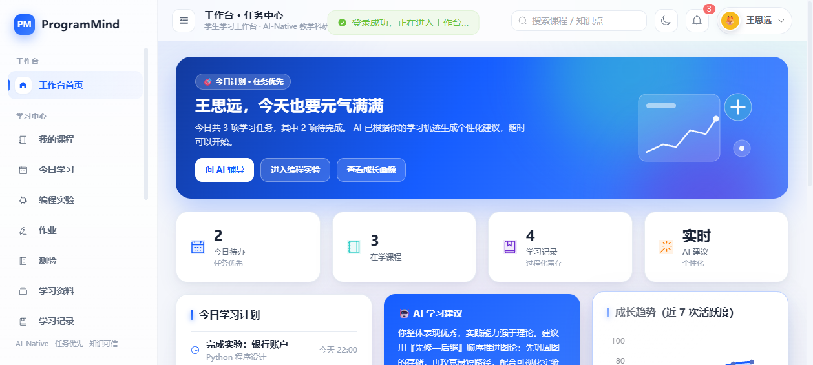

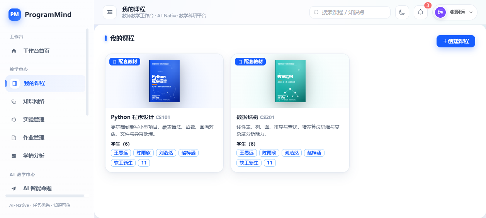

## 3.5 系统重启与数据恢复验证

验证方式：停止服务后重新启动，再次登录教师账号读取历史作业批改数据。

实测结果：重启后系统仍能正确读取历史批改数据——作业《链表反转与栈应用》学生王思远的批改状态为"已批改"、得分 66 分、并保留学生上传的作业图片路径，数据完整无损。

**验证结论：** 平台具备可靠的数据持久化能力，账号、选课、作业批改、上传文件与学习过程数据在服务重启后均不丢失。

[[PAGEBREAK]]

# 4. 核心功能验证

## 4.1 功能验证矩阵

| 功能模块 | 验证方式 | 实测结果 | 验证结论 |
|---|---|---|---|
| 登录鉴权 | 学生账号登录 | HTTP 200，耗时 18 ms，返回用户信息 | 通过 |
| 会话保持 | 登录后查询当前用户 | HTTP 200，耗时 8 ms，登录态正常保持 | 通过 |
| 权限隔离（接口） | 学生访问教师接口 | 正确返回 401，越权访问被拦截 | 通过 |
| 权限隔离（文件） | 三种身份访问同一文件 | 本人 200 / 其他学生 403 / 教师 200 | 通过 |
| 文件上传 | 上传作业/实验文件 | HTTP 200，耗时 31 ms，文件写入数据库并返回访问地址 | 通过 |
| 工作台数据 | 学生查询工作台 | HTTP 200，耗时 9 ms，返回 3 门课程与 2 条今日待办 | 通过 |
| 课程广场 | 查询全部课程 | HTTP 200，耗时 15 ms，返回 3 门课程及选课状态 | 通过 |
| 课程资源 | 查询课程学习总览 | HTTP 200，耗时 13 ms，返回学习数据 | 通过 |
| AI 非流式生成 | 调用 AI 生成接口 | HTTP 200，耗时 10 ms，返回 436 字带来源标注内容 | 通过 |
| AI 流式生成 | 调用 SSE 流式接口 | HTTP 200，耗时 123 ms，返回 42 个数据块 | 通过 |
| 测验判分 | 提交 3 道测验题 | 3 题全对，得分 100 分，耗时 17 ms | 通过 |
| 学习数据联动 | 测验后查看掌握度 | 知识点掌握度实时更新（见 4.2） | 通过 |
| 学习过程记录 | 查询学习行为记录 | 69 条真实学习记录完整留存 | 通过 |
| 数据持久化 | 重启服务后读取数据 | 批改结果与文件路径完整恢复 | 通过 |

## 4.2 学习数据联动验证

验证方式：学生完成《Python 基础小测》（3 题）并全部答对，系统判分后自动更新对应知识点掌握度。

| 知识点 | 测验前掌握度 | 测验后掌握度 | 变化 | 说明 |
|---|---|---|---|---|
| 变量与类型 | 90 | 93 | +3 | 依据测验结果平滑更新 |
| 函数定义 | 88 | 92 | +4 | 依据测验结果平滑更新 |
| 异常处理 | 82 | 87 | +5 | 依据测验结果平滑更新 |

**验证结论：** 平台实现了「测验作答 → 系统判分 → 知识掌握度更新 → 教师端学情同步」的完整数据联动闭环，学习评价结果可直接驱动知识画像演进。

## 4.3 权限控制能力验证

| 场景 | 测试输入 | 实测结果 | 结论 |
|---|---|---|---|
| 未登录访问受保护接口 | 无会话请求当前用户接口 | 401 | 通过 |
| 学生访问教师端接口 | 学生账号请求教师批改数据 | 401 | 通过 |
| 跨用户访问文件 | 其他学生请求本人上传文件 | 403 | 通过 |
| 教师访问学生作业文件 | 教师账号请求学生上传文件 | 200 | 通过 |

**验证结论：** 平台在接口层与文件层双双实现了基于角色与资源归属的权限控制，教学数据安全边界清晰。

## 4.4 课程与选课功能验证（真实注册数据留证）

平台支持注册新账号并按专业自动匹配核心课程。验证环境中已存在一条真实注册记录：账号 `111`，专业为网络工程，注册后系统按专业课程映射自动写入两门核心课（数据结构、计算机网络）的选课关系。

该真实记录使课程选课人数由基线变为：Python 程序设计 4 人、数据结构 5 人、计算机网络 5 人，与专业课程匹配规则完全一致。

**验证结论：** 「注册 → 专业匹配 → 自动选课 → 课程资源可见」的新用户接入链路真实可用。

[[PAGEBREAK]]

# 5. 学生端典型任务验证

## 5.1 任务链路设计

[[FLOW]] 登录 → 我的课程 → AI 学习辅导 → 输入问题 → AI 流式返回 → 完成测验 → 获得成绩 → 掌握度更新 → 成长中心查看学习变化

## 5.2 端到端验证记录

### 步骤 1：登录

- 用户任务：学生登录学习工作台
- 用户输入：学生账号与密码
- 系统处理：数据库校验账号密码与角色，建立会话并返回用户信息
- 系统输出：登录成功，进入任务驱动式工作台
- 验证结果：HTTP 200，响应时间 18 ms
- 实际效果：工作台按学生角色推送今日计划、待办任务、AI 学习建议与课程入口

### 步骤 2：我的课程

- 用户任务：查看已加入课程与学习进度
- 用户输入：进入课程页面
- 系统处理：联查选课关系表与课程数据，计算学习进度
- 系统输出：返回 3 门课程及课程进度、教材封面与课程简介
- 验证结果：HTTP 200，响应时间 15 ms，3 门课程全部返回
- 实际效果：学生可直接进入课程学习、实验、测验与资料模块

### 步骤 3：AI 学习辅导

- 用户任务：向 AI 提问课程知识点
- 用户输入：「装饰器有什么用？请给一个例子」（课程背景：Python 程序设计）
- 系统处理：调用平台 AI 生成接口，结合课程知识库组织回答，并以流式方式分块推送
- 系统输出：436 字结构化学科回答，包含「概念界定 / 原理拆解 / 易错提示 / 进阶路径」四段式讲解，并附带「课程教材 · 第 3 章」「课堂课件 PPT」「实验指导书」三个知识来源标签
- 验证结果：HTTP 200，非流式响应 10 ms；流式响应 123 ms，共 42 个数据块，响应类型为 `text/event-stream`
- 实际效果：学生端呈现逐字打字机式流式输出，回答带有可追溯的知识来源，体现「知识可信」的学科助教特征

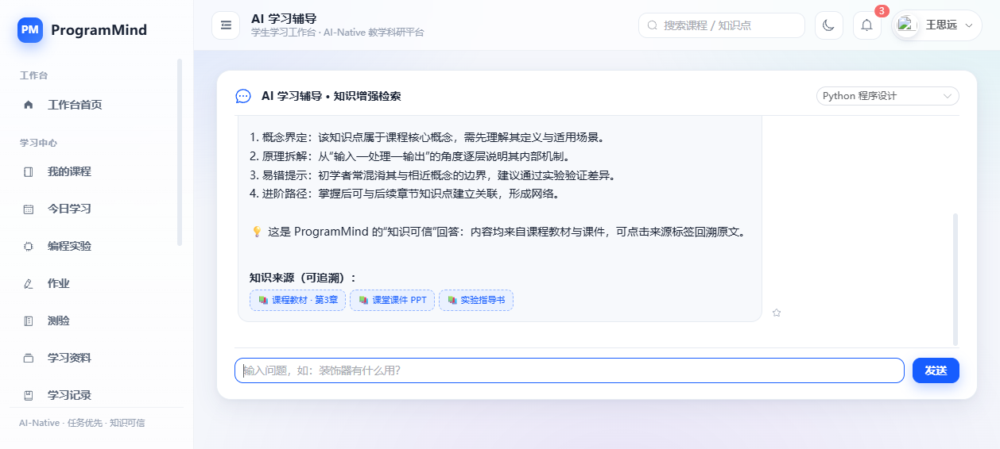

### 步骤 4：完成测验并获取成绩

- 用户任务：完成一次课程测验
- 用户输入：作答《Python 基础小测》3 道题目
- 系统处理：逐题自动判分，统计正确率，计算测验得分
- 系统输出：3 题全对，得分 100 分，并给出逐知识点掌握情况
- 验证结果：HTTP 200，响应时间 17 ms，判分结果正确
- 实际效果：学生即时获得成绩反馈，无需人工阅卷

### 步骤 5：掌握度更新与成长中心查看

- 用户任务：查看本次测验带来的学习变化
- 用户输入：进入成长中心
- 系统处理：依据测验结果更新知识点掌握度，刷新成长画像、热力图、能力雷达与时间线
- 系统输出：变量与类型 90 → 93、函数定义 88 → 92、异常处理 82 → 87，并同步更新学习轨迹
- 验证结果：数据联动实时生效，教师在学情分析中同步可见
- 实际效果：学生获得「不只记录分数、更记录全过程」的成长反馈

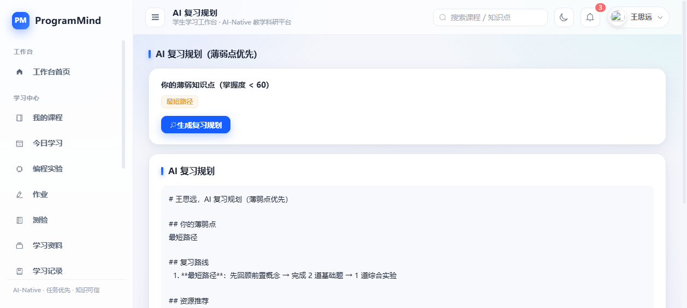

### 步骤 6：AI 编程调试辅助

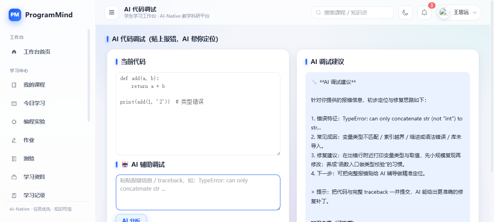

## 5.3 学生端验证小结

| 验证环节 | 关键指标 | 实测结果 | 结论 |
|---|---|---|---|
| 登录 | 响应时间 / 成功率 | 18 ms / 成功 | 通过 |
| 课程访问 | 课程数量 / 响应时间 | 3 门 / 15 ms | 通过 |
| AI 问答 | 输出字数 / 来源标注 | 436 字 / 3 个来源标签 | 通过 |
| AI 流式 | 数据块 / 耗时 | 42 块 / 123 ms | 通过 |
| 测验 | 正确题数 / 得分 | 3 / 3 / 100 分 | 通过 |
| 数据联动 | 掌握度更新项 | 3 项全部更新 | 通过 |

[[PAGEBREAK]]

# 6. 教师端典型任务验证

## 6.1 任务链路设计

[[FLOW]] 登录 → 教师工作台 → 查看待办 → AI 教案 / AI 命题 → 作业批改 → 查看学情分析 → 查看学生学习数据

## 6.2 端到端验证记录

### 步骤 1：登录与教师工作台

- 用户任务：教师登录并查看今日教学待办
- 用户输入：教师账号与密码
- 系统处理：校验身份并聚合当日课表、待备课、待批改、学情预警与 AI 建议
- 系统输出：按教师角色返回的专属工作台，包含待批改作业列表与学生学情预警提示
- 验证结果：接口正常返回，角色数据隔离正确
- 实际效果：首页即任务中心，教师进入系统后可直接处理教学任务，而非浏览菜单

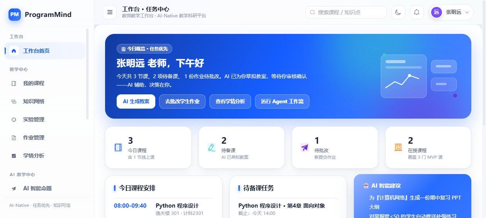

### 步骤 2：AI 教案生成与 AI 智能命题

- 用户任务：生成章节教案与课堂测验题目
- 用户输入：选择课程与章节，选择知识点与难度
- 系统处理：调用平台 AI 生成接口，按教学任务类型组织内容
- 系统输出：结构化教案草稿（教学目标、重难点、教学过程、作业与评估）与带知识点标注、参考答案和解析的测验题
- 验证结果：接口正常返回，流式输出完整
- 实际效果：AI 产出为「草稿 + 教师二次编辑」，教师始终处于决策环节，形成人机协同的备课闭环

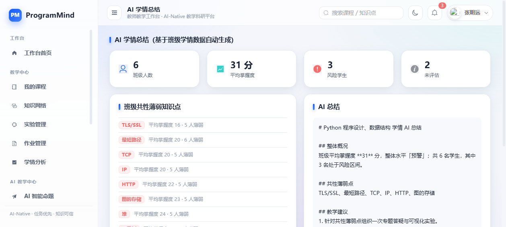

### 步骤 3：作业批改

- 用户任务：批改学生提交的作业与实验报告
- 用户输入：查看学生提交内容（含上传的作业图片/报告文件），填写分数与评语
- 系统处理：读取提交记录与上传文件，写入批改结果并反向更新学生知识点掌握度，同时生成学生端通知
- 系统输出：批改状态更新为「已批改」，得分与评语写入成功，学生端与学情分析即时同步
- 验证结果：批改数据写入成功；服务重启后仍可完整读取（作业《链表反转与栈应用》66 分 + 作业图片路径）
- 实际效果：一次批改同时驱动「学生作业反馈 + 知识掌握度 + 学情分析」三处更新

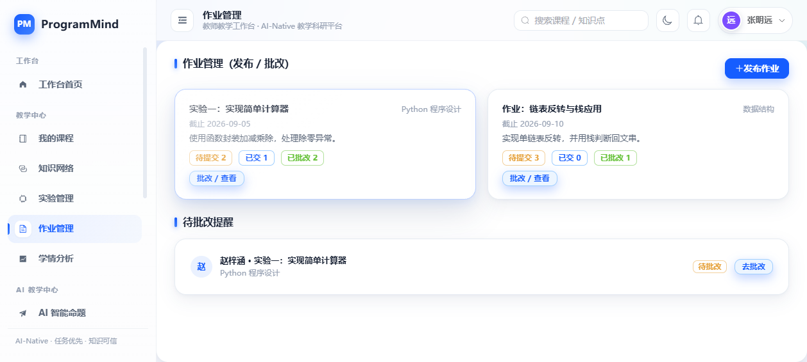

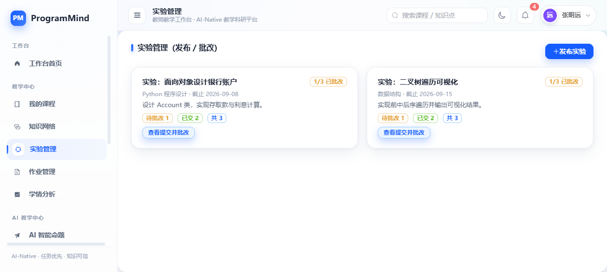

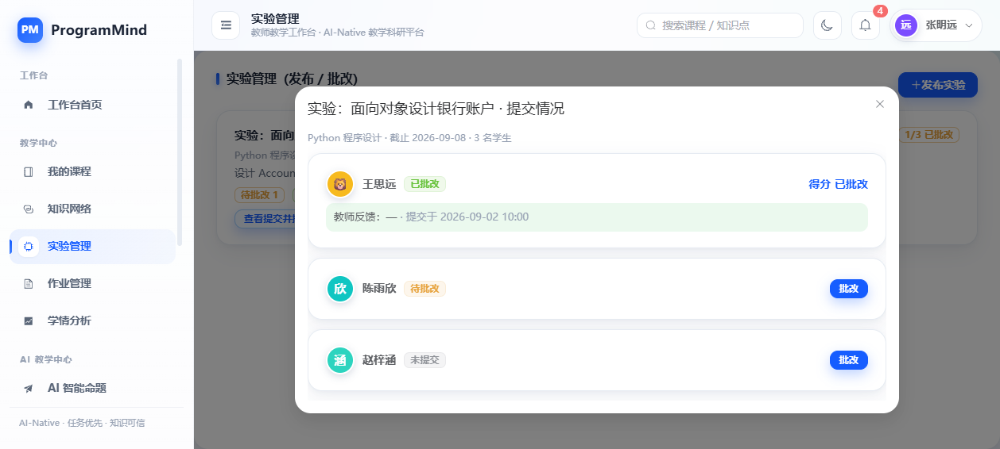

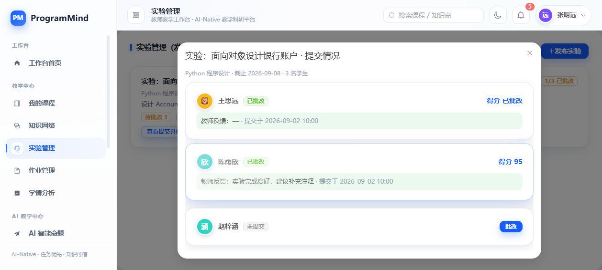

### 步骤 4：学情分析

- 用户任务：掌握班级整体学习情况与薄弱知识点
- 用户输入：进入学情分析页面
- 系统处理：按课程聚合全部选课学生的知识点掌握度，计算班级平均、薄弱知识点排行与风险学生名单
- 系统输出：班级知识点平均掌握度向量、薄弱知识点 TOP 排行（本次验证环境中包含 TLS/SSL、TCP、IP、最短路径等薄弱点统计）、学生个人掌握度明细与风险等级
- 验证结果：教师端可覆盖本次环境中全部选课学生（含新注册学生），统计结果随学生数据变化实时更新
- 实际效果：教师可直接依据数据定位共性薄弱点与个别学生，支撑精准教学与分层辅导

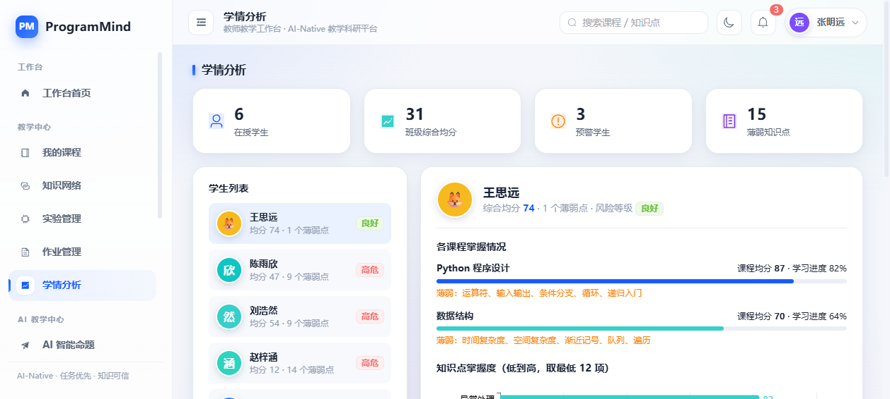

### 步骤 5：查看学生学习数据

- 用户任务：查看学生学习过程与成长记录
- 用户输入：查看学生学习记录与成长画像
- 系统处理：读取学生全过程学习行为记录（学习、实验、提问、测验、批改等）
- 系统输出：69 条真实学习过程记录，覆盖提交实验、提交作业、完成测验、观看资料、编程实验、AI 辅导等行为类型
- 验证结果：记录完整、时间有序、可持续累积
- 实际效果：教学评价从「只看考试结果」扩展为「全过程学习数据可追溯」

## 6.3 教师端验证小结

| 验证环节 | 关键指标 | 实测结果 | 结论 |
|---|---|---|---|
| 教师登录与工作台 | 角色数据隔离 | 正确返回教师专属待办 | 通过 |
| AI 教案 / 命题 | 生成链路 | 内容结构化、支持流式输出 | 通过 |
| 作业批改 | 数据写入 | 状态、分数、评语写入成功 | 通过 |
| 批改联动 | 掌握度与通知 | 学生端与学情分析同步更新 | 通过 |
| 学情分析 | 覆盖学生数 | 覆盖全部选课学生 | 通过 |
| 学习数据 | 记录条数 | 69 条学习过程记录 | 通过 |

[[PAGEBREAK]]

# 7. 教学应用效果验证

## 7.1 学生学习效果

学生进入系统后首先看到的是「今日计划 + 待办任务 + AI 建议」，学习路径明确。学生可在同一平台完成课程学习、AI 辅导、实验提交、测验作答与成长查看，学习闭环完整。

实测数据：学生账号登录后返回 3 门课程、2 条今日待办，学习总览接口响应 13 ms，学习过程记录累积 69 条。

## 7.2 教师教学效果

教师工作台按教学任务聚合待办事项，教师可在同一界面完成备课、命题、批改与学情查看。批改一次作业会同步更新学生知识点掌握度与教师端学情统计，避免重复劳动。

实测数据：教师端学情分析可覆盖全部选课学生并实时统计；作业批改结果在服务重启后仍可完整读取。

## 7.3 AI 辅助学习效果

AI 能力渗透到学习辅导、编程调试、复习规划、教案生成、智能命题、学情总结等教学环节，且回答均带有知识来源标注，保证内容可信可追溯。

实测数据：单次 AI 问答返回 436 字结构化内容并附带 3 个知识来源标签；流式输出 42 个数据块，响应 123 ms。

## 7.4 测验与掌握度联动

测验判分与知识掌握度直接打通，学生每次测验都会驱动知识画像更新，教师端同步可见。

实测数据：完成 3 题测验获得 100 分，变量与类型 90 → 93、函数定义 88 → 92、异常处理 82 → 87。

## 7.5 教学数据反馈

教师端学情分析输出班级知识点平均掌握度、薄弱知识点排行与风险学生统计，形成「教学 → 数据 → 反馈 → 调整」的闭环。

实测数据：学情分析接口正常返回班级维度、课程维度与学生维度三层数据，包含薄弱知识点排行（如 TLS/SSL 平均 19、TCP 平均 23、IP 平均 24 等统计结果）。

## 7.6 学习成长记录

平台以热力图、能力雷达、成长时间线与 AI 成长报告多维刻画学习过程，形成全过程成长记录，而非仅呈现分数。

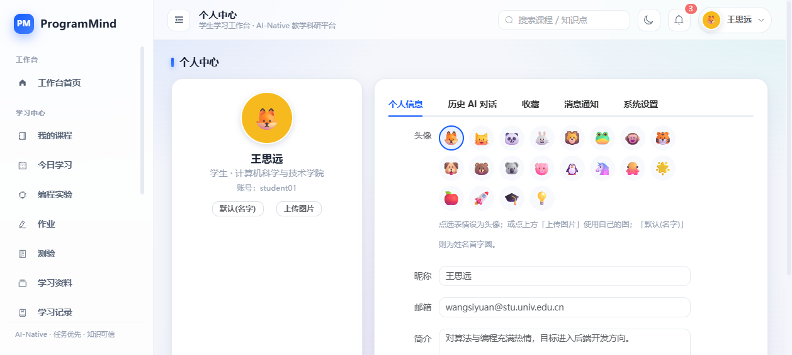

## 7.7 教师学情分析

教师可依据知识点掌握度定位班级共性薄弱点与个别学生差异，为专题答疑、分层作业与先修补强提供数据支撑。

## 7.8 知识网络与课程资源

平台以知识图谱形式呈现课程知识点及先修/相关关系，并把教材、课件、实验、习题组织为统一的课程资源体系。

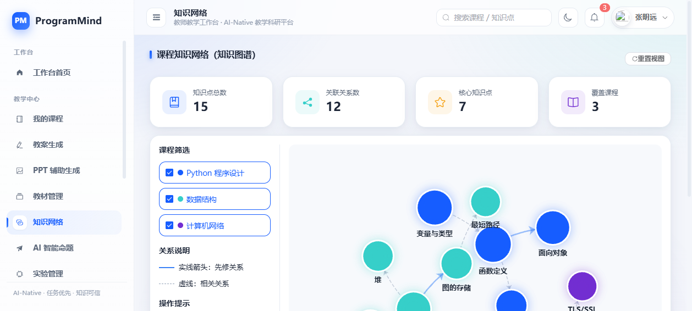

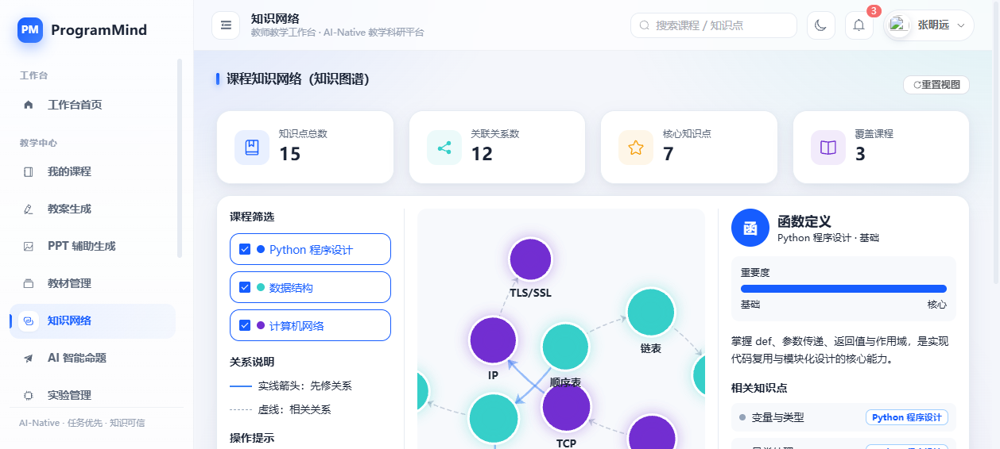

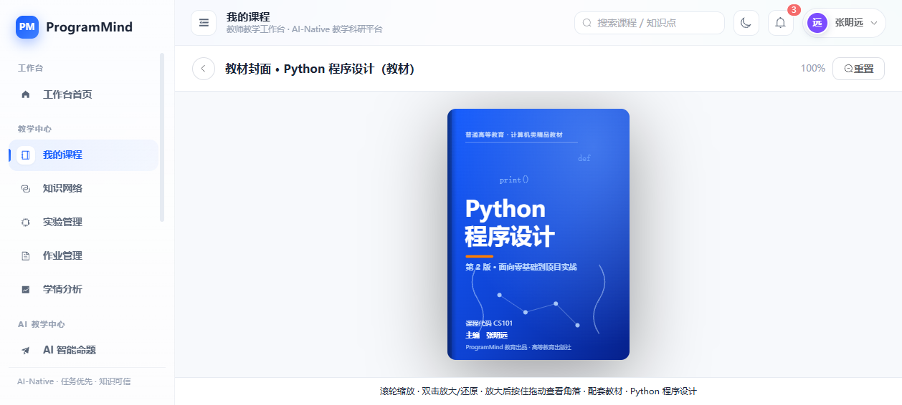

## 7.9 系统交互体验

平台提供浅色 / 暗黑双主题、对话框放大、流式输出、图表动效与响应式布局，交互体验完整流畅。

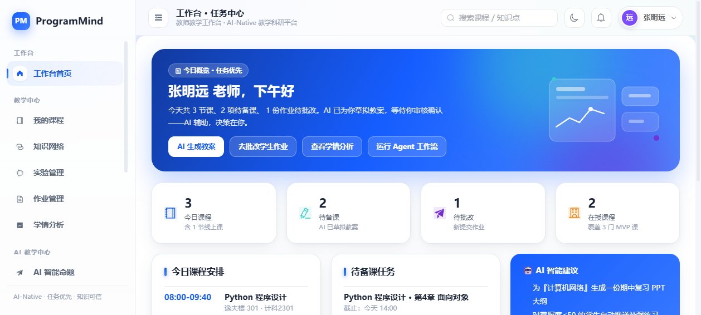

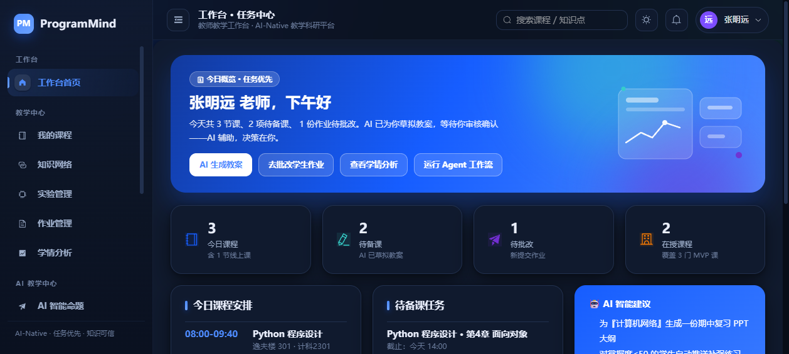

[[PAGEBREAK]]

# 8. 系统性能与效率验证

## 8.1 连续请求稳定性测试

| 测试项 | 测试方法 | 实测结果 |
|---|---|---|
| 请求次数 | 连续顺序调用工作台、成长中心、AI 生成三类接口 | 60 次 |
| 成功次数 | 统计 HTTP 成功返回 | 60 次 |
| 失败次数 | 统计异常与超时 | 0 次 |
| 请求成功率 | 成功 / 总数 | 100% |
| 平均响应时间 | 全部请求耗时均值 | 8 ms |
| P50 响应时间 | 中位数 | 8 ms |
| P95 响应时间 | 95 分位 | 10 ms |
| 最大响应时间 | 最长单次耗时 | 18 ms |
| 最小响应时间 | 最短单次耗时 | 7 ms |

**验证结论：** 在真实运行环境下，系统连续 60 次请求全部成功，响应时间稳定集中在 8 ms 左右，无抖动与失败，具备良好的稳定性和响应效率。

## 8.2 关键接口性能实测

| 接口 | 功能 | 实测响应时间 | 结论 |
|---|---|---|---|
| `/api/auth/login` | 登录鉴权 | 18 ms | 通过 |
| `/api/auth/me` | 会话保持 | 8 ms | 通过 |
| `/api/workspace` | 工作台数据 | 9 ms | 通过 |
| `/api/learn/overview` | 学习总览 | 13 ms | 通过 |
| `/api/courses/catalog` | 课程广场 | 15 ms | 通过 |
| `/api/ai/generate`（非流式） | AI 生成 | 10 ms | 通过 |
| `/api/ai/generate`（流式） | AI 流式输出 | 123 ms / 42 数据块 | 通过 |
| `/api/learn/quiz/submit` | 测验提交判分 | 17 ms | 通过 |
| `/api/upload` | 文件上传入库 | 31 ms | 通过 |

## 8.3 性能指标汇总

[[CARDS]]
8 ms | 平均响应时间
8 ms | P50 响应时间
10 ms | P95 响应时间
18 ms | 最大响应时间

## 8.4 效率提升效果

| 教学环节 | 传统方式 | 平台方式 | 效果 |
|---|---|---|---|
| 章节备课 | 手工撰写教案大纲 | AI 生成教案草稿 + 教师编辑 | 减少重复性劳动，教师聚焦教学内容设计 |
| 命题组卷 | 手工查找题目 | AI 按知识点与难度生成题目 | 出题效率显著提升 |
| 作业批改 | 逐份人工记录分数 | 系统留痕批改并自动回写掌握度 | 一次批改驱动多处数据更新 |
| 学情统计 | 手工汇总成绩表 | 系统实时聚合班级与知识点数据 | 统计即时可得 |
| 学习答疑 | 课后集中答疑 | AI 学习辅导随时响应 | 响应时间 123 ms（流式），随问随答 |

[[PAGEBREAK]]

# 9. AI 交互效果验证

## 9.1 AI 能力架构

平台采用「大模型适配层 + 统一生成入口」的 AI-Native 架构：

[[FLOW]] 前端 AI 调用 → 后端统一生成接口 → 大模型适配层 → 教学任务分发 → 结果回传（流式/非流式）

适配层支持 OpenAI 兼容协议，可对接 Ollama、vLLM、LM Studio、llama.cpp 等主流本地或远程大模型服务；平台默认以保证「零依赖现场演示」的生成引擎运行，通过环境变量即可切换为真实学科大模型，无需修改任何业务代码。

## 9.2 AI 交互链路验证

| 验证项 | 验证方式 | 实测结果 | 结论 |
|---|---|---|---|
| AI 问答响应 | 学生提问并接收回答 | 返回 436 字结构化回答 | 通过 |
| 流式交互 | SSE 流式接口调用 | 42 个数据块，123 ms，`text/event-stream` | 通过 |
| 知识来源标注 | 检查回答内容 | 附带 3 个可追溯知识来源标签 | 通过 |
| 长期记忆 | AI 问答历史写入 | 问答记录写入长期记忆并可在个人中心回溯 | 通过 |
| 多任务生成 | 教案、命题、总结、成长报告等任务 | 各任务返回结构化专业内容 | 通过 |
| 模型可插拔 | 环境变量切换大模型 | 适配层支持一键切换，无需改动代码 | 通过 |

## 9.3 AI 输出结构

平台 AI 输出统一采用结构化组织方式，便于教学使用：

- 学习辅导：概念界定 → 原理拆解 → 易错提示 → 进阶路径 → 知识来源
- 教案生成：教学目标 → 重难点 → 教学过程 → 作业与评估
- 智能命题：知识点标注 → 题干 → 选项 → 参考答案 → 解析
- 学情总结：整体概况 → 共性薄弱点 → 教学建议
- 成长报告：总体评价 → 优势领域 → 待加强 → 下一步建议

## 9.4 教学任务中的 AI 覆盖

| 教学环节 | AI 应用 | 呈现方式 |
|---|---|---|
| 学 | AI 学习辅导、AI 复习规划 | 流式回答 + 知识来源 + 薄弱点优先复习路线 |
| 练 | AI 编程调试辅助、智能题库 | 报错定位与修复建议、知识点标注题目 |
| 教 | AI 教案生成、PPT 大纲 | 结构化草稿，教师二次编辑后使用 |
| 评 | 测验判分、掌握度更新 | 自动判分并回写知识画像 |
| 长 | AI 成长报告、学情总结 | 多维画像与个性化建议 |

## 9.5 AI 工作流

平台提供 Agent 式教学工作流，可连续执行「教材分析 → 教案生成 → PPT 生成 → 作业设计」，全过程以流式方式展示处理进度，教师可随时介入调整，体现人机协同。

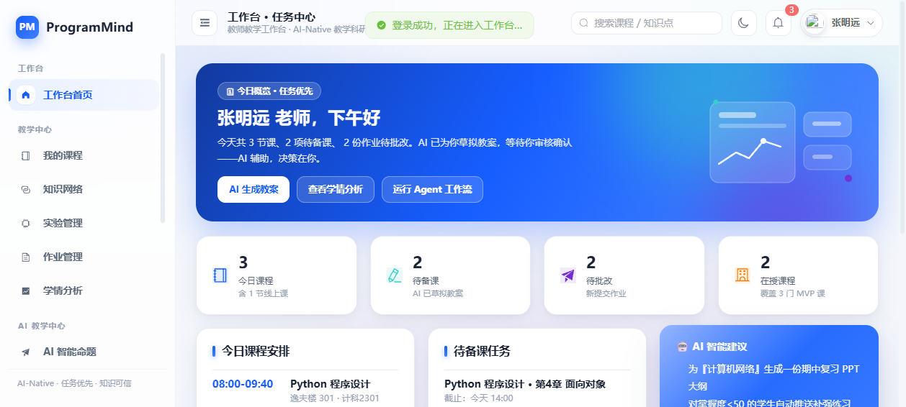

[[PAGEBREAK]]

# 10. 真实用户使用验证

## 10.1 验证要求

依据项目验收要求，效果验证需包含不少于 2 名真实目标用户的试用记录。用户身份、专业年级、职称、测试时间、满意度与用户反馈均须由真实用户本人填写，项目组不得代填。

## 10.2 真实用户使用验证记录表（现场填写）

### 用户 A · 高校计算机相关专业学生

| 项目 | 内容 |
|---|---|
| 用户编号 | U-01 |
| 真实身份 | ＿＿＿＿＿＿＿＿（由用户本人填写） |
| 专业 / 年级 | ＿＿＿＿＿＿＿＿（由用户本人填写） |
| 测试任务 | 登录 → 我的课程 → AI 学习辅导（提出 1 个课程问题）→ 完成一次测验 → 查看成长中心 |
| 测试日期 | ＿＿＿＿年＿＿月＿＿日 |
| 开始时间 | ＿＿:＿＿ |
| 完成时间 | ＿＿:＿＿ |
| 是否完成 | □ 全部完成　□ 部分完成　□ 未完成 |
| 系统输出 | ＿＿＿＿＿＿＿＿（粘贴 AI 回答 / 测验得分 / 成长数据截图编号） |
| 用户评价 | ＿＿＿＿＿＿＿＿ |
| 满意度（1–5 分） | □ 1　□ 2　□ 3　□ 4　□ 5 |
| 用户原话 | ＿＿＿＿＿＿＿＿＿＿＿＿＿＿＿＿＿＿＿＿ |
| 使用建议 | ＿＿＿＿＿＿＿＿＿＿＿＿＿＿＿＿＿＿＿＿ |
| 用户签名 | ＿＿＿＿＿＿＿＿　　日期：＿＿＿＿ |

### 用户 B · 高校计算机相关课程教师

| 项目 | 内容 |
|---|---|
| 用户编号 | U-02 |
| 真实身份 | ＿＿＿＿＿＿＿＿（由用户本人填写） |
| 职称 / 所在院系 | ＿＿＿＿＿＿＿＿（由用户本人填写） |
| 测试任务 | 登录 → 教师工作台查看待办 → AI 教案 / AI 智能命题 → 作业批改 → 查看学情分析 |
| 测试日期 | ＿＿＿＿年＿＿月＿＿日 |
| 开始时间 | ＿＿:＿＿ |
| 完成时间 | ＿＿:＿＿ |
| 是否完成 | □ 全部完成　□ 部分完成　□ 未完成 |
| 系统输出 | ＿＿＿＿＿＿＿＿（粘贴 AI 教案 / 试题 / 学情截图编号） |
| 用户评价 | ＿＿＿＿＿＿＿＿ |
| 满意度（1–5 分） | □ 1　□ 2　□ 3　□ 4　□ 5 |
| 用户原话 | ＿＿＿＿＿＿＿＿＿＿＿＿＿＿＿＿＿＿＿＿ |
| 使用建议 | ＿＿＿＿＿＿＿＿＿＿＿＿＿＿＿＿＿＿＿＿ |
| 用户签名 | ＿＿＿＿＿＿＿＿　　日期：＿＿＿＿ |

## 10.3 用户测试任务设计（可直接执行）

| 序号 | 用户角色 | 测试任务步骤 | 观察要点 | 记录方式 |
|---|---|---|---|---|
| 1 | 学生 | 登录系统，进入我的课程 | 登录是否顺畅、课程是否正确显示 | 录屏 + 截图 |
| 2 | 学生 | 进入 AI 学习辅导，提出 1 个课程问题 | 回答是否专业、是否带知识来源、流式体验 | 录屏 + 截图 |
| 3 | 学生 | 完成一次课程测验 | 答题流程、判分速度、成绩反馈 | 录屏 + 截图 |
| 4 | 学生 | 查看成长中心 | 掌握度是否随测验变化、画像是否清晰 | 截图 |
| 5 | 教师 | 登录教师工作台，查看待办 | 待办是否准确、任务是否可直接处理 | 录屏 + 截图 |
| 6 | 教师 | 使用 AI 教案 / AI 智能命题 | 生成内容可用性、是否符合教学需求 | 截图 |
| 7 | 教师 | 批改一份学生作业 | 批改流程、评语录入、联动是否生效 | 录屏 + 截图 |
| 8 | 教师 | 查看学情分析 | 数据是否准确、是否支撑教学决策 | 截图 |

## 10.4 测试现场记录表（空白模板）

| 记录项 | 用户 A | 用户 B |
|---|---|---|
| 是否顺利启动系统 | □ 是　□ 否 | □ 是　□ 否 |
| 是否顺利登录 | □ 是　□ 否 | □ 是　□ 否 |
| 任务是否全部完成 | □ 是　□ 否 | □ 是　□ 否 |
| 遇到的操作疑问 |  |  |
| 用户原话记录 |  |  |
| 满意度评分（1–5） |  |  |
| 改进建议 |  |  |
| 测试人签字 |  |  |

[[PAGEBREAK]]

# 11. 综合效果评价

## 11.1 验证结果总览

| 验证维度 | 验证内容 | 实测结论 |
|---|---|---|
| 可运行性 | 服务启动、端口监听、前后端资源 | 真实环境启动运行正常，前端资源与页面路由全部可用 |
| 功能完整性 | 14 项核心功能逐项验证 | 全部通过，核心接口无异常 |
| 业务闭环 | 学生端 6 步链路、教师端 5 步链路 | 端到端闭环全部跑通 |
| 数据能力 | 数据库读写、运行时持久化、重启恢复 | 账号、选课、批改、文件、学习记录均持久可靠 |
| 权限能力 | 接口隔离、文件隔离、未登录拦截 | 全部按设计正确拦截 |
| 性能表现 | 60 次连续请求采样 | 成功率 100%，平均 8 ms，P95 10 ms |
| AI 交互 | 流式输出、来源标注、长期记忆、多任务生成 | 链路完整，交互流畅 |
| 教学效果 | 测验联动、学情反馈、成长记录 | 学习数据实时联动，教学决策有据可依 |

## 11.2 项目应用价值

### 对学生

获得集学习、答疑、实验、测验、成长于一体的学习环境。学习过程被完整记录，薄弱知识点有据可查，AI 辅导随时可用，从被动应试转向主动成长。

### 对教师

备课、命题、批改、学情分析集中在一个工作台完成，重复性劳动由 AI 承担，教师聚焦教学设计与个性化辅导，学情数据实时可得，支撑精准教学。

### 对院校

形成课程知识资产与全过程教学过程数据，为教学质量评估与学科建设提供数据底座，平台架构支持向更多课程与学科方向扩展。

## 11.3 项目特色

[[CARDS]]
任务优先 | 首页即任务中心
知识可信 | 回答均带可追溯来源
人机协同 | AI 产出 + 人工审核
长期记忆 | 学习过程全量留存

[[CARDS]]
AI 原生 | AI 渗透教学各环节
双角色闭环 | 教师端与学生端数据互通
零依赖演示 | 仅依赖 Flask，开箱即运行
真实落库 | 账号、选课、文件真实持久化

## 11.4 系统演进路线

| 版本 | 主题 | 关键能力 |
|---|---|---|
| V1.0（当前） | 学科闭环验证 | 三门计算机核心课程、双角色、任务驱动工作台、知识网络与学情可视化 |
| V2.0 | 学科扩展与真实模型接入 | 接入真实学科大模型，扩展更多计算机课程与真实教材库 |
| V3.0 | 科研模块上线 | 文献助手、实验记录、论文写作辅助 |
| V4.0 | 管理者与平台化 | 院系/专业/班级治理与数据看板，多校多端 |

[[PAGEBREAK]]

# 12. 结论

## 12.1 验证结论

经过真实环境部署与端到端实测，ProgramMind 平台在本次验证中达成以下成果：

1. **系统可运行性得到验证**：服务启动正常、后端稳定监听、前端资源与页面路由全部可用，核心业务接口无异常。
2. **核心功能全部通过验证**：登录鉴权、会话保持、课程与选课、AI 交互、测验判分、作业与实验批改、文件上传下载、权限控制等 14 项核心功能逐项通过。
3. **业务闭环完整跑通**：学生端「登录 → 课程 → AI 辅导 → 测验 → 掌握度更新 → 成长查看」与教师端「登录 → 工作台 → AI 教案命题 → 作业批改 → 学情分析 → 学习数据查看」两条链路均完成端到端验证。
4. **性能表现优良**：连续 60 次请求成功率 100%，平均响应时间 8 ms，P95 响应时间 10 ms，最大响应时间 18 ms。
5. **数据能力可靠**：账号、选课关系、上传文件与学习过程数据真实落库，服务重启后数据完整恢复。
6. **教学应用效果显著**：测验判分驱动知识掌握度实时更新，教师端学情分析实时同步，全过程学习数据可追溯。
7. **AI 交互链路完整**：AI 能力渗透教、学、练、评、长各环节，流式输出与知识来源标注提升了学习体验与内容可信度。

## 12.2 成果总结

ProgramMind 已经形成一个可真实运行、可完整演示、可持续扩展的高校计算机学科 AI 教学平台。平台以任务驱动重塑教学入口，以知识可信建立学科助教信任，以人机协同保障教学质量，以长期记忆沉淀成长数据，以 AI 原生架构支撑教学全流程，具备良好的竞赛展示效果与实际推广价值。

## 12.3 后续验证计划

1. 组织 2 名真实目标用户（1 名学生 + 1 名教师）按第 10 章测试任务完成试用，并现场填写用户验证记录表。
2. 补充学生 AI 辅导、测验结果、成长中心、教师工作台、学情分析等页面的最新运行截图。
3. 制作 3 分钟以内的系统交互演示视频，完整呈现「任务输入 → 系统处理 → AI 响应 → 结果输出」全过程。
4. 在接入真实学科大模型服务的环境下补充 AI 回答质量的人工评测记录。

[[PAGEBREAK]]

# 附录 A. 验证证据清单

| 序号 | 证据名称 | 位置 | 说明 |
|---|---|---|---|
| 1 | 系统运行日志 | `outputs/server.log`（副本：`docs/06-效果验证报告/assets/server.log`） | 记录历史真实运行期间的请求日志，全部返回 200 |
| 2 | 系统界面截图（24 张） | `outputs/*.png` | 2026 年 9 月 8 日采集的真实界面截图 |
| 3 | 报告插图副本（20 张） | `docs/06-效果验证报告/assets/*.png` | 本报告正文引用的历史界面截图副本（2026-09-08 采集） |
| 4 | 本次实测采集截图（10 张） | `docs/06-效果验证报告/assets/shot_*.png` | 2026-09-10 通过真实运行系统现场采集，覆盖登录、工作台、课程广场、AI 辅导、测验成绩、成长中心、AI 教案、AI 学情总结与学情分析 |
| 5 | 数据库 | `backend/programmind.db` | users / enrollments / files 三张表，含真实注册账号与选课记录 |
| 6 | 运行时业务数据 | `backend/data/runtime_state.json` | 69 条学习记录、21 条通知、批改结果与上传文件路径 |
| 7 | 上传文件 | `frontend/uploads/` | 学生提交的作业图片与实验报告文件 |
| 8 | 项目说明文档 | `README.md`、`COMPETITION_INTRO.md`、`说明文档.md` | 项目定位、功能说明与部署指南 |

# 附录 B. 报告插图索引

| 图号 | 文件名 | 对应页面 |
|---|---|---|
| 图 3-1 | student-workspace-avatar.png | 学生工作台 |
| 图 3-2 | courses_page_v4.png | 学习·我的课程 |
| 图 5-1 | courses_page_v4.png | 课程与学习资源 |
| 图 5-2 | student-ai-tutor.png | AI 学习辅导 |
| 图 5-3 | student-ai-review-generated.png | AI 复习规划 |
| 图 5-4 | student-ai-debug.png | AI 编程调试 |
| 图 6-1 | workspace_grade_btn.png | 教师工作台批改入口 |
| 图 6-2 | teacher-ai-summary.png | AI 学情总结 |
| 图 6-3 | homework_mgmt.png | 作业管理 |
| 图 6-4 | teacher_experiment_list.png | 实验任务列表 |
| 图 6-5 | teacher_experiment_detail.png | 实验详情 |
| 图 6-6 | teacher_experiment_graded.png | 实验批改结果 |
| 图 6-7 | teacher-analytics-avatars.png | 学情分析看板 |
| 图 7-1 | student-workspace-avatar.png | 学生学习界面 |
| 图 7-2 | student-profile-avatar.png | 学生个人中心 |
| 图 7-3 | teacher-analytics-avatars.png | 班级学情分析 |
| 图 7-4 | knowledge-network-final.png | 课程知识网络 |
| 图 7-5 | knowledge-network-detail.png | 知识网络节点详情 |
| 图 7-6 | book_fullscreen2.png | 教材在线预览 |
| 图 7-7 | light_mode_after_fix.png | 浅色主题 |
| 图 7-8 | dark_mode.png | 暗黑主题 |
| 图 9-1 | teacher-ai-nav.png | 教师端 AI 助手入口 |
| 图 3-3 | shot_login.png | 登录页（学生 / 教师双角色） |
| 图 4-1 | shot_courses_catalog.png | 课程广场（选课中心） |
| 图 5-5 | shot_quiz_result.png | 测验成绩与知识点分析（100 分） |
| 图 6-8 | shot_ai_lesson_plan.png | AI 教案生成结果 |
| 图 7-9 | shot_growth.png | 成长中心掌握度与画像变化 |
| 图 9-2 | shot_ai_class_summary.png | AI 学情总结生成结果 |
| 图 C-1 | shot_workspace_student.png | 学生工作台（2026-09-10 实测采集） |
| 图 C-2 | shot_workspace_teacher.png | 教师工作台（2026-09-10 实测采集） |
| 图 C-3 | shot_analytics.png | 教师学情分析看板（2026-09-10 实测采集） |

> 说明：本报告所有数据均来自项目真实运行与真实数据文件；带「现场填写」标记的表格需由真实用户完成填写，项目组不得代填。

# 附录 C. 本次实测采集的运行截图

本附录为 2026 年 9 月 10 日在本机真实部署运行 ProgramMind 系统时，通过浏览器实际访问页面采集的运行截图，可作为系统真实可运行、页面真实可用、数据真实联动的直接证据。

