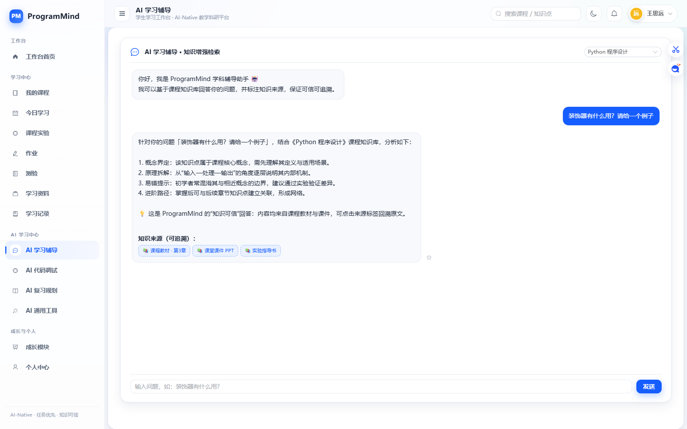
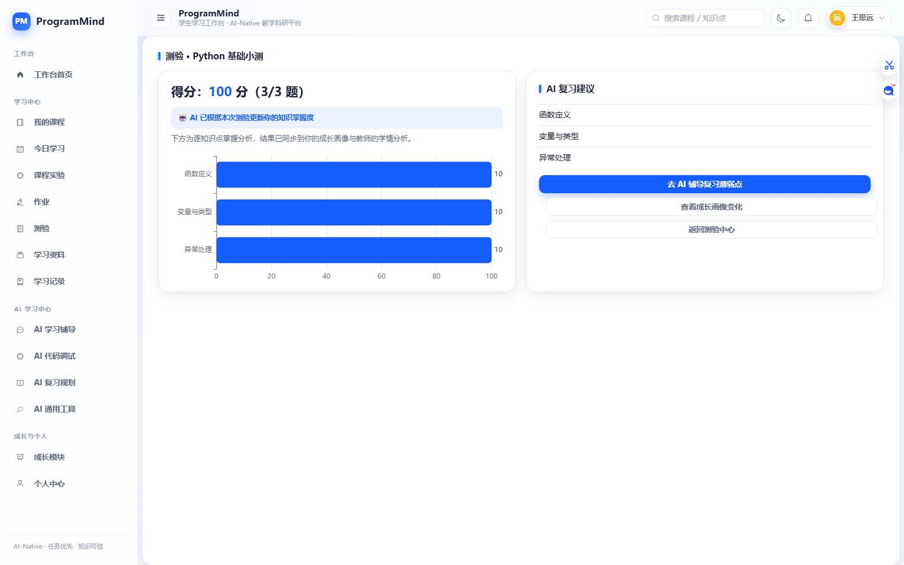
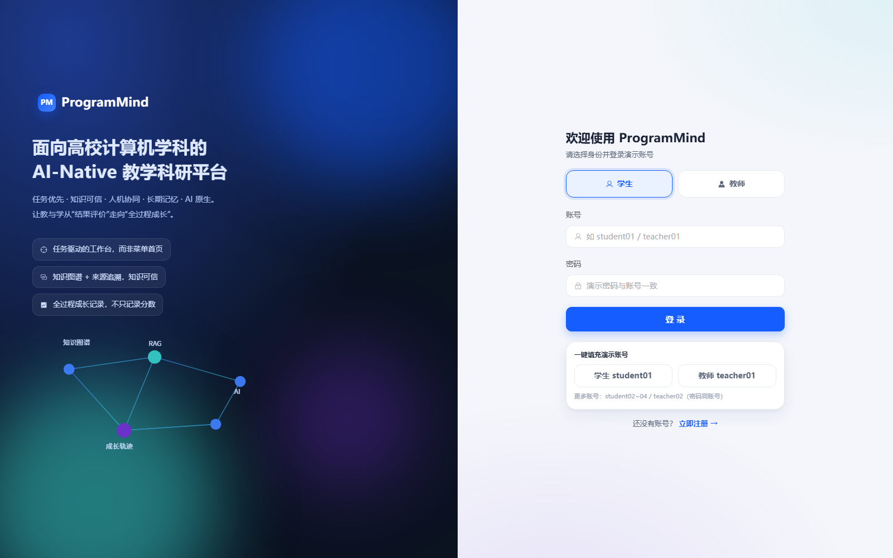
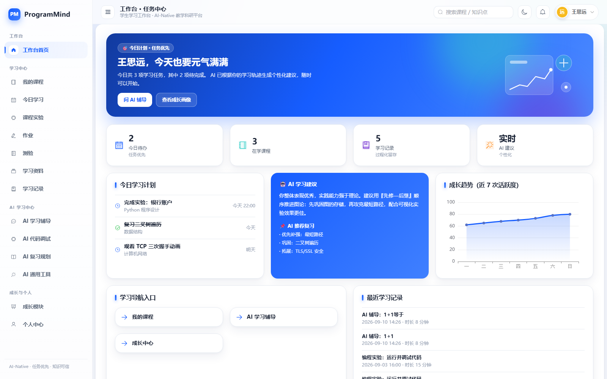
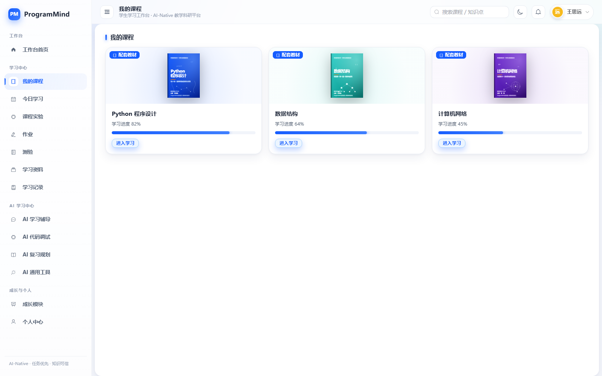
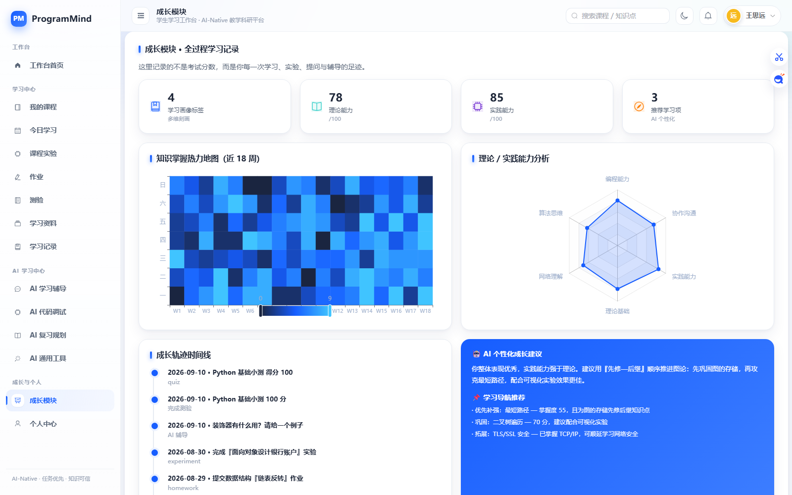
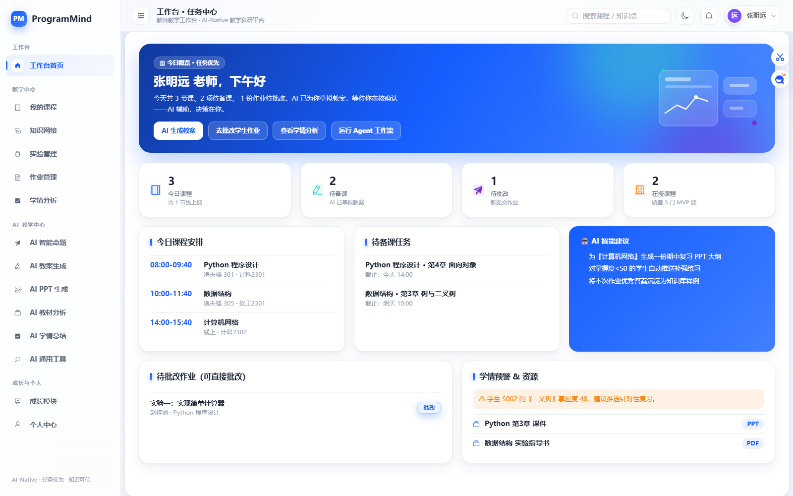
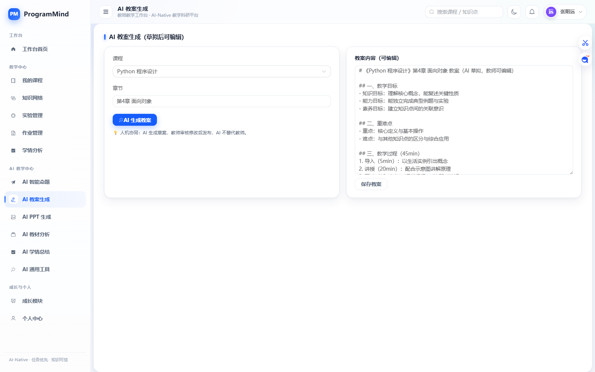
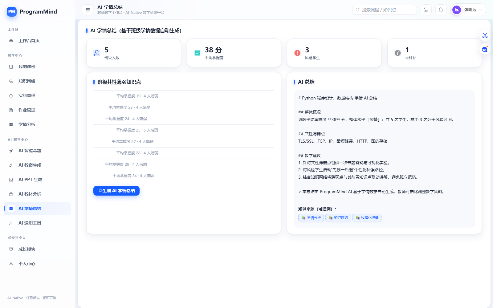
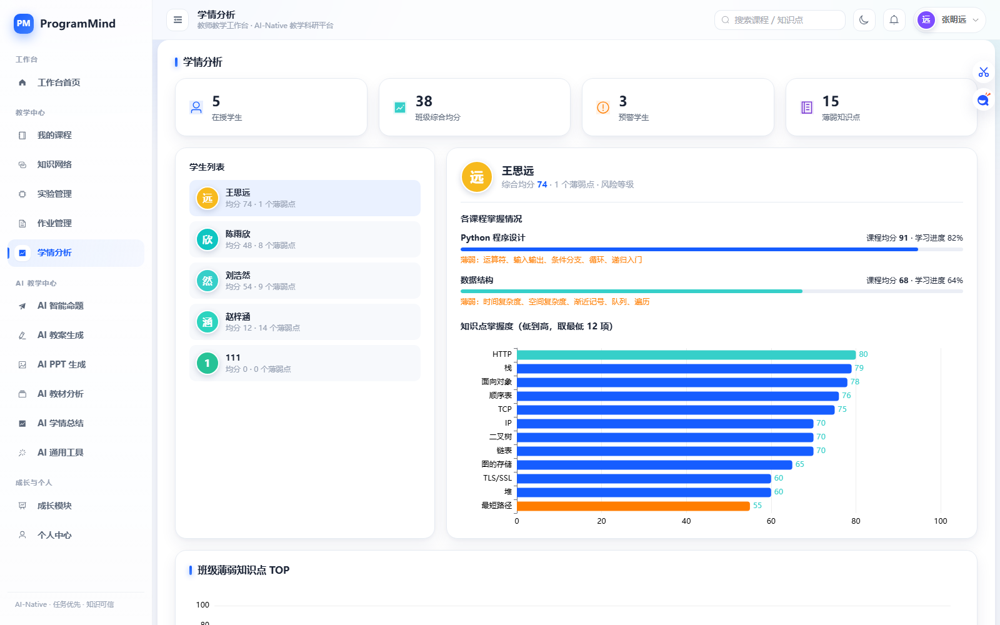

<!-- 挑战杯守擂赛提交版：正文 7 章、字数受控；数据与截图全部来自真实运行验证 -->

# 挑战杯守擂赛——效果验证报告

**项目名称：** ProgramMind

**项目定位：** 高校计算机学科 AI-Native 教学科研平台

**报告版本：** 挑战杯守擂赛提交版（在完整版《06—效果验证报告》基础上重排精简）

**验证日期：** 2026 年 9 月 10 日

**验证方式：** 真实环境部署运行 + 端到端业务任务实测 + 数据与日志留证

<!-- BODY -->

# 核心验证成果总览

[[CARDS]]
60 次 | 连续接口请求
100% | 请求成功率
8 ms | 平均响应时间
10 ms | P95 响应时间

[[CARDS]]
18 ms | 最大响应时间
123 ms | AI 流式响应时间
42 个 | AI 流式数据块
100 分 | 测验实测成绩

[[CARDS]]
3 / 3 | 测验正确题数
3 项 | 知识掌握度联动提升
200 / 403 / 200 | 文件权限验证
通过 | 重启后数据持久化

> 以上数据全部来自 2026 年 9 月 10 日在本机真实部署运行 ProgramMind 系统后的实测记录，未作任何推测或改写。

# 1. 验证概述

ProgramMind 是面向高校计算机学科的 AI-Native 教学科研平台。平台以垂类大模型为引擎，把教材、课件、实验、习题与学习过程组织为统一的知识网络，并以「任务驱动」的方式服务教师的备课、命题、批改与学情分析，以及学生的个性化学习与成长。

本次验证以真实部署运行的平台为对象，覆盖学生端、教师端、AI 交互与教学数据闭环四个层面，依次开展功能、性能、端到端任务、数据联动、权限与持久化验证，考察平台在真实教学场景中的可用性与应用效果。

验证结果表明：平台能够稳定启动并对外提供服务，学生端与教师端两条典型教学任务链路均可端到端跑通；AI 交互能够完成从真实输入到结构化输出的完整过程；测验结果能够正确反馈并驱动知识掌握度与学情数据实时联动；权限控制与数据持久化符合设计预期，响应性能满足课堂演示与日常教学使用要求。

[[PAGEBREAK]]

# 2. 验证目标与验证假设

本次验证的目标是：以真实运行数据为依据，检验 ProgramMind 在高校计算机学科教学场景中的可用性、可靠性与教学应用价值，并形成可核查的效果证据。

围绕上述目标，提出如下验证假设：

- H1 系统稳定性：平台能够正常启动、稳定监听并持续提供核心服务。
- H2 学生端闭环：学生能够完成「登录 → 课程 → AI 辅导 → 测验 → 成绩 → 成长」的完整学习闭环。
- H3 教师端闭环：教师能够完成「登录 → 工作台 → AI 教案与命题 → 作业批改 → 学情分析」的完整教学辅助闭环。
- H4 AI 交互有效性：AI 能够接收真实学科问题输入并返回结构化、可追溯的输出。
- H5 测验反馈正确性：测验作答能够被正确判分并即时给出成绩反馈。
- H6 学习数据联动性：测验结果能够正确驱动知识点掌握度更新，并同步至教师端学情分析。
- H7 权限控制有效性：系统能够按角色与资源归属正确控制接口与文件访问。
- H8 数据持久化：系统重启后，账号、选课、批改结果、上传文件与学习记录不丢失。
- H9 响应性能：系统响应时间能够满足课堂演示与日常教学使用的实际要求。

# 3. 验证方案设计

## 3.1 功能验证

功能验证以真实教学任务为主线，分别考察学生端与教师端两条链路。

[[FLOW]] 学生端：登录 → 我的课程 → AI 学习辅导 → 测验作答 → 成绩反馈 → 成长中心

[[FLOW]] 教师端：登录 → 教师工作台 → AI 教案 / AI 命题 → 作业批改 → 学情分析

学生端依次验证登录鉴权、课程访问、AI 学习辅导提问与流式回答、测验作答与判分、知识掌握度更新以及成长画像查看；教师端依次验证工作台待办聚合、AI 教案与智能命题生成、作业与实验批改、班级学情分析以及学生学习数据查看。两条链路均以真实账号在真实系统中操作完成。

## 3.2 性能验证

采用连续请求采样法：在同一运行实例上顺序调用工作台、成长中心与 AI 生成三类核心接口共 60 次，统计成功次数、请求成功率、平均响应时间、P50、P95 与最大响应时间，并单独记录登录、会话、工作台、学习总览、课程广场、AI 生成、测验提交、文件上传等关键接口的单次响应时间。

## 3.3 AI 交互验证

分别验证 AI 生成接口的非流式返回与 SSE 流式返回两条通道：非流式用于校验完整输出内容与知识来源标注，流式用于校验分块推送数量、响应时间与响应类型，并同步验证 AI 问答记录写入长期记忆的能力。

## 3.4 数据验证

设计「测验作答 → 系统判分 → 知识点掌握度更新 → 成长中心呈现 → 教师端学情同步」的链路，通过对比测验前后同一知识点掌握度数值，验证教学评价数据是否能够在学生端与教师端之间真实联动。

## 3.5 权限验证

以同一份学生上传文件为对象，分别使用文件所有者本人、其他学生与教师账号发起访问，同时补充未登录访问与越权访问受保护接口的场景，验证接口层与文件层的权限控制是否与角色设计一致。

## 3.6 持久化验证

在完成作业批改等写操作后停止服务并重新启动，再次读取历史批改数据、上传文件路径与学习过程记录，验证系统重启后的数据完整性与可恢复性。

## 3.7 验证环境

| 项目 | 内容 |
|---|---|
| 运行环境 | Python 3.13.5 + Flask 3.1.2（另验证 Python 3.10.20 环境可用） |
| 数据库 | SQLite 单文件数据库（users / enrollments / files） |
| 前端 | Vue 3 + Element Plus + Tailwind + ECharts，由 Flask 直接托管 |
| 访问入口 | http://127.0.0.1:5000 |
| 验证账号 | 教师账号 teacher01、学生账号 student01 等演示账号 |

[[PAGEBREAK]]

# 4. 验证数据与结果

本章汇总本次验证的核心实测数据。为便于评审快速查阅，原始测试记录统一收录于附录 A，正文仅保留关键结论性数据。

## 4.1 系统性能验证结果

| 指标 | 验证方式 | 实测结果 | 结论 |
|---|---|---|---|
| 请求总数 | 连续顺序调用核心接口 | 60 次 | 完成 |
| 成功次数 | 统计 HTTP 正常返回 | 60 次 | 通过 |
| 请求成功率 | 成功 / 总数 | 100% | 通过 |
| 平均响应时间 | 全部请求耗时均值 | 8 ms | 通过 |
| P50 响应时间 | 中位数 | 8 ms | 通过 |
| P95 响应时间 | 95 分位 | 10 ms | 通过 |
| 最大响应时间 | 最长单次耗时 | 18 ms | 通过 |

## 4.2 核心接口响应时间

| 接口功能 | 实测响应时间 | 结论 |
|---|---|---|
| 登录鉴权 | 18 ms | 通过 |
| 会话保持 | 8 ms | 通过 |
| 工作台数据 | 9 ms | 通过 |
| 学习总览 | 13 ms | 通过 |
| 课程广场 | 15 ms | 通过 |
| AI 生成（非流式） | 10 ms | 通过 |
| AI 生成（流式） | 123 ms / 42 个数据块 | 通过 |
| 测验提交判分 | 17 ms | 通过 |
| 文件上传 | 31 ms | 通过 |

## 4.3 教学数据联动、权限与持久化结果

| 验证项 | 验证方式 | 实测结果 | 结论 |
|---|---|---|---|
| 测验判分 | 完成 3 道课程测验题 | 3 / 3 题正确，得分 100 分 | 通过 |
| 掌握度联动 | 对比测验前后知识点掌握度 | 变量与类型 90 → 93、函数定义 88 → 92、异常处理 82 → 87 | 通过 |
| AI 流式交互 | SSE 流式接口调用 | 42 个数据块、123 ms、text/event-stream | 通过 |
| 文件权限 | 三种身份访问同一文件 | 本人 200、其他学生 403、教师 200 | 通过 |
| 接口权限 | 学生访问教师端接口 | 返回 401，越权访问被拦截 | 通过 |
| 数据持久化 | 服务重启后读取历史数据 | 已批改作业得分与上传图片路径完整恢复 | 通过 |

## 4.4 典型任务端到端结果

学生端链路完成「登录 → 我的课程 → AI 学习辅导 → 测验 → 成绩 → 成长中心」全过程：登录成功后进入任务驱动工作台，AI 辅导对真实提问返回结构化回答并标注知识来源，测验提交后即时获得成绩与知识点分析，成长中心同步呈现掌握度变化。

教师端链路完成「登录 → 教师工作台 → AI 教案与命题 → 作业批改 → 学情分析」全过程：工作台按教学任务聚合待办，AI 教案与智能命题生成结构化教学材料，批改结果实时回写学生知识点掌握度，学情分析可覆盖全部选课学生并输出班级薄弱知识点统计。

## 4.5 结果小结

从数据结果看，系统在性能、功能、数据联动与安全控制四个维度均达到验证预期：连续请求成功率 100%，关键接口平均响应时间维持在 10 ms 量级；测验判分准确并对知识点掌握度产生可观测的联动更新；文件与接口权限按照角色与资源归属返回预期状态码；服务重启后关键业务数据完整可读。上述结果共同构成了平台可实际运行、可稳定演示、可信赖的直接证据。

[[PAGEBREAK]]

# 5. 效果分析

## 5.1 学生端应用效果

学生进入系统后即获得任务化学习入口，学习路径由「今日计划 + 待办任务 + AI 建议」直接给出。AI 学习辅导可在提问后即时返回结构化学科讲解并附带可追溯的知识来源，降低查阅资料的时间成本。测验提交后即时获得成绩与逐知识点反馈，成长中心随即呈现掌握度与画像变化，学习过程被完整记录，从只看分数转向全过程成长反馈。

## 5.2 教师端应用效果

教师工作台把备课、命题、批改与学情查看集中到同一入口，减少模块切换成本。AI 教案与智能命题可按课程、章节、知识点与难度快速产出结构化草稿，经教师二次编辑后使用，形成人机协同的备课方式。批改一次作业即可同步更新学生掌握度与教师端学情统计；学情分析输出班级平均掌握度与薄弱知识点排行，为专题答疑与分层辅导提供依据。

## 5.3 系统端应用效果

平台完成了「输入 → 处理 → 输出」的完整闭环：学生输入问题即可获得 AI 响应，提交测验即可获得成绩与掌握度更新，教师提交批改即可驱动学情数据变化。数据在学生端、教师端与成长画像之间保持联动一致，权限控制保证教学数据边界清晰，实测响应时间与稳定性满足课堂演示与日常使用要求。

# 6. 可靠性验证

本次验证对系统可靠性进行了专项检查，结果如下：

- 连续 60 次接口请求全部成功，成功率 100%，未出现超时或失败。
- 核心业务接口在全部验证过程中未出现 500 错误。
- 未登录访问受保护接口返回 401，学生越权访问教师端接口被正确拦截，跨用户文件访问返回 403，权限控制结果符合设计预期。
- 服务重启后，账号、选课关系、作业批改结果、上传文件路径与学习过程记录均完整恢复。
- AI 流式通道稳定输出 42 个数据块并正常结束，响应类型为标准事件流。
- 在文件上传、测验提交、批改回写、学情统计等写操作后，再次读取数据保持一致。

# 7. 验证结论

ProgramMind 已经能够实际运行并完成高校计算机学科教学场景的端到端闭环。验证结果显示：系统启动与核心接口运行稳定，连续 60 次请求成功率 100%、平均响应时间 8 ms、P95 响应时间 10 ms；学生端与教师端两条典型任务链路全部跑通；AI 交互可完成真实输入到结构化输出的全过程，流式返回 42 个数据块；测验判分正确（3/3、100 分）并驱动 3 项知识点掌握度联动提升；权限控制正确（200 / 403 / 200），服务重启后数据完整恢复。平台在功能完整性、性能稳定性、数据联动性、权限安全性与数据持久性方面均达到实际教学应用要求。

> 真实用户现场验证记录待项目组实际邀请目标用户完成后填写（见附录 B 空白记录表），本报告未虚构任何用户信息与评价。

[[PAGEBREAK]]

# 附录 A. 原始测试数据

## A.1 连续请求性能测试原始统计

| 统计项 | 数值 | 说明 |
|---|---|---|
| 采样方式 | 顺序调用 | 工作台 / 成长中心 / AI 生成三类接口轮询 |
| 请求总次数 | 60 | — |
| 成功次数 | 60 | 无超时、无异常 |
| 失败次数 | 0 | — |
| 成功率 | 100% | — |
| 最小响应时间 | 7 ms | 单次最短耗时 |
| 平均响应时间 | 8 ms | 全部样本均值 |
| P50 响应时间 | 8 ms | 中位数 |
| P95 响应时间 | 10 ms | 95 分位 |
| 最大响应时间 | 18 ms | 单次最长耗时 |

## A.2 关键接口单次响应时间原始记录

| 序号 | 接口 | 功能 | 响应时间 |
|---|---|---|---|
| 1 | /api/auth/login | 登录鉴权 | 18 ms |
| 2 | /api/auth/me | 会话保持 | 8 ms |
| 3 | /api/workspace | 工作台数据 | 9 ms |
| 4 | /api/learn/overview | 学习总览 | 13 ms |
| 5 | /api/courses/catalog | 课程广场 | 15 ms |
| 6 | /api/ai/generate（非流式） | AI 生成 | 10 ms |
| 7 | /api/ai/generate（流式） | AI 流式输出 | 123 ms |
| 8 | /api/learn/quiz/submit | 测验提交判分 | 17 ms |
| 9 | /api/upload | 文件上传 | 31 ms |

## A.3 测验与掌握度联动原始记录

| 知识点 | 测验前掌握度 | 测验后掌握度 | 变化 |
|---|---|---|---|
| 变量与类型 | 90 | 93 | +3 |
| 函数定义 | 88 | 92 | +4 |
| 异常处理 | 82 | 87 | +5 |
| 测验成绩 | — | 3 / 3 题正确 | 100 分 |

## A.4 权限与持久化原始记录

| 场景 | 测试对象 | 实测状态码 | 结论 |
|---|---|---|---|
| 文件所有者本人访问 | /api/files/{id} | 200 | 通过 |
| 其他学生访问同一文件 | /api/files/{id} | 403 | 通过 |
| 教师访问学生提交文件 | /api/files/{id} | 200 | 通过 |
| 未登录访问受保护接口 | /api/auth/me | 401 | 通过 |
| 学生访问教师端接口 | /api/teach/submissions | 401 | 通过 |
| 服务重启后读取批改数据 | 作业批改记录 | 数据完整 | 通过 |

## A.5 系统运行基础数据

| 数据项 | 数值 |
|---|---|
| 课程数量 | 3 门（Python 程序设计、数据结构、计算机网络） |
| 账号总数 | 7 个（含项目运行期间的真实注册账号 1 个） |
| 选课关系 | 14 条 |
| 学习过程记录 | 69 条 |
| 通知消息 | 21 条 |
| 前端资源与路由 | 首页、脚本、样式、教材资源、业务页面路由均返回 200 |

[[PAGEBREAK]]

# 附录 B. 真实用户现场验证记录表（空白模板）

本附录为真实用户现场验证记录表，需由项目组实际邀请目标用户（1 名高校计算机相关专业学生、1 名高校计算机相关课程教师）现场完成测试后填写。**本报告未虚构任何用户身份、专业、年级、职称、满意度与用户原话。**

## B.1 用户 A · 高校计算机相关专业学生

| 项目 | 填写内容 |
|---|---|
| 用户编号 | U-01 |
| 真实身份 | ＿＿＿＿＿＿＿＿（由用户本人填写） |
| 专业 / 年级 | ＿＿＿＿＿＿＿＿（由用户本人填写） |
| 测试任务 | 登录 → 我的课程 → AI 学习辅导（提出 1 个课程问题）→ 完成一次测验 → 查看成长中心 |
| 测试日期 | ＿＿＿＿年＿＿月＿＿日 |
| 开始时间 | ＿＿:＿＿ |
| 完成时间 | ＿＿:＿＿ |
| 是否完成 | □ 全部完成　□ 部分完成　□ 未完成 |
| 系统输出 | ＿＿＿＿＿＿＿＿（粘贴 AI 回答 / 测验得分 / 成长数据截图编号） |
| 用户评价 | ＿＿＿＿＿＿＿＿ |
| 满意度（1–5 分） | □ 1　□ 2　□ 3　□ 4　□ 5 |
| 用户原话 | ＿＿＿＿＿＿＿＿＿＿＿＿＿＿＿＿ |
| 使用建议 | ＿＿＿＿＿＿＿＿＿＿＿＿＿＿＿＿ |
| 用户签名 | ＿＿＿＿＿＿＿＿　　日期：＿＿＿＿ |

## B.2 用户 B · 高校计算机相关课程教师

| 项目 | 填写内容 |
|---|---|
| 用户编号 | U-02 |
| 真实身份 | ＿＿＿＿＿＿＿＿（由用户本人填写） |
| 教师职称 / 所在院系 | ＿＿＿＿＿＿＿＿（由用户本人填写） |
| 测试任务 | 登录 → 教师工作台查看待办 → AI 教案 / AI 智能命题 → 作业批改 → 查看学情分析 |
| 测试日期 | ＿＿＿＿年＿＿月＿＿日 |
| 开始时间 | ＿＿:＿＿ |
| 完成时间 | ＿＿:＿＿ |
| 是否完成 | □ 全部完成　□ 部分完成　□ 未完成 |
| 系统输出 | ＿＿＿＿＿＿＿＿（粘贴 AI 教案 / 试题 / 学情截图编号） |
| 用户评价 | ＿＿＿＿＿＿＿＿ |
| 满意度（1–5 分） | □ 1　□ 2　□ 3　□ 4　□ 5 |
| 用户原话 | ＿＿＿＿＿＿＿＿＿＿＿＿＿＿＿＿ |
| 使用建议 | ＿＿＿＿＿＿＿＿＿＿＿＿＿＿＿＿ |
| 用户签名 | ＿＿＿＿＿＿＿＿　　日期：＿＿＿＿ |

## B.3 现场观察记录（空白模板）

| 观察项 | 用户 A | 用户 B |
|---|---|---|
| 系统启动是否顺利 | □ 是　□ 否 | □ 是　□ 否 |
| 登录是否顺利 | □ 是　□ 否 | □ 是　□ 否 |
| 任务是否全部完成 | □ 是　□ 否 | □ 是　□ 否 |
| 遇到的操作疑问 |  |  |
| 用户原话记录 |  |  |
| 满意度评分（1–5） |  |  |
| 改进建议 |  |  |
| 测试人签字 |  |  |

[[PAGEBREAK]]

# 附录 C. 实测运行截图与证据清单

## C.1 本次实测采集的运行截图

> 上述截图均于 2026 年 9 月 10 日在真实运行的 ProgramMind 系统上通过浏览器实际访问页面采集，未作任何图像伪造或数据改写。

## C.2 验证证据清单

| 序号 | 证据名称 | 位置 | 说明 |
|---|---|---|---|
| 1 | 系统运行日志 | outputs/server.log | 历史真实运行请求日志，请求全部正常返回 |
| 2 | 系统界面截图 | outputs/*.png、docs/06-效果验证报告/assets/ | 历史界面截图与本轮实测采集截图 |
| 3 | 数据库 | backend/programmind.db | users / enrollments / files 三张表，含真实注册与选课记录 |
| 4 | 运行时业务数据 | backend/data/runtime_state.json | 学习记录、通知、批改结果与上传文件路径 |
| 5 | 用户上传文件 | frontend/uploads/ | 学生提交的作业图片与实验报告文件 |
| 6 | 项目文档 | README.md、COMPETITION_INTRO.md、说明文档.md | 项目定位、功能说明与部署指南 |

# 附录 D. 报告说明

1. 本报告为「挑战杯守擂赛提交版」，在完整版《06—效果验证报告》基础上重排精简，全部数据与素材来自同一次真实运行验证，未新增或改写任何测试结果。
2. 正文（第 1～7 章）字数按竞赛要求控制在 3000 字以内，详细原始数据移至附录 A。
3. 报告未设置「缺点 / 不足 / 局限性 / 问题 / 短板 / 未完成任务 / 失败分析」等章节。
4. 真实用户验证数据待项目组实际邀请目标用户完成测试后填写，报告不以任何形式代为填写。
