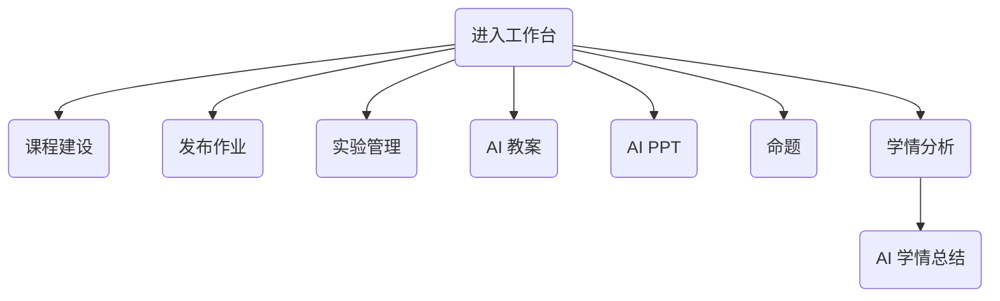
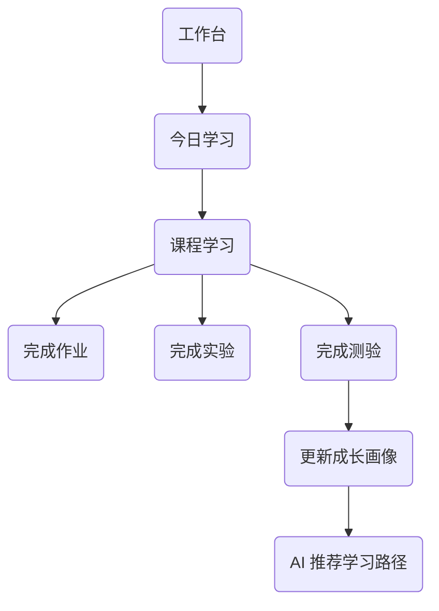

# ProgramMind V2.0 产品需求说明书（PRD）

> Challenge Cup 揭榜挂帅专项赛（XH-202620）正式开发文档

---

# 文档信息

| 项目    | 内容                                                                              |
| ----- | ------------------------------------------------------------------------------- |
| 项目名称  | ProgramMind——面向高校学科建设的垂类大模型与智能教学科研平台                                            |
| 英文名称  | ProgramMind — AI-Native Vertical Foundation Model Platform for Higher Education |
| 文档编号  | DOC01                                                                           |
| 文档版本  | V2.0（开发版）                                                                       |
| 当前章节  | Part 01：项目背景、产品定位、用户体系、产品目标                                                     |
| 面向对象  | 全体开发成员、产品负责人、指导教师、答辩材料编写人员                                                      |
| 项目负责人 | 陈天宇                                                                             |
| 更新日期  | 2026-09                                                                         |
| 对应赛事  | 2026 挑战杯揭榜挂帅专项赛 XH-202620                                                       |

---

# 文档说明

本文档是 **ProgramMind V2.0** 的唯一产品需求文档（Product Requirement Document）。

整个项目开发过程中：

- 产品设计以 DOC01 为唯一标准。
- 页面开发必须遵循 DOC01 页面规格。
- 后端接口必须满足 DOC01 页面行为。
- AI 功能必须满足 DOC01 产品流程。
- UI、数据库、API 不允许脱离 DOC01 独立设计。

> **注意**
> 
> DOC01 不描述数据库字段、不描述 API 参数、不描述算法实现。
> 
> 这些内容将在 DOC02~DOC07 中详细说明。

---

# 修订记录

| 版本   | 日期      | 修改人   | 内容                                            |
| ---- | ------- | ----- | --------------------------------------------- |
| V1.0 | 2026-06 | 陈天宇   | Demo 产品设计版本                                   |
| V1.5 | 2026-07 | 项目组   | 新增 AI 教学中心、成长中心                               |
| V2.0 | 2026-09 | 项目负责人 | 根据 Demo 审计报告全面重构产品体系，重构 IA、业务流程、AI 能力设计、页面规格。 |

---

# 第一章 项目背景

## 1.1 项目背景

### 1.1.1 国家战略背景

近年来，人工智能已经成为我国数字中国、新质生产力和教育数字化战略的重要组成部分。

ProgramMind 项目紧密结合以下国家战略方向：

| 战略方向      | ProgramMind 对应能力          |
| --------- | ------------------------- |
| 教育数字化战略行动 | AI 助教、AI 助学、课程知识库、智能评价    |
| 人工智能+教育   | 学科垂类模型、知识增强检索（RAG）、多智能体协同 |
| 数字中国建设    | 高校教学数据治理、成长画像、课程数字资产      |
| 新质生产力     | AI Native 教学科研平台、智能课程建设工具 |
| 高校学科建设    | 面向专业课程建设的一体化智能平台          |

ProgramMind 并不是一个通用聊天机器人，而是一个 **服务高校学科建设全过程** 的 AI 平台。

---

### 1.1.2 教育行业现状

当前高校教学主要存在五类核心问题。

#### （一）课程资源碎片化

课程资源分散在：

- PPT
- PDF
- Word
- 教材
- MOOC
- 实验指导书
- GitHub
- 视频课程

教师和学生缺少统一知识入口。

#### （二）AI 无法理解课程上下文

通用大模型存在问题：

- 不知道本课程教材内容。
- 不知道老师课堂安排。
- 不知道学生学习进度。
- 无法引用课程知识来源。
- 回答不可验证。

#### （三）教学评价滞后

教师只能看到：

- 作业成绩
- 测验成绩

无法持续了解：

- 哪个知识点不会。
- 学习行为变化。
- 学习风险趋势。

#### （四）课程建设效率低

教师需要重复完成：

- 教案。
- PPT。
- 命题。
- 作业。
- 实验。
- 学情总结。

大量重复劳动。

#### （五）缺少 AI 原生教学平台

现有产品大多属于：

- AI Chat。
- AI PPT。
- AI 出题。

而不是一个贯穿教学全过程的平台。

---

## 1.2 项目定位

### 1.2.1 产品定位

> ProgramMind 是一套面向高校学科建设的 AI Native 垂类大模型平台。

平台围绕高校课程建设全过程，构建四个智能中心：

| 中心              | 作用                          |
| --------------- | --------------------------- |
| Teaching Center | AI 助教、课程建设、教材管理、命题、实验、学情分析。 |
| Learning Center | AI 助学、课程学习、实验、测验、代码调试、学习资料。 |
| AI Center       | 多智能体协同、AI 工作流、课程知识问答、文档生成。  |
| Growth Center   | 学习状态镜像、成长画像、风险预测、学习路径。      |

ProgramMind 的定位不是 LMS，而是 AI-Native Learning Operating System。

---

### 1.2.2 产品一句话介绍

> ProgramMind 是一套融合课程知识库、知识增强检索（RAG）、多智能体协同、学习状态镜像和智能评价体系的高校学科智能教学科研平台。

---

### 1.2.3 产品使命（Mission）

打造高校课程建设全过程 AI 基础设施。

包括：

- 教学。
- 学习。
- 评价。
- 成长。
- 科研（V2 后续）。

---

### 1.2.4 产品愿景（Vision）

ProgramMind 希望成为高校课程建设中的 AI Operating System。

每一门课程拥有自己的：

- 知识库。
- AI Tutor。
- AI Lesson Agent。
- AI Quiz Agent。
- AI Analytics Agent。
- Growth Engine。

---

## 1.3 项目核心理念

ProgramMind 的设计理念包括五项原则。

### 原则一 AI Native First

AI 不是插件，而是系统能力。

所有核心页面均存在 AI 能力入口。

例如：

- AI 教案生成。
- AI PPT。
- AI 学习辅导。
- AI 代码调试。
- AI 学情总结。

---

### 原则二 Course-Centric

所有能力围绕课程展开。

课程成为平台第一实体。

课程拥有：

- 教材。
- 章节。
- 知识点。
- 作业。
- 实验。
- 测验。
- 学情。
- AI 知识库。

---

### 原则三 Human in the Loop

AI 永远作为辅助者。

教师拥有最终决定权。

流程包括：

```text
AI生成
    ↓
教师修改
    ↓
教师确认
    ↓
发布课程资源
```

---

### 原则四 Explainable AI

AI 输出必须说明来源。

不是回答结束，而是回答 + 来源。

输出包括：

- 来源教材。
- 来源章节。
- 来源知识点。
- 来源课件。

后续版本支持引用定位。

---

### 原则五 Continuous Growth

成长不是一次考试。

成长来自长期学习行为。

包括：

- 作业。
- 实验。
- 测验。
- AI 学习记录。
- 学习时长。
- 知识点掌握变化。

最终形成成长画像。

---

# 第二章 产品目标

## 2.1 产品目标

ProgramMind V2.0 共定义四层目标。

### 第一层 教学目标

帮助教师降低课程建设成本。

目标包括：

| 能力     | 目标           |
| ------ | ------------ |
| AI 教案  | 自动生成课程教案。    |
| AI PPT | 自动生成 PPT 大纲。 |
| AI 命题  | 自动生成多题型题库。   |
| AI 实验  | 自动生成实验任务。    |
| 学情总结   | 自动分析班级学习情况。  |

---

### 第二层 学习目标

帮助学生建立 AI 学习助手。

目标包括：

- AI Tutor。
- AI Debug。
- AI Review。
- AI Practice。
- AI Knowledge Search。

实现课程学习全过程辅助。

---

### 第三层 学科建设目标

帮助高校建设课程数字资产。

包括：

- 教材数字化。
- 知识图谱。
- 课程知识库。
- AI 课程助手。
- 教学评价体系。

---

### 第四层 AI 平台目标

ProgramMind 最终形成统一 AI 平台能力。

包括：

- RAG。
- Multi-Agent。
- State Engine。
- Workflow。
- Knowledge Base。

这些能力支持多个学科复用。

---

## 2.2 MVP 范围（Challenge Cup 初赛版本）

本次比赛仅完成 MVP。

### 已纳入 MVP

| 模块              | 是否进入 MVP |
| --------------- | -------- |
| 登录注册            | ✅        |
| 双角色系统           | ✅        |
| 工作台             | ✅        |
| 课程中心            | ✅        |
| 作业              | ✅        |
| 实验              | ✅        |
| 测验              | ✅        |
| AI Tutor        | ✅        |
| AI Lesson       | ✅        |
| AI Quiz         | ✅        |
| AI Analytics    | ✅        |
| Knowledge Graph | ✅        |
| Growth Center   | ✅        |

---

### Challenge Cup V2 必做能力

| 模块                   | 是否必须 |
| -------------------- | ---- |
| RAG 知识库              | ✅    |
| 文档上传解析               | ✅    |
| Citation 引用来源        | ✅    |
| Multi-Agent Workflow | ✅    |
| State Engine         | ✅    |
| Learning Path        | ✅    |

---

### 暂不进入 MVP

| 模块         | 原因   |
| ---------- | ---- |
| AI 助研中心    | 决赛版本 |
| 管理员后台      | 后续版本 |
| 多学校支持      | 后续版本 |
| 多课程协同推荐    | 后续版本 |
| 科研文献 Agent | 后续版本 |

---

# 第三章 用户体系设计

## 3.1 用户角色

ProgramMind 共设计四类角色。

| 角色       | 英文       | 权限        |
| -------- | -------- | --------- |
| 教师       | Teacher  | 教学管理全部权限。 |
| 学生       | Student  | 学习中心全部权限。 |
| AI Agent | AI Agent | 系统智能执行角色。 |
| 管理员（预留）  | Admin    | 平台管理权限。   |

本次比赛仅开放教师、学生两个角色。

---

## 3.2 教师画像

### 基本信息

| 属性   | 内容             |
| ---- | -------------- |
| 用户类型 | 高校教师           |
| 使用场景 | 课程建设、教学管理、班级分析 |
| 核心需求 | 提高教学效率。        |

---

### 教师核心任务

教师每天进入平台主要完成：



---

### 教师价值目标

ProgramMind 帮助教师：

- 少写 PPT。
- 少写教案。
- 少写题目。
- 自动批改。
- 自动分析班级。

---

## 3.3 学生画像

### 基本信息

| 属性   | 内容                 |
| ---- | ------------------ |
| 用户类型 | 高校学生               |
| 使用课程 | Python、数据结构、计算机网络等 |
| 核心需求 | AI 学习助手。           |

---

### 学生每日学习流程



---

### 学生价值目标

ProgramMind 提供：

- AI Tutor。
- AI Debug。
- AI Review。
- AI Practice。
- 成长画像。

---

## 3.4 AI Agent 用户（系统角色）

AI Agent 不是页面用户，而是系统角色。

平台包含多个 AI Agent。

| Agent           | 职责         |
| --------------- | ---------- |
| Tutor Agent     | 学生问答、知识辅导。 |
| Lesson Agent    | 教案生成。      |
| PPT Agent       | PPT 大纲生成。  |
| Quiz Agent      | 命题生成。      |
| Analytics Agent | 学情分析。      |
| Planner Agent   | 多智能体调度。    |

Agent 不直接暴露数据库。

所有 Agent 都通过 Workflow 调度。

---

# 第四章 产品能力地图

## 4.1 四大中心

ProgramMind 产品地图如下。

```text
ProgramMind
│
├── Teaching Center
│
├── Learning Center
│
├── AI Center
│
└── Growth Center
```

---

## 4.2 一级能力地图

| 一级模块            | 二级能力                                                      |
| --------------- | --------------------------------------------------------- |
| Teaching Center | 我的课程、教材管理、AI 教案、AI PPT、AI 命题、实验管理、作业管理、学情分析、AI 学情总结。      |
| Learning Center | 我的课程、今日学习、学习资料、AI Tutor、AI Debug、AI Review、作业、实验、测验、学习记录。 |
| AI Center       | AI 文档助手、AI 工作流、AI 知识问答、AI 总结、AI 命题助手。                     |
| Growth Center   | 成长画像、掌握雷达、热力图、风险预测、学习路径、成长报告。                             |

---

## 4.3 产品能力矩阵

| 能力        | 教师     | 学生     |
| --------- | ------ | ------ |
| 创建课程      | ✅      | ❌      |
| 上传教材      | ✅      | ❌      |
| AI 教案     | ✅      | ❌      |
| AI PPT    | ✅      | ❌      |
| AI 命题     | ✅      | ❌      |
| 发布作业      | ✅      | ❌      |
| 批改作业      | ✅      | ❌      |
| AI Tutor  | ❌      | ✅      |
| AI Debug  | ❌      | ✅      |
| AI Review | ❌      | ✅      |
| 学情分析      | ✅      | ❌      |
| 成长画像      | 查看班级   | 查看个人   |
| 学习路径      | 查看班级建议 | 查看个人建议 |

---

# 第五章 产品设计原则

## 5.1 页面设计原则

所有页面遵循统一设计系统。

### 布局规范

- 左侧导航栏固定。
- 顶部导航栏统一。
- 页面宽度统一。
- 卡片化布局。

---

### 色彩规范

品牌色：

- ProgramMind Blue
- AI Purple
- Success Green
- Warning Orange
- Danger Red

统一来自 Design Token。

---

### 页面状态规范

每个页面必须具备四种状态。

| 状态      | 是否必须 |
| ------- | ---- |
| Loading | ✅    |
| Empty   | ✅    |
| Error   | ✅    |
| Success | ✅    |

任何页面不得出现白屏。

---

### AI 页面规范

AI 页面统一包含：

- Prompt 输入区。
- 参数配置区。
- AI 输出区。
- 来源引用区。
- 保存按钮。
- 重新生成按钮。

所有 AI 页面保持一致交互。

---

## Part 01 结束

下一部分将开始 **第六章 信息架构 IA（57 个页面完整规格）**，进入 Teacher Center 与 Student Center 的完整页面树设计。
