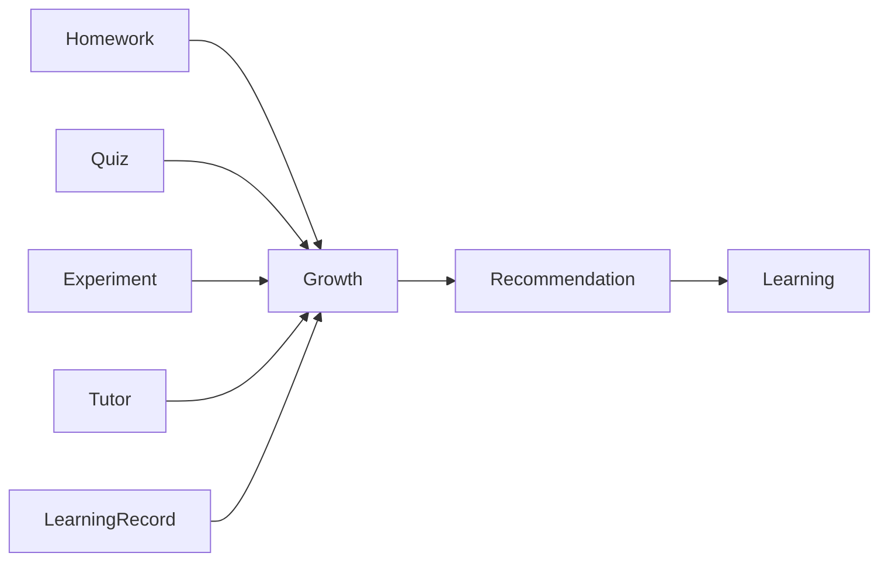
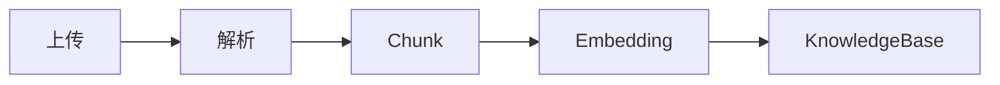

# ProgramMind V2.0 产品需求说明书（PRD）

# Part 02 —— 第六章 产品信息架构（Information Architecture）

> 本章节定义 ProgramMind V2.0 全部页面结构、导航体系、模块关系、页面职责、权限控制和页面状态，是整个项目唯一的信息架构标准。

---

# 第六章 产品信息架构（IA）

## 6.1 信息架构设计原则

ProgramMind V2.0 采用 **AI Native + 双角色工作台 + 四大中心（Teaching / Learning / AI / Growth）** 的信息架构。

整个系统遵循以下设计原则：

### 一、角色驱动（Role First）

登录后根据用户身份进入不同首页。

| 用户角色        | 首页                 |
| ----------- | ------------------ |
| 教师（Teacher） | Teaching Workspace |
| 学生（Student） | Learning Workspace |

角色决定：

- 左侧导航菜单。
- 首页工作台内容。
- 页面访问权限。
- AI 能力入口。

---

### 二、课程驱动（Course First）

课程是平台第一业务实体。

所有教学、学习行为围绕课程展开。

```text
课程
├── 教材
├── 章节
├── 知识点
├── PPT
├── 作业
├── 实验
├── 测验
├── AI Tutor
├── 学情分析
└── 成长画像
```

课程拥有自己的知识库和 AI。

---

### 三、AI 无处不在（AI Native）

AI 不独立存在，而嵌入页面。

例如：

| 页面       | AI 能力     |
| -------- | --------- |
| 我的课程     | AI 推荐学习内容 |
| 教材管理     | AI 构建知识网络 |
| AI Tutor | RAG 问答    |
| AI 教案    | 多智能体生成教案  |
| AI PPT   | 自动生成 PPT  |
| AI 学情分析  | 自动总结班级问题  |
| 成长中心     | AI 学习路径推荐 |

---

### 四、成长贯穿全过程（Growth Loop）

所有学习行为都会影响成长画像。



成长中心不是独立页面，而是学习循环终点。

---

## 6.2 全局页面树（57 页面）

ProgramMind V2.0 共设计 **57 个页面**。

---

# 页面树总览

```text
ProgramMind
│
├── 登录系统（3）
│
├── Teacher Center（17）
│
├── Student Center（16）
│
├── AI Center（11）
│
├── Growth Center（6）
│
├── Profile Center（4）
│
└── System Pages（若干）
```

总页面数：

| 模块             | 页面数                |
| -------------- | ------------------ |
| 登录系统           | 3                  |
| Teacher Center | 17                 |
| Student Center | 16                 |
| AI Center      | 11                 |
| Growth Center  | 6                  |
| Profile Center | 4                  |
| 系统页面           | 若干弹窗/Drawer/Dialog |
| **总计**         | **57 页面**          |

---

# 6.3 一级导航设计

登录后左侧导航保持固定。

## Teacher 导航

```text
工作台
│
├── 我的课程
├── 教材管理
├── AI 教案生成
├── AI PPT生成
├── AI 智能命题
├── 作业管理
├── 实验管理
├── 学情分析
├── AI 学情总结
│
AI Center
│
Growth Center
│
个人中心
```

导航数量：

9 个一级入口。

---

## Student 导航

```text
工作台
│
├── 我的课程
├── 今日学习
├── 学习资料
├── AI 学习辅导
├── AI 代码调试
├── AI 复习规划
├── 作业
├── 实验
├── 测验中心
├── 学习记录
│
AI Center
│
Growth Center
│
个人中心
```

导航数量：

10 个一级入口。

---

# 6.4 页面路由规范

所有页面统一采用 Vue Router。

---

## 路由命名规范

| 类型      | 示例           |
| ------- | ------------ |
| 工作台     | /workspace   |
| 学习中心    | /learn/...   |
| 教学中心    | /teach/...   |
| AI 中心   | /ai/...      |
| Growth  | /growth/...  |
| Profile | /profile/... |

统一 REST 风格。

---

## Route Meta

所有路由必须定义：

```ts
meta:{
    title:"",
    icon:"",
    role:["teacher"],
    keepAlive:true,
    requiresAuth:true
}
```

字段说明：

| 字段           | 作用                |
| ------------ | ----------------- |
| title        | 页面标题              |
| icon         | Element Plus Icon |
| role         | 权限                |
| keepAlive    | 页面缓存              |
| requiresAuth | 登录校验              |

---

# 第七章 Teacher Center 页面规格（17 页面）

Teacher Center 是教师教学工作区。

---

# 页面 T1 —— 教师工作台（Workspace）

路由：

```text
/workspace
```

页面定位：

教师每日进入平台第一页面。

---

## 页面布局

```text
Header
│
├── 欢迎语
├── 今日日期
├── AI 快捷入口
│
课程概览
│
待办任务
│
班级概览
│
AI 教学建议
│
最近通知
```

---

## 页面组成

### ① 欢迎卡片

展示：

| 字段    | 内容     |
| ----- | ------ |
| 教师姓名  | 当前登录教师 |
| 学院    | 用户资料   |
| 今日课程数 | 自动统计   |
| 今日待办数 | 自动统计   |

按钮：

- AI 教学建议
- 创建课程

---

### ② 我的课程概览

卡片展示课程。

字段：

| 字段     | 内容  |
| ------ | --- |
| 封面     |     |
| 课程名称   |     |
| 学期     |     |
| 学生人数   |     |
| 今日课程状态 |     |
| 进入课程按钮 |     |

支持：

- 搜索课程。
- 收藏课程。
- Pin 课程。

---

### ③ 今日待办

来源：

- 未批改作业。
- 未批改实验。
- 今日课程。
- AI 推荐任务。

展示：

优先级颜色：

- 红
- 黄
- 蓝

支持一键跳转。

---

### ④ 班级概览

统计：

- 班级人数
- 作业完成率
- 测验平均分
- 实验完成率
- 风险学生数量

图表：

- 饼图
- 柱状图
- 趋势图

---

### ⑤ AI 今日建议

AI 自动生成：

示例：

> 建议今天重点讲解递归算法，因为 43% 学生该知识点掌握不足。

支持：

- 查看详情。
- 一键生成教案。

---

## 页面状态

| 状态      | UI                 |
| ------- | ------------------ |
| Loading | Skeleton Dashboard |
| Empty   | 暂无课程               |
| Error   | 重试按钮               |

---

# 页面 T2 —— 我的课程（Teacher Course Center）

路由：

```text
/teach/courses
```

课程管理中心。

---

## 页面布局

```text
课程列表
│
课程详情 Drawer
│
学生列表 Drawer
│
创建课程 Dialog
```

---

## 页面能力

教师可：

- 创建课程。
- 编辑课程。
- 删除课程。
- 查看学生。
- 上传资源。
- 进入课程工作区。

---

## 创建课程

字段：

| 字段   | 必填  |
| ---- | --- |
| 课程名称 | √   |
| 学期   | √   |
| 专业   | √   |
| 学院   | √   |
| 封面   | ×   |
| 简介   | √   |

按钮：

创建课程。

---

## 课程详情

展示：

- 基本信息
- 教材数量
- 章节数量
- 作业数量
- 实验数量
- 测验数量
- AI 状态

---

## 学生列表

支持：

搜索。

展示：

| 字段   |
| ---- |
| 姓名   |
| 学号   |
| 学习进度 |
| 平均分  |
| 风险等级 |

支持导出。

---

# 页面 T3 —— 教材管理（Knowledge Library）

路由：

```text
/teach/textbook
```

定位：

课程知识库入口。

---

## 页面布局

```text
课程切换
│
教材资源区
│
知识库构建状态
│
文档上传区
│
知识点列表
```

---

## 教材资源

展示：

- 教材封面。
- PDF。
- PPT。
- Markdown。
- Word。

分类：

| 类型   |
| ---- |
| 教材   |
| PPT  |
| 讲义   |
| 实验指导 |
| 参考资料 |

---

## 上传教材

上传类型：

- PDF
- DOCX
- PPTX
- Markdown
- TXT

上传流程：



上传成功显示：

AI 已加入课程知识库。

---

## 文档状态

| 状态  |
| --- |
| 上传中 |
| 解析中 |
| 向量化 |
| 完成  |
| 失败  |

支持重建知识库。

---

# 页面 T4 —— AI 教案生成

路由：

```text
/teach/lesson-plan
```

定位：

AI Lesson Agent 页面。

---

## 页面布局

```text
课程选择
│
章节选择
│
Prompt配置
│
AI输出
│
教师编辑区
```

---

## 输入区域

字段：

| 字段   |
| ---- |
| 课程   |
| 教材章节 |
| 教学目标 |
| 教学时长 |
| 教学重点 |
| 教学难点 |

高级参数：

- Bloom Taxonomy
- 难度
- 输出格式

---

## AI 输出

包含：

```text
课程目标

教学重点

知识点讲解

课堂案例

课堂互动

课后练习
```

支持 Markdown 编辑。

---

## 教师编辑

支持：

- 编辑。
- AI 局部重写。
- 保存草稿。
- 发布课程资源。

---

# 页面 T5 —— AI PPT 生成

路由：

```text
/teach/ppt
```

定位：

PPT Agent 页面。

---

## 页面布局

```text
课程信息
│
章节选择
│
AI 大纲
│
页面编辑器
│
导出 PPT
```

---

## AI 输出内容

每页包含：

| 字段    |
| ----- |
| 标题    |
| 内容    |
| 图示建议  |
| 动画建议  |
| 配图关键词 |

支持：

新增页面。

删除页面。

拖拽排序。

---

## 导出

支持：

- PPTX。
- PDF。
- Markdown。

---

# 页面 T6 —— AI 智能命题

路由：

```text
/teach/question
```

定位：

Quiz Agent 页面。

---

## 页面布局

```text
课程配置
│
知识点选择
│
AI 命题配置
│
题库编辑器
```

---

## AI 参数

支持：

| 参数  |
| --- |
| 单选  |
| 多选  |
| 判断  |
| 填空  |
| 编程  |
| 实验题 |

难度：

- Easy
- Medium
- Hard

---

## AI 输出

每题展示：

- 题目。
- 答案。
- 解析。
- 来源知识点。

支持编辑。

支持加入课程题库。

---

# 页面 T7 —— 作业管理

路由：

```text
/teach/homework
```

定位：

课程作业中心。

---

## 页面布局

```text
作业列表
│
发布作业
│
提交情况
│
批改页面
```

---

## 发布作业

字段：

| 字段   |
| ---- |
| 标题   |
| 描述   |
| 截止时间 |
| 知识点  |
| 附件   |

支持 AI 生成作业描述。

---

## 作业批改

支持：

- 图片预览。
- PDF 预览。
- Markdown。
- AI 建议评分。
- 教师评分。
- 评论。

支持下一位学生快捷切换。

---

# 页面 T8 —— 实验管理

路由：

```text
/teach/experiment
```

定位：

课程实验中心。

---

## 页面布局

```text
实验列表
│
发布实验
│
实验详情
│
实验批改
```

支持：

- 上传实验模板。
- 上传 Starter Code。
- AI 实验建议。

---

# 页面 T9 —— 学情分析

路由：

```text
/teach/analytics
```

定位：

课程数据中心。

---

## 页面布局

```text
课程统计
│
知识掌握雷达
│
风险学生
│
趋势分析
│
行为分析
```

图表包括：

- Radar
- HeatMap
- Bar
- Line
- Pie

全部支持课程切换。

---

# 页面 T10 —— AI 学情总结

路由：

```text
/teach/ai-summary
```

定位：

Analytics Agent 页面。

AI 输入：

课程。

班级。

时间范围。

输出：

- 班级总结。
- 知识薄弱点。
- 风险学生。
- 教学建议。
- 推荐课堂活动。

支持导出 Markdown/PDF。

---

# Teacher Center 页面索引（17 页面）

| 编号  | 页面          | 路由                 |
| --- | ----------- | ------------------ |
| T1  | 教师工作台       | /workspace         |
| T2  | 我的课程        | /teach/courses     |
| T3  | 教材管理        | /teach/textbook    |
| T4  | AI 教案生成     | /teach/lesson-plan |
| T5  | AI PPT生成    | /teach/ppt         |
| T6  | AI 智能命题     | /teach/question    |
| T7  | 作业管理        | /teach/homework    |
| T8  | 实验管理        | /teach/experiment  |
| T9  | 学情分析        | /teach/analytics   |
| T10 | AI 学情总结     | /teach/ai-summary  |
| T11 | 课程资源详情      | Drawer             |
| T12 | 创建课程 Dialog | Dialog             |
| T13 | 编辑课程 Dialog | Dialog             |
| T14 | 学生列表 Drawer | Drawer             |
| T15 | 批改作业全屏      | Drawer             |
| T16 | 批改实验全屏      | Drawer             |
| T17 | AI 命题编辑器    | Drawer             |

---

**Part 02 结束。**

下一部分（Part 03）将进入 **Student Center 全部 16 个页面规格**，包括《我的课程》《今日学习》《AI 学习辅导》《AI 代码调试》《AI 复习规划》《实验》《测验》《学习记录》等页面，每个页面都会按照 Challenge Cup 开发文档标准详细编写。
