# ProgramMind V2.0 产品需求说明书（PRD）

# Part 05 —— 第十一章 全局业务流程设计（Business Workflow）

> 本章节定义 ProgramMind 全部核心业务流程，包括教师教学流程、学生学习流程、RAG 检索流程、多智能体 Workflow、成长状态流转流程、通知流程等，是系统业务逻辑唯一标准。

---

# 第十一章 全局业务流程设计（Business Workflow）

## 11.1 流程设计原则

ProgramMind 的业务流程遵循四项原则：

### 一、课程驱动（Course First）

所有业务必须绑定课程（Course）。

课程作为系统一级实体。

所有资源归属于课程。

```text
Course
├── Knowledge Base
├── Homework
├── Experiment
├── Quiz
├── Analytics
└── Growth
```

---

### 二、事件驱动（Event Driven）

所有学习行为都会产生事件（Learning Event）。

例如：

| 行为    | Event             |
| ----- | ----------------- |
| 登录课程  | COURSE_ENTER      |
| 学习章节  | CHAPTER_LEARN     |
| AI 问答 | AI_CHAT           |
| 提交作业  | HOMEWORK_SUBMIT   |
| 提交实验  | EXPERIMENT_SUBMIT |
| 完成测验  | QUIZ_FINISH       |

事件统一进入 Learning Record。

---

### 三、状态驱动（State Engine）

学习状态不是一次计算，而是持续更新。

每一个 Event 都更新：

- Mastery
- Growth
- Behavior
- Risk
- Recommendation

形成持续成长闭环。

---

### 四、AI 驱动（AI Native Workflow）

AI 参与多个流程。

例如：

- AI Tutor
- AI Lesson
- AI Quiz
- AI Summary
- AI Analytics
- AI Planner

统一由 Workflow 调度。

---

# 11.2 全局业务总流程

整个 ProgramMind 生命周期如下。

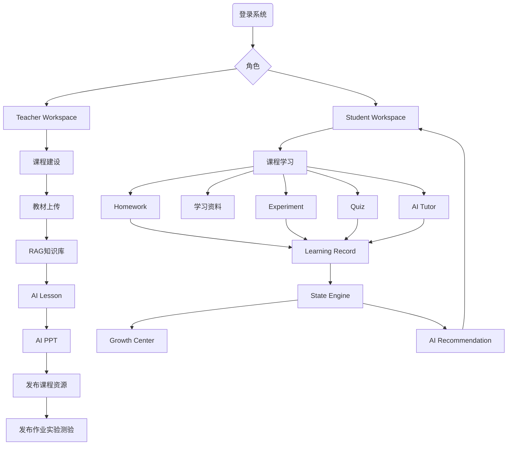

整个产品围绕一个闭环运行。

---

# 第一部分 教师教学业务流程

## 11.3 教师课程建设流程

### 流程目标

教师创建课程，并建立课程知识资产。

---

### 完整流程

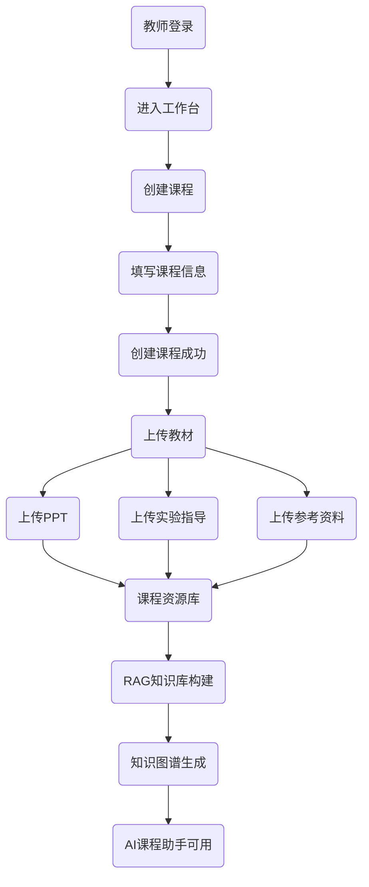

---

### 页面参与

| 页面               | 功能     |
| ---------------- | ------ |
| Workspace        | 创建课程入口 |
| My Courses       | 创建课程   |
| Textbook Center  | 上传教材   |
| Knowledge Center | 查看知识图谱 |

---

### 输出数据

课程创建后生成：

| 数据对象               |
| ------------------ |
| Course             |
| Chapter            |
| Resource           |
| Knowledge Document |
| Knowledge Chunk    |
| Embedding          |

---

## 11.4 教师 AI 教案生成流程

产品目标：

教师 3 分钟完成课程教案。

---

### 流程图

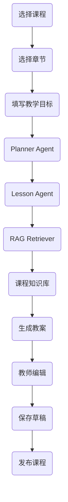

---

### 输入信息

| 输入        | 来源   |
| --------- | ---- |
| Course    | 当前课程 |
| Chapter   | 当前章节 |
| Objective | 教师输入 |
| Duration  | 教师输入 |

---

### 输出结果

教案包括：

- 教学目标
- 教学重点
- 教学难点
- 教学流程
- 课堂案例
- 板书设计
- 课后练习

---

### 页面行为

教师可以：

- AI 重写。
- AI 扩展案例。
- AI 增加互动。
- AI 调整难度。

---

## 11.5 AI PPT 工作流

目标：

自动生成 PPT。

---

### 流程

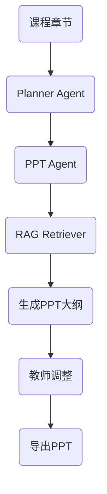

---

输出内容：

每一页包含：

- 标题
- 内容
- 图片建议
- 动画建议
- 演讲备注

---

## 11.6 AI 命题流程

目标：

AI 自动构建题库。

---

### 流程图

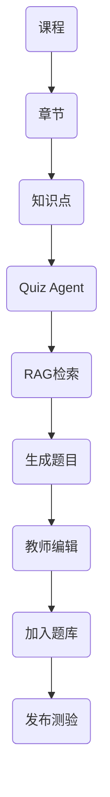

---

支持题型：

| 类型  |
| --- |
| 单选  |
| 多选  |
| 判断  |
| 填空  |
| 编程  |
| 实验  |

---

## 11.7 发布作业流程

教师发布课程任务。

---

### 流程图

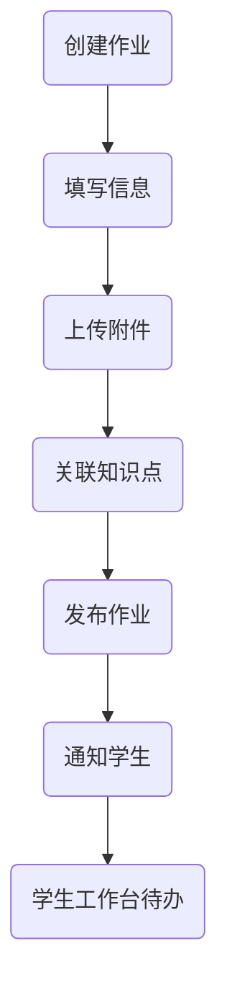

---

### 自动通知

生成：

- Notification
- Workspace Todo

---

## 11.8 教师批改流程

教师查看学生提交。

---

### 流程图

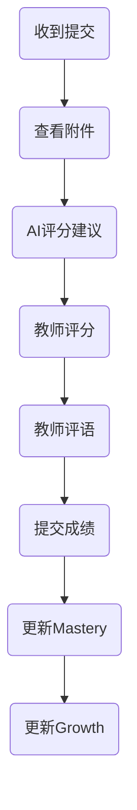

---

AI 建议包括：

- 推荐分数
- 错误分析
- 推荐反馈

教师拥有最终评分权。

---

# 第二部分 学生学习业务流程

## 11.9 学生学习闭环

ProgramMind 学习闭环。

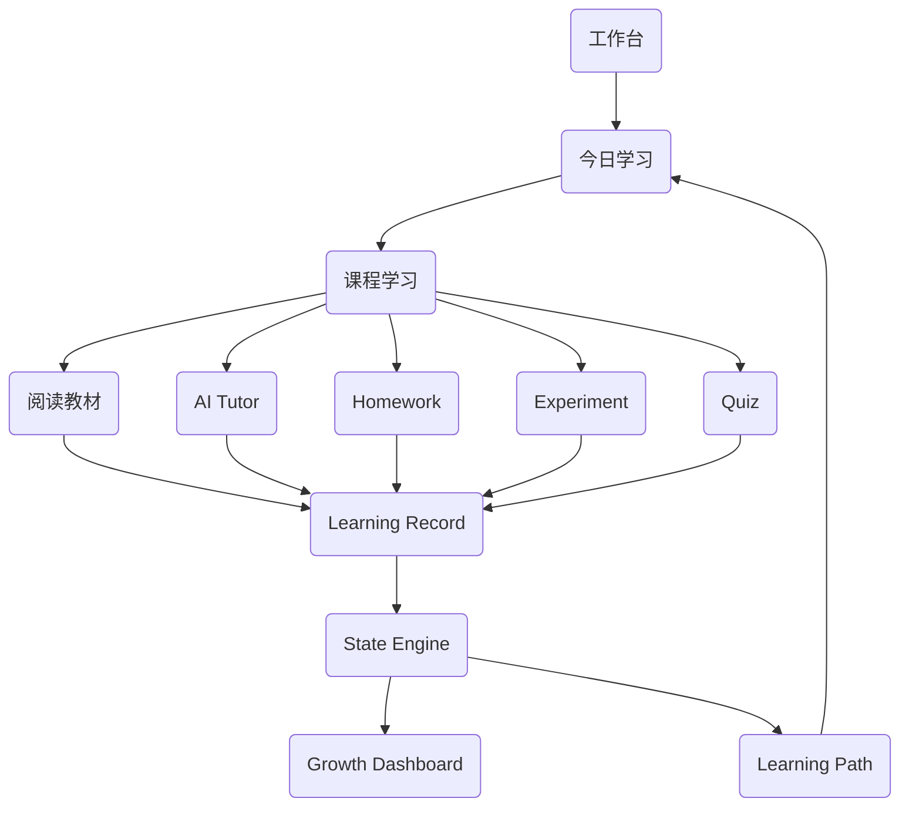

形成持续学习循环。

---

## 11.10 今日学习流程

目标：

AI 自动安排学习任务。

---

### 流程

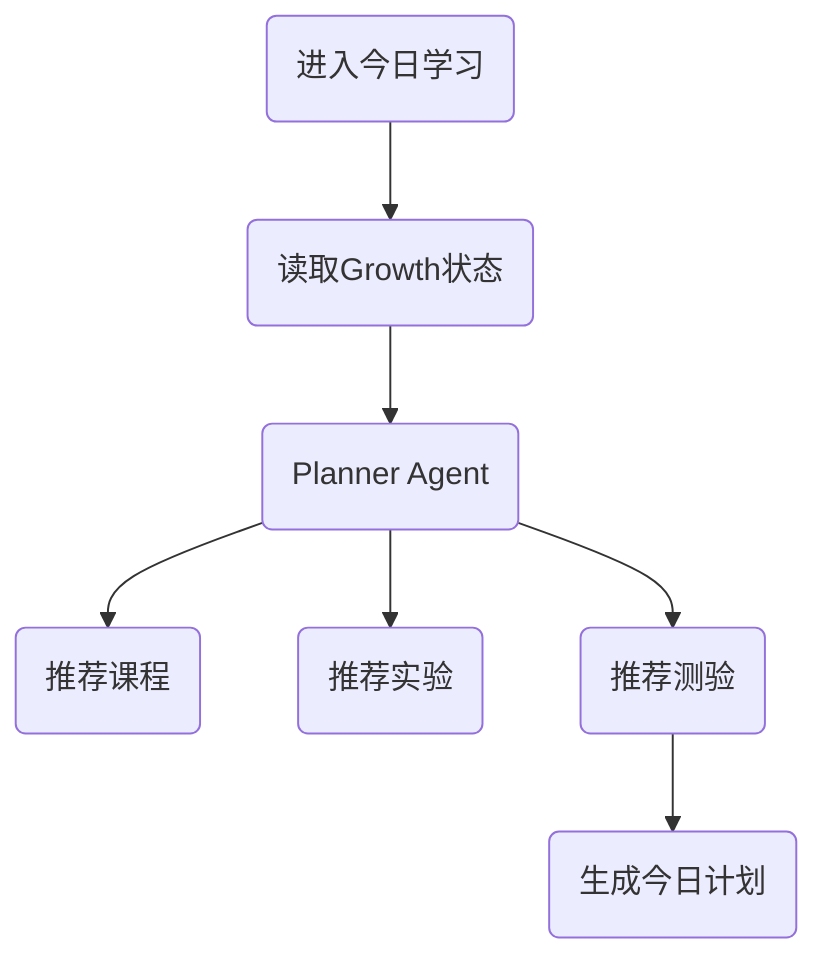

---

输出：

- 今日目标。
- 今日任务。
- 推荐时长。

---

## 11.11 AI Tutor 学习流程（RAG）

这是学生最重要 AI 流程。

---

### 流程图

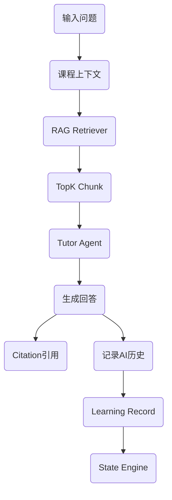

---

### AI Tutor 输出组成

回答包括：

| 内容      |
| ------- |
| AI 回答   |
| 来源教材    |
| 来源章节    |
| 来源课件    |
| 推荐下一知识点 |

---

### Learning Record

记录：

- 问题。
- 回答。
- Token。
- Chunk。
- 时间。

---

## 11.12 AI Debug 学习流程

学生上传代码。

---

### 流程图

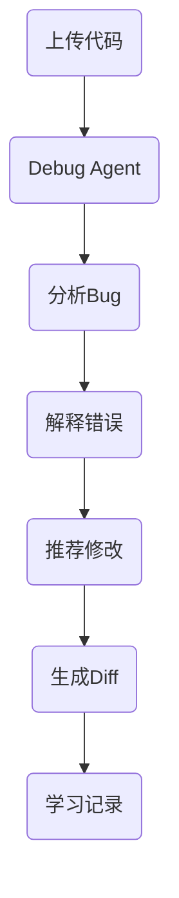

---

AI 输出：

- Bug 类型。
- 修复代码。
- 时间复杂度。
- 最佳实践。

---

## 11.13 Homework 提交流程

学生提交作业。

---

### 流程图

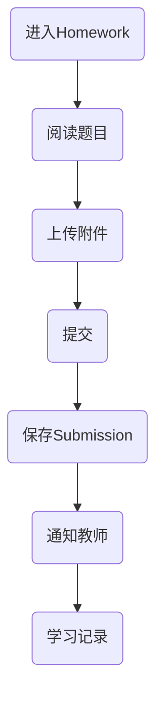

---

支持：

- PDF。
- Word。
- Markdown。
- 图片。
- ZIP。

---

## 11.14 Experiment 提交流程

实验提交流程。

---

### 流程图

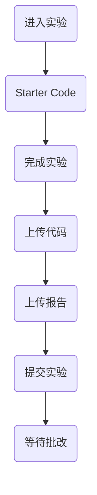

---

实验状态：

- Draft
- Submitted
- Graded

---

## 11.15 Quiz 测验流程

学生完成测验。

---

### 流程图

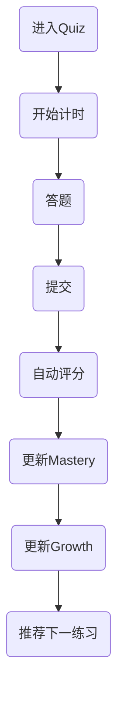

---

评分完成立即更新成长状态。

---

# 第三部分 Growth 状态流转流程

## 11.16 Learning Record 更新流程

所有行为都会进入 Learning Record。

---

### 流程图

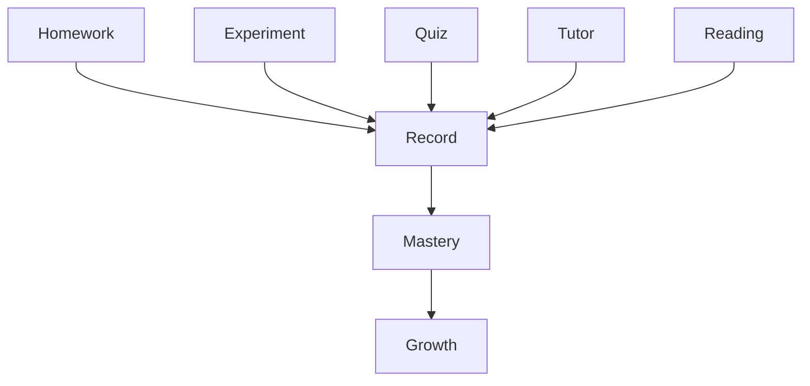

---

Learning Record 保存：

- Event
- Time
- Course
- Chapter
- Duration
- Source

---

## 11.17 Mastery 更新流程

目标：

更新知识掌握度。

---

### 流程图

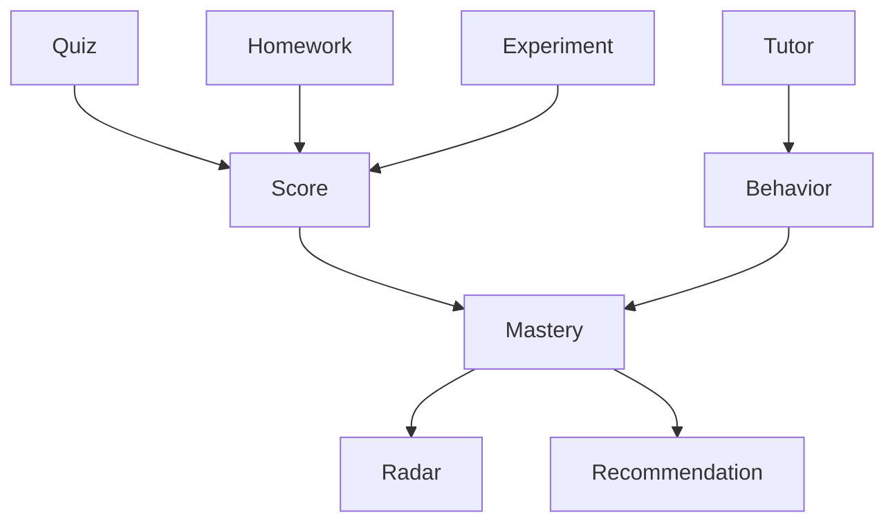

---

掌握度来源：

| 来源         | 权重  |
| ---------- | --- |
| Quiz       | 高   |
| Homework   | 中   |
| Experiment | 中   |
| Tutor      | 低   |

---

## 11.18 Growth Dashboard 更新流程

成长首页刷新流程。

---

### 流程图

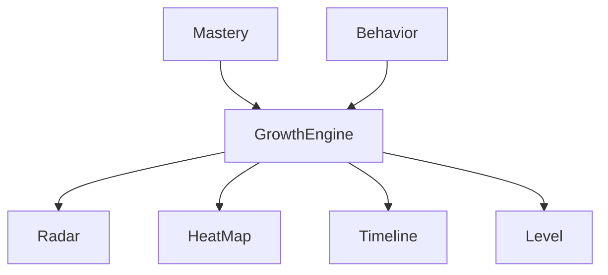

所有成长组件同步更新。

---

## 11.19 风险预测流程

AI 分析风险学生。

---

### 流程图

```mermaid
flowchart TD

Learning Record --> Behavior Analyzer

Mastery --> Risk Analyzer

Behavior Analyzer --> Risk Engine

Risk Analyzer --> Risk Engine

Risk Engine --> Risk Level

Risk Level --> Recommendation
```

输出：

- 风险等级。
- 风险原因。
- AI 干预建议。

---

## 11.20 学习路径推荐流程

学习路径自动生成。

---

### 流程图

```mermaid
flowchart TD

Growth --> Planner Agent

Planner Agent --> Knowledge Graph

Knowledge Graph --> Recommendation

Recommendation --> Daily Plan

Daily Plan --> Workspace
```

输出：

阶段学习计划。

推荐课程。

推荐实验。

推荐 Quiz。

---

# 第四部分 通知系统流程

## 11.21 Notification 生命周期

通知统一进入通知中心。

---

### 流程图

```mermaid
flowchart TD

Homework Publish --> Notification

Quiz Publish --> Notification

Experiment Publish --> Notification

Teacher Grade --> Notification

AI Reminder --> Notification

Notification --> Workspace Badge

Notification --> Drawer

Notification --> History
```

---

通知类型：

| 类型         |
| ---------- |
| Homework   |
| Experiment |
| Quiz       |
| Grade      |
| AI         |
| System     |

支持已读、全部已读、跳转页面。

---

# 第五部分 收藏系统流程

## 11.22 Favorite 流程

支持收藏：

- AI 对话。
- 学习资料。
- 课程资源。
- Prompt。

---

流程：

```mermaid
flowchart TD

Resource --> Favorite

Favorite --> Profile

Favorite --> AI History
```

---

# 第六部分 搜索流程

## 11.23 全局搜索流程

ProgramMind 全局搜索支持：

- Course
- Homework
- Experiment
- Quiz
- Material
- AI History

---

### 流程图

```mermaid
flowchart TD

Search --> Search Service

Search Service --> Course

Search Service --> Homework

Search Service --> Material

Search Service --> AI History

Search Service --> Knowledge Base
```

搜索结果分类展示。

---

# 第七部分 页面状态流转规范

## 11.24 页面生命周期

统一状态。

```mermaid
stateDiagram-v2

[*] --> Loading

Loading --> Success

Loading --> Error

Success --> Refresh

Refresh --> Loading

Success --> Empty

Empty --> Refresh
```

所有页面统一状态机。

---

## 11.25 AI 页面生命周期

```mermaid
stateDiagram-v2

Idle --> Typing

Typing --> Generating

Generating --> Streaming

Streaming --> Finished

Streaming --> Error

Finished --> Idle
```

支持停止生成。

支持重新生成。

---

# 第八部分 Workflow 总览

## 11.26 ProgramMind Workflow 地图

系统共设计 Workflow：

| Workflow           | Agent 数 |
| ------------------ | ------- |
| Lesson Workflow    | 3       |
| PPT Workflow       | 3       |
| Quiz Workflow      | 3       |
| Analytics Workflow | 4       |
| Tutor Workflow     | 2       |
| Review Workflow    | 2       |

Workflow 统一由 Planner Agent 调度。

---

# 本章总结

本章节定义了 ProgramMind 全部核心业务流程，包括：

- 教师课程建设流程。
- AI 教案/PPT/命题流程。
- 学生学习闭环。
- Homework、Experiment、Quiz 生命周期。
- AI Tutor（RAG）流程。
- Growth State Engine 流程。
- Notification 生命周期。
- Search 生命周期。
- AI 页面状态机。

这些流程将作为 DOC02（系统架构）、DOC04（API）、DOC06（Multi-Agent）、DOC07（State Engine）的唯一业务依据。

---

**Part 05 完。下一部分 Part 06 将进入《第十二章 页面交互规范（UI/UX Specification）》**，详细规定 57 个页面的组件规范、按钮行为、表单规则、Drawer/Dialog、上传组件、图表规范、Markdown 编辑器规范、AI 输出规范、移动端规范等。
