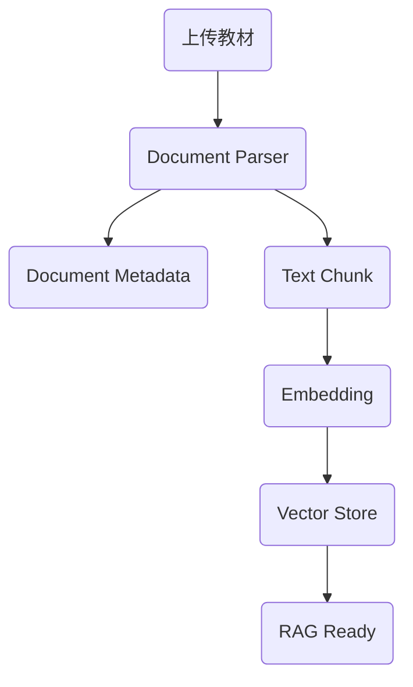
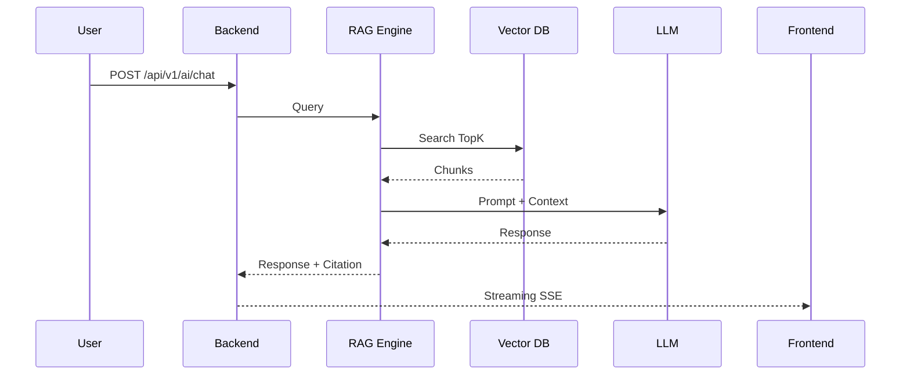

# ProgramMind V2.0 系统总体设计说明书（SDS）

# Part 04A —— AI Engine 架构设计（RAG 与知识库系统）

> 面向开发成员：AI/RAG 成员（负责人）、产品负责人（AI 架构）
> 
> 技术栈：Qwen3 + Ollama + bge-m3 + FAISS（开发版）/ Chroma（正式版）+ LangGraph（Agent）+ FastAPI

---

# 第二十九章 AI Engine 总体架构

## 29.1 AI Engine 定位

AI Engine 是 ProgramMind 的智能能力核心。

区别于 Backend，它不负责权限和 CRUD，而负责 AI 推理能力。

AI Engine 包含八个子系统：

| 子系统                   | 功能             |
| --------------------- | -------------- |
| Knowledge Engine      | 学科知识库管理        |
| RAG Engine            | 知识增强检索         |
| Embedding Engine      | 文本向量化          |
| Prompt Engine         | Prompt 模板管理    |
| Memory Engine         | AI 长短期记忆       |
| Workflow Engine       | Multi-Agent 编排 |
| State Engine          | 学习状态镜像         |
| Recommendation Engine | AI 推荐与预测       |

整个 AI Engine 独立于业务层。

---

## 29.2 AI Engine 架构图

```text
                AI Engine

                User Query
                    │
                    ▼
             Prompt Engine
                    │
                    ▼
            Workflow Planner
                    │
      ┌─────────────┼──────────────┐
      ▼             ▼              ▼
 RAG Retriever   Memory Engine   Tool Router
      │             │              │
      ▼             ▼              ▼
 Knowledge DB   Conversation DB   Service Tools
      │
      ▼
 Embedding Vector DB
      │
      ▼
   TopK Chunks
      │
      ▼
      LLM（Qwen3）
      │
      ▼
 Citation Builder
      │
      ▼
 Streaming Response
```

---

## 29.3 AI Engine 与 Backend 边界

### Backend 负责

- JWT。
- 用户身份。
- 课程权限。
- API。
- 文件上传。

### AI Engine 负责

- 检索知识。
- Prompt 拼接。
- Agent 调度。
- AI 输出。
- Citation。
- Memory。
- Recommendation。

Backend 永远调用 AI Engine，不直接调用模型。

---

# 第三十章 Knowledge Engine（学科知识库）

## 30.1 产品定位

Knowledge Engine 管理所有课程知识资产。

支持：

- 教材 PDF。
- PPT。
- Markdown。
- TXT。
- DOCX。
- 图片 OCR（预留）。

知识库是 RAG 的唯一数据来源。

---

## 30.2 知识库目录结构

```text
knowledge/

├── python/
│   ├── textbook/
│   ├── ppt/
│   ├── experiment/
│   ├── homework/
│   ├── syllabus/
│   └── chunks/
│
├── data_structure/
│
├── computer_network/
│
└── database/
```

每门课程一个目录。

禁止不同课程混放文档。

---

## 30.3 文档生命周期



文档上传一次即可参与 AI 检索。

---

## 30.4 支持文档类型

| 类型        | Parser         |
| --------- | -------------- |
| PDF       | PyMuPDF        |
| DOCX      | python-docx    |
| Markdown  | markdown-it-py |
| TXT       | UTF-8 Reader   |
| PPTX      | python-pptx    |
| Image（预留） | PaddleOCR      |

---

## 30.5 Document Metadata

每个文档必须保存元数据。

字段：

| 字段          | 描述             |
| ----------- | -------------- |
| document_id | UUID           |
| course_id   | 所属课程           |
| title       | 文档标题           |
| type        | PDF/PPT/TXT... |
| source      | 上传来源           |
| author      | 上传教师           |
| upload_time | 上传时间           |
| version     | 文档版本           |

所有 Chunk 必须关联 Document。

---

# 第三十一章 Document Parser（文档解析）

## 31.1 Parser Pipeline

文档解析统一流程。

```text
Upload

↓

Parser Factory

↓

Extract Text

↓

Clean Text

↓

Split Chunk

↓

Save Metadata
```

---

## 31.2 Parser Factory

根据 MIME 自动选择 Parser。

| MIME            | Parser         |
| --------------- | -------------- |
| application/pdf | PDFParser      |
| pptx            | PPTParser      |
| docx            | WordParser     |
| markdown        | MarkdownParser |
| text/plain      | TXTParser      |

---

## 31.3 PDF Parser

输出：

- Page。
- Paragraph。
- Heading。
- Table（预留）。

保留页码。

Citation 使用页码。

---

## 31.4 PPT Parser

解析：

- Slide Title。
- Bullet。
- Note（预留）。

Citation 保留 Slide Number。

---

## 31.5 Markdown Parser

解析：

- Heading。
- Code Block。
- Table。
- List。

保留 Heading Tree。

---

## 31.6 Clean Pipeline

统一文本清洗。

步骤：

- 去空白。
- 去重复换行。
- Unicode 清理。
- 页眉页脚过滤。
- 页码过滤（保留引用）。

---

# 第三十二章 Chunk Engine（文本切分）

## 32.1 Chunk 原则

Chunk 是 RAG 检索最小单位。

目标：

- 语义完整。
- 长度适中。
- 可引用。

---

## 32.2 Chunk 流程

```text
Document

↓

Section Split

↓

Paragraph Split

↓

Sentence Merge

↓

Chunk

↓

Embedding
```

---

## 32.3 Chunk 配置（V2 标准）

| 参数            | 值          |
| ------------- | ---------- |
| Chunk Size    | 500 Tokens |
| Chunk Overlap | 100 Tokens |
| Max Chunk     | 700 Tokens |
| Min Chunk     | 200 Tokens |

所有课程统一。

---

## 32.4 Chunk Metadata

字段：

| 字段          |
| ----------- |
| chunk_id    |
| document_id |
| course_id   |
| chapter     |
| section     |
| page        |
| order       |
| content     |

Citation 必须依赖这些字段。

---

## 32.5 Chunk Storage

数据库：

knowledge_chunk。

向量库保存：

chunk_id → vector。

正文仍保存在 MySQL。

---

# 第三十三章 Embedding Engine

## 33.1 Embedding 模型

默认模型：

**bge-m3**

原因：

- 中文优秀。
- 支持长文本。
- 支持多语言。
- 本地部署方便。

---

## 33.2 Embedding Pipeline

```text
Chunk

↓

Embedding Model

↓

Vector

↓

Vector Store
```

---

## 33.3 Embedding Service

职责：

- Batch Embedding。
- Increment Embedding。
- Update Embedding。
- Delete Embedding。

---

## 33.4 Embedding Metadata

字段：

| 字段           |
| ------------ |
| embedding_id |
| chunk_id     |
| model        |
| dimension    |
| created_at   |

---

## 33.5 向量维度

统一：

1024。

所有课程一致。

禁止混模型。

---

# 第三十四章 Vector Store（向量数据库）

## 34.1 Vector DB 方案

开发版：

FAISS。

正式版：

ChromaDB。

后续支持：

Milvus / Qdrant。

---

## 34.2 Vector Store 目录

```text
vector_store/

python/

data_structure/

network/
```

课程独立索引。

---

## 34.3 Index 生命周期

```mermaid
flowchart TD

Chunk --> Vector

Vector --> Build Index

Build Index --> Save Index

Save Index --> Load Index

Load Index --> Search
```

---

## 34.4 更新策略

上传新文档：

增量 Embedding。

删除文档：

删除 Chunk。

重建索引：

后台任务。

---

# 第三十五章 RAG Retriever（知识增强检索）

## 35.1 Retriever Pipeline

```mermaid
flowchart TD

Question

↓

Rewrite Query

↓

Vector Search

↓

TopK Chunk

↓

Rerank

↓

Prompt Context
```

---

## 35.2 Query Rewrite

目标：

规范用户问题。

例如：

"递归"

↓

"Python课程 递归函数 基础案例"

提高召回率。

---

## 35.3 Vector Search

输入：

Embedding(Query)。

输出：

TopK Chunk。

默认：

Top5。

---

## 35.4 TopK 配置

| 模式      | TopK |
| ------- | ---- |
| Tutor   | 5    |
| Lesson  | 8    |
| PPT     | 10   |
| Summary | 6    |
| Quiz    | 6    |

支持教师修改。

---

## 35.5 Rerank（V2.1）

预留。

流程：

Top20

↓

Reranker

↓

Top5

正式版加入 bge-reranker。

---

## 35.6 Context Builder

负责：

拼 Prompt Context。

格式：

```text
Context1

Context2

Context3

Question
```

所有 Context 带 Citation。

---

# 第三十六章 Citation Engine（引用溯源）

## 36.1 Citation 原则

ProgramMind AI 必须可追溯。

每段回答都有来源。

---

## 36.2 Citation Builder

输出：

```text
📚 Python教材 第四章 P32

📄 实验指导 第二节

📊 PPT 第12页
```

点击打开 Drawer。

---

## 36.3 Citation Metadata

字段：

| 字段         |
| ---------- |
| title      |
| page       |
| chapter    |
| section    |
| chunk_id   |
| similarity |

---

## 36.4 Citation UI 数据格式

返回：

```json
{
"title":"Python教材",
"page":32,
"section":"4.2 递归",
"score":0.91
}
```

前端统一渲染 CitationCard。

---

# 第三十七章 RAG API 生命周期

## 37.1 RAG Chat 请求流程



---

## 37.2 Streaming 输出格式

每段包含：

- token
- citation（最后发送）
- finish_reason

统一 SSE。

---

# 第三十八章 Knowledge Engine Checklist

## 文档解析

- [ ] PDF Parser
- [ ] PPT Parser
- [ ] DOCX Parser
- [ ] Markdown Parser
- [ ] TXT Parser

## Chunk Engine

- [ ] Chunk Splitter
- [ ] Chunk Metadata
- [ ] Chunk Save

## Embedding

- [ ] bge-m3
- [ ] Batch Embedding
- [ ] Increment Embedding

## Vector Store

- [ ] FAISS
- [ ] Chroma
- [ ] Search TopK

## Citation

- [ ] Citation Builder
- [ ] Citation Card
- [ ] Chunk Drawer

## API

- [ ] Upload Knowledge
- [ ] Build Vector
- [ ] Search Knowledge
- [ ] RAG Chat

---

# 本章输出成果

本章节完成 ProgramMind AI Engine 第一部分设计：

- Knowledge Engine。
- Document Parser。
- Chunk Engine。
- Embedding Engine。
- Vector Store。
- RAG Retriever。
- Citation Engine。
- RAG Streaming 生命周期。

这是 AI/RAG 成员第一阶段必须完成的开发内容。

---

**DOC02 Part 04A 完成。**
