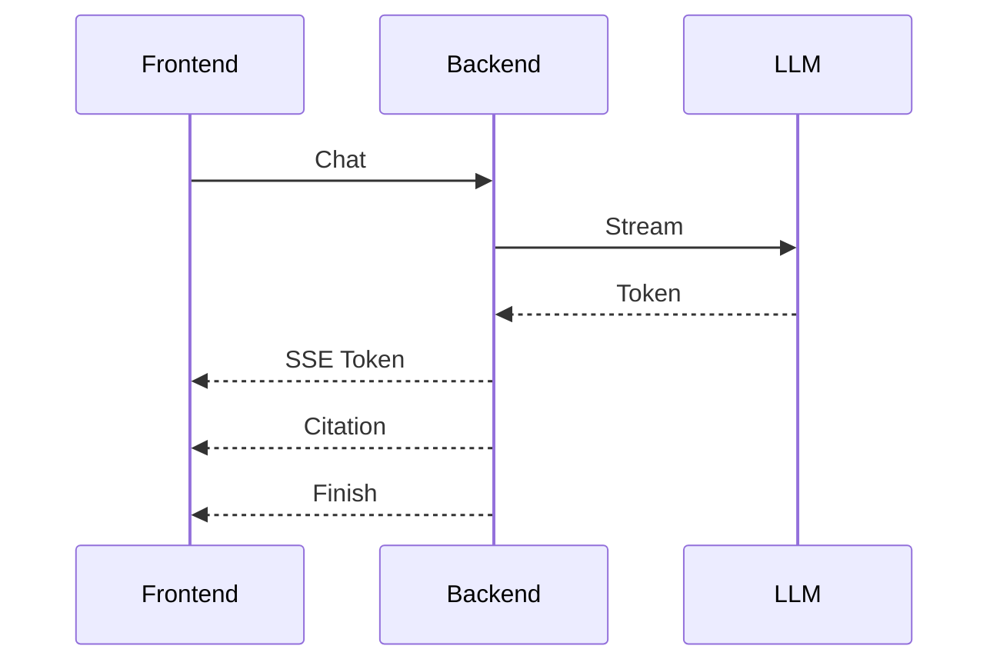

# ProgramMind V2.0 系统总体设计说明书（SDS）

# Part 04C —— AI Engine 架构设计（Prompt、Memory、Conversation、AI API）

> 面向开发成员：AI/RAG 成员、Backend 成员（接口对接）、产品负责人
> 
> 技术栈：FastAPI + LangGraph + Ollama(Qwen3) + MySQL + Redis(预留)

---

# 第五十五章 Prompt Engine（Prompt 模板引擎）

## 55.1 Prompt Engine 定位

Prompt Engine 是所有 Agent 的 Prompt 管理中心。

职责：

- Prompt 模板统一维护。
- 动态变量注入。
- RAG Context 注入。
- Memory 注入。
- Tool 返回注入。
- System Prompt 管理。

任何 Agent **禁止在代码中拼 Prompt 字符串**。

所有 Prompt 必须来自 Prompt Engine。

---

## 55.2 Prompt 生命周期

```text
用户请求
    │
    ▼
Task Router
    │
    ▼
Prompt Template
    │
    ▼
变量注入
    │
    ▼
RAG Context 注入
    │
    ▼
Memory 注入
    │
    ▼
LLM Prompt
```

---

## 55.3 Prompt 分类

目录结构：

```text
prompt/

system/

teacher.md

student.md

tutor/

answer.md

lesson_plan/

lesson.md

ppt.md

quiz/

choice.md

coding.md

analysis.md

growth/

summary.md

recommendation.md
```

Prompt 文件全部 Markdown。

禁止写入 Python。

---

## 55.4 Prompt Template 变量

统一变量格式：

```text
{{course}}

{{chapter}}

{{knowledge}}

{{context}}

{{memory}}

{{question}}
```

Prompt Engine 自动替换。

---

## 55.5 System Prompt（教师）

职责：

规定 AI 身份。

包含：

- ProgramMind 教师助手。
- 高校课程规范。
- 输出 Markdown。
- 引用知识来源。

禁止模型虚构教材来源。

---

## 55.6 System Prompt（学生）

职责：

ProgramMind AI Tutor。

要求：

- 面向大学生。
- 优先教材内容。
- 不直接给答案。
- 提供学习建议。

---

## 55.7 Prompt Builder

输入：

Task。

Course。

Memory。

Context。

输出：

最终 Prompt。

Builder 不调用模型。

---

# 第五十六章 Memory Engine（记忆引擎）

## 56.1 Memory 分类

ProgramMind Memory 分三层。

| Memory              | 生命周期   |
| ------------------- | ------ |
| Conversation Memory | 当前聊天   |
| Session Memory      | 当前登录   |
| Long Memory         | 长期学习画像 |

---

## 56.2 Conversation Memory

保存：

当前 AI 对话。

结构：

```text
User

Assistant

User

Assistant
```

限制窗口长度。

默认：

最近 8 轮。

---

## 56.3 Session Memory

保存：

当前用户一次登录期间所有 AI 行为。

包括：

- Tutor。
- Lesson。
- Quiz。
- Debug。

Session 退出清空。

---

## 56.4 Long Memory

长期保存学习行为。

来源：

Learning Record。

Homework。

Quiz。

Experiment。

Mastery。

AI Conversation。

生成用户学习画像。

---

## 56.5 Memory 生命周期

```mermaid
flowchart TD

Conversation

↓

Save Memory

↓

Summarize Memory

↓

Long Memory

↓

Retrieve Memory
```

---

## 56.6 Memory Summarizer

超过窗口长度。

自动摘要。

摘要加入 Long Memory。

保留：

学习目标。

知识点。

问题偏好。

不会保留全部聊天。

---

## 56.7 Memory 检索策略

AI 调用 Memory。

优先：

最近 Memory。

再查询：

长期 Memory。

最后查询：

Growth Memory。

---

# 第五十七章 Conversation Engine

## 57.1 Conversation Engine 定位

Conversation 管理 AI 聊天。

支持：

多会话。

历史恢复。

流式回复。

引用恢复。

---

## 57.2 Conversation 生命周期

```text
Create Conversation

↓

Append Message

↓

AI Reply

↓

Append Citation

↓

Save Memory
```

---

## 57.3 Conversation 数据结构

Conversation：

| 字段              |
| --------------- |
| conversation_id |
| user_id         |
| role            |
| title           |
| created_at      |
| updated_at      |

Message：

| 字段              |
| --------------- |
| message_id      |
| conversation_id |
| sender          |
| content         |
| citations       |
| token           |
| created_at      |

---

## 57.4 Conversation Title

首次聊天自动生成标题。

规则：

用户第一句话摘要。

例如：

Python递归函数问答。

---

## 57.5 Message Metadata

Message 保存：

- Markdown。
- Citation。
- Tool。
- Agent。
- Token。

方便恢复历史。

---

# 第五十八章 Streaming Engine（流式输出）

## 58.1 Streaming 定位

ProgramMind 所有 AI 回复统一 SSE。

禁止一次性返回全部文本。

---

## 58.2 Streaming 生命周期



---

## 58.3 SSE Event 类型

| Event    | 描述             |
| -------- | -------------- |
| token    | 文本 Token       |
| citation | 引用             |
| tool     | Tool 调用结果      |
| workflow | Agent Timeline |
| finish   | 回复完成           |

---

## 58.4 SSE Token 数据格式

```json
{
"type":"token",
"content":"递归函数..."
}
```

---

## 58.5 Citation Event

```json
{
"type":"citation",
"title":"Python教材",
"page":32
}
```

前端统一渲染。

---

## 58.6 Workflow Event

Planner 工作流 Timeline。

返回：

当前 Agent。

状态。

耗时。

---

# 第五十九章 Token Engine（Token 管理）

## 59.1 Token Engine 定位

统计 AI 调用成本。

用于：

日志。

性能。

排行榜（预留）。

---

## 59.2 Token 生命周期

Prompt Tokens。

Completion Tokens。

Total Tokens。

保存数据库。

---

## 59.3 Token Metadata

字段：

| 字段                |
| ----------------- |
| prompt_tokens     |
| completion_tokens |
| total_tokens      |
| latency           |
| model             |

---

## 59.4 Token Dashboard（教师后台预留）

统计：

课程 AI 使用次数。

学生 AI 使用次数。

模型 Token 消耗。

平均响应时间。

---

# 第六十章 AI API 设计

## 60.1 AI API 总览

统一 `/api/v1/ai`

| API                  | 功能              |
| -------------------- | --------------- |
| POST /chat           | Tutor 问答        |
| POST /lesson-plan    | 教案生成            |
| POST /ppt            | PPT 生成          |
| POST /quiz           | AI 命题           |
| POST /summary        | 内容总结            |
| POST /debug          | AI 调试           |
| POST /workflow       | Multi-Agent 工作流 |
| GET /conversation    | 获取历史            |
| DELETE /conversation | 删除历史            |

---

## 60.2 Chat API 请求

字段：

conversation_id。

course_id。

chapter。

question。

stream。

---

## 60.3 Chat API 返回

SSE：

Token。

Citation。

Finish。

---

## 60.4 Lesson API

输入：

课程。

章节。

目标。

输出：

Markdown 教案。

Citation。

---

## 60.5 Workflow API

输入：

任务。

Planner 自动生成 Workflow。

输出：

Timeline。

最终结果。

---

# 第六十一章 AI 数据库设计

## 61.1 ai_conversations

字段：

| 字段         |
| ---------- |
| id         |
| user_id    |
| role       |
| title      |
| created_at |
| updated_at |

---

## 61.2 ai_messages

字段：

| 字段              |
| --------------- |
| id              |
| conversation_id |
| sender          |
| content         |
| citations       |
| token           |
| latency         |
| created_at      |

---

## 61.3 ai_workflows

字段：

| 字段          |
| ----------- |
| workflow_id |
| user_id     |
| task        |
| planner     |
| status      |
| created_at  |

---

## 61.4 ai_workflow_steps

字段：

| 字段          |
| ----------- |
| step_id     |
| workflow_id |
| agent       |
| input       |
| output      |
| duration    |
| status      |

---

## 61.5 ai_memories

字段：

| 字段         |
| ---------- |
| memory_id  |
| user_id    |
| type       |
| summary    |
| vector_id  |
| created_at |

---

## 61.6 ai_token_logs

字段：

| 字段                |
| ----------------- |
| log_id            |
| conversation_id   |
| model             |
| prompt_tokens     |
| completion_tokens |
| total_tokens      |
| latency           |

---

# 第六十二章 AI Cache（Redis 预留）

## 62.1 Cache 分类

| Cache              | TTL     |
| ------------------ | ------- |
| Embedding Cache    | 永久      |
| Search Cache       | 10 min  |
| Conversation Cache | Session |
| Workflow Cache     | 30 min  |

---

## 62.2 Search Cache

缓存 TopK Chunk。

减少重复向量检索。

---

## 62.3 Workflow Cache

缓存 Planner DAG。

避免重复规划。

---

# 第六十三章 AI Logging

## 63.1 AI 日志分类

chat.log。

workflow.log。

tool.log。

rag.log。

---

## 63.2 Chat Log

保存：

问题。

课程。

模型。

Token。

耗时。

---

## 63.3 Workflow Log

保存：

Planner。

Agent Timeline。

失败节点。

---

## 63.4 Tool Log

保存：

调用工具。

参数。

返回结果。

---

# 第六十四章 AI Security

## 64.1 Prompt Injection 防护

所有用户输入：

包裹 Delimiter。

禁止覆盖 System Prompt。

---

## 64.2 Citation 校验

Citation 必须来自 Chunk。

禁止模型生成 Citation。

---

## 64.3 HTML 输出安全

AI 输出 Markdown。

统一 Markdown Parser。

禁止 v-html。

---

## 64.4 Conversation 权限

Conversation 只能本人访问。

Workflow 同样。

---

# 第六十五章 AI Checklist（最终）

## Prompt Engine

- [ ] Prompt Loader
- [ ] Prompt Builder
- [ ] Template Variable
- [ ] System Prompt

## Memory Engine

- [ ] Conversation Memory
- [ ] Session Memory
- [ ] Long Memory
- [ ] Memory Summarizer

## Conversation

- [ ] Conversation CRUD
- [ ] Message CRUD
- [ ] Conversation Title

## Streaming

- [ ] SSE Token
- [ ] Citation Event
- [ ] Workflow Event

## Token Engine

- [ ] Token Logger
- [ ] Latency Logger
- [ ] Dashboard API

## AI API

- [ ] Chat API
- [ ] Lesson API
- [ ] Quiz API
- [ ] Workflow API
- [ ] Conversation API

## Database

- [ ] ai_conversations
- [ ] ai_messages
- [ ] ai_workflows
- [ ] ai_workflow_steps
- [ ] ai_memories
- [ ] ai_token_logs

---

# 本章输出成果

ProgramMind AI Engine 全部设计完成：

- Prompt Engine。
- Memory Engine。
- Conversation Engine。
- Streaming SSE。
- Token Engine。
- AI API。
- AI 数据库。
- AI Logging。
- AI Security。

至此 ProgramMind AI 底座设计完成，可直接进入 AI 模块开发阶段。

---

**DOC02 Part04C 完成。**
