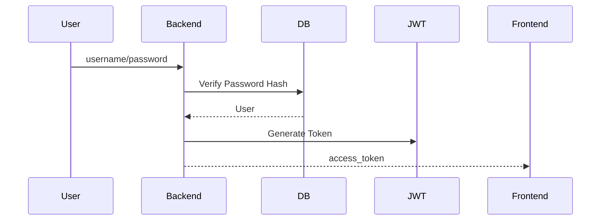

# ProgramMind V2.0 数据库设计说明书（DDS）

# Part 02 —— 用户中心数据库设计（Users / Profiles / Majors / Enrollments）

> 面向开发成员：Backend（数据库负责人）
> 
> 技术栈：MySQL 8.0 + SQLAlchemy 2.x + Alembic

---

# 第十一章 用户中心数据库设计

## 11.1 模块职责

用户中心负责整个 ProgramMind 的身份体系。

负责：

- 登录认证。
- 教师 / 学生身份。
- 学院专业信息。
- 用户资料。
- 学生选课关系。

这一模块是所有业务模块的入口。

---

## 11.2 ER 图（用户中心）

```text
majors
   │
   │1
   │
   ▼N
users
   │1
   ▼1
user_profiles

users
   │1
   ▼N
enrollments
   ▲N
   │
courses
```

---

## 11.3 数据表清单

| 表名            | 描述      |
| ------------- | ------- |
| users         | 用户账号表   |
| user_profiles | 用户详细资料表 |
| majors        | 专业信息表   |
| enrollments   | 学生选课表   |

共四张表。

---

# 第十二章 users（用户账号表）

## 12.1 表定位

保存系统账号。

不保存学习数据。

所有模块通过 user_id 建立关系。

---

## 12.2 字段设计

| 字段            | 类型           | 约束              | 说明                        |
| ------------- | ------------ | --------------- | ------------------------- |
| id            | CHAR(36)     | PK              | UUID 主键                   |
| username      | VARCHAR(50)  | UNIQUE NOT NULL | 登录账号                      |
| password_hash | VARCHAR(255) | NOT NULL        | 密码哈希                      |
| role          | ENUM         | NOT NULL        | student / teacher / admin |
| name          | VARCHAR(50)  | NOT NULL        | 用户姓名                      |
| email         | VARCHAR(100) | UNIQUE          | 邮箱                        |
| phone         | VARCHAR(20)  | NULL            | 手机号                       |
| major_id      | CHAR(36)     | FK              | 学生专业                      |
| school        | VARCHAR(100) | NULL            | 学院                        |
| status        | ENUM         | DEFAULT active  | active / disabled         |
| avatar_url    | VARCHAR(255) | NULL            | 头像 URL                    |
| created_at    | DATETIME     | NOT NULL        | 创建时间                      |
| updated_at    | DATETIME     | NOT NULL        | 更新时间                      |

---

## 12.3 字段说明

### role

统一三种角色。

| 值       | 描述        |
| ------- | --------- |
| student | 学生        |
| teacher | 教师        |
| admin   | 管理员（V2预留） |

---

### status

账号状态。

| 状态       | 描述      |
| -------- | ------- |
| active   | 正常      |
| disabled | 禁用      |
| deleted  | 软删除（预留） |

---

### password_hash

统一使用：

Werkzeug Password Hash。

禁止保存明文密码。

密码格式：

```
pbkdf2:sha256:600000:xxxxx
```

---

## 12.4 SQLAlchemy Model

```python
class User(Base):
    __tablename__ = "users"

    id = mapped_column(...)
    username = mapped_column(...)
    password_hash = mapped_column(...)
    role = mapped_column(...)
```

禁止 password 字段。

---

## 12.5 索引设计

| 索引名称              | 字段              |
| ----------------- | --------------- |
| idx_user_username | username UNIQUE |
| idx_user_email    | email UNIQUE    |
| idx_user_role     | role            |
| idx_user_major    | major_id        |

---

## 12.6 接口关联

| API                 | 用途   |
| ------------------- | ---- |
| POST /auth/register | 创建用户 |
| POST /auth/login    | 登录   |
| GET /auth/me        | 当前用户 |
| PATCH /profile      | 修改资料 |

---

## 12.7 Demo 升级点

Demo：

password 明文。

V2：

password_hash。

JWT 登录。

统一 UUID。

---

# 第十三章 user_profiles（用户资料表）

## 13.1 表定位

扩展用户信息。

与 users 一对一。

避免 users 字段膨胀。

---

## 13.2 字段设计

| 字段             | 类型          | 描述                    |
| -------------- | ----------- | --------------------- |
| id             | CHAR(36)    | PK                    |
| user_id        | CHAR(36)    | UNIQUE FK             |
| title          | VARCHAR(50) | 教师职称                  |
| grade          | VARCHAR(20) | 学生年级                  |
| class_name     | VARCHAR(50) | 班级                    |
| student_number | VARCHAR(30) | 学号                    |
| teacher_number | VARCHAR(30) | 工号                    |
| bio            | TEXT        | 简介                    |
| interests      | JSON        | 兴趣标签                  |
| do_not_disturb | BOOLEAN     | 消息免打扰                 |
| theme          | ENUM        | light / dark / system |
| created_at     | DATETIME    | 创建时间                  |
| updated_at     | DATETIME    | 更新时间                  |

---

## 13.3 JSON 字段说明

interests 示例：

```json
[
  "Python",
  "机器学习",
  "算法设计"
]
```

用于 AI 推荐课程。

---

## 13.4 索引设计

| 索引                | 字段             |
| ----------------- | -------------- |
| idx_profile_user  | user_id UNIQUE |
| idx_profile_grade | grade          |
| idx_profile_class | class_name     |

---

## 13.5 API 对应

| API                   | 功能   |
| --------------------- | ---- |
| GET /profile          | 查询资料 |
| PATCH /profile        | 修改资料 |
| PATCH /profile/theme  | 修改主题 |
| PATCH /profile/avatar | 修改头像 |

---

## 13.6 与 AI Engine 的关系

Growth Engine。

Recommendation Agent。

读取：

- grade
- interests
- major

用于推荐学习内容。

---

# 第十四章 majors（专业信息表）

## 14.1 表定位

维护高校专业目录。

用于注册。

用于课程推荐。

用于课程过滤。

---

## 14.2 字段设计

| 字段         | 类型           | 描述      |
| ---------- | ------------ | ------- |
| id         | CHAR(36)     | PK      |
| code       | VARCHAR(20)  | 专业代码    |
| name       | VARCHAR(100) | 专业名称    |
| school     | VARCHAR(100) | 所属学院    |
| degree     | VARCHAR(20)  | 本科 / 专科 |
| status     | BOOLEAN      | 是否启用    |
| created_at | DATETIME     | 创建时间    |

---

## 14.3 初始化专业

第一批初始化：

| code      | 专业         |
| --------- | ---------- |
| AI240581  | 人工智能       |
| CS240101  | 计算机科学与技术   |
| SE240201  | 软件工程       |
| DS240301  | 数据科学与大数据技术 |
| NET240401 | 网络工程       |

Demo 中 majors API 改为数据库读取。

---

## 14.4 索引设计

| 索引               | 字段          |
| ---------------- | ----------- |
| idx_major_code   | code UNIQUE |
| idx_major_school | school      |

---

## 14.5 API

| API                 | 功能       |
| ------------------- | -------- |
| GET /courses/majors | 专业列表     |
| GET /majors         | 后台管理（预留） |

---

## 14.6 推荐课程逻辑

AI 根据专业推荐课程。

例如：

人工智能：

推荐 Python。

推荐 数据结构。

推荐 计算机网络。

---

# 第十五章 enrollments（学生选课表）

## 15.1 表定位

用户与课程多对多关系。

学生一门课一条记录。

---

## 15.2 ER 图

```text
users

1

N enrollments N

1 courses
```

---

## 15.3 字段设计

| 字段                 | 类型           | 描述                             |
| ------------------ | ------------ | ------------------------------ |
| id                 | CHAR(36)     | PK                             |
| student_id         | CHAR(36)     | FK users                       |
| course_id          | CHAR(36)     | FK courses                     |
| progress           | DECIMAL(5,2) | 学习进度                           |
| completed_chapters | INT          | 完成章节                           |
| status             | ENUM         | learning / completed / dropped |
| enrolled_at        | DATETIME     | 选课时间                           |
| updated_at         | DATETIME     | 更新时间                           |

---

## 15.4 状态说明

| 状态        | 描述   |
| --------- | ---- |
| learning  | 学习中  |
| completed | 完成课程 |
| dropped   | 退课   |

---

## 15.5 唯一约束

联合唯一。

(student_id, course_id)

禁止重复选课。

---

## 15.6 索引设计

| 索引                        | 字段                           |
| ------------------------- | ---------------------------- |
| idx_enroll_student        | student_id                   |
| idx_enroll_course         | course_id                    |
| idx_enroll_status         | status                       |
| idx_enroll_student_course | UNIQUE(student_id,course_id) |

---

## 15.7 API 对应

| API                             | 功能   |
| ------------------------------- | ---- |
| POST /learn/enroll              | 学生选课 |
| DELETE /learn/enroll            | 学生退课 |
| GET /learn/courses              | 我的课程 |
| GET /teach/course/{id}/students | 学生名单 |

---

## 15.8 Progress 更新规则

Progress 来源：

Homework。

Quiz。

Experiment。

Chapter。

自动聚合。

公式：

```
课程进度 =
章节完成40%
+
作业完成20%
+
实验完成20%
+
测验完成20%
```

后台自动更新。

---

# 第十六章 用户中心 Repository 设计

## 16.1 Repository 目录

```
repositories/

user_repository.py

major_repository.py

enrollment_repository.py
```

Repository 不写业务逻辑。

只负责数据库。

---

## 16.2 UserRepository

负责：

- get_user
- create_user
- update_user
- delete_user
- verify_password

---

## 16.3 MajorRepository

负责：

- get_major_list
- get_major
- search_major

---

## 16.4 EnrollmentRepository

负责：

- enroll_course
- drop_course
- get_student_courses
- get_course_students
- update_progress

---

# 第十七章 用户中心 Service 设计

## 17.1 Service 职责

Service 负责业务。

Repository 负责数据库。

---

## 17.2 AuthService

方法：

| 方法             | 描述   |
| -------------- | ---- |
| register()     | 注册   |
| login()        | 登录   |
| logout()       | 登出   |
| current_user() | 当前用户 |

---

## 17.3 ProfileService

方法：

更新资料。

上传头像。

更新主题。

更新简介。

更新兴趣。

---

## 17.4 EnrollmentService

方法：

学生选课。

退课。

同步课程人数。

初始化掌握度。

初始化成长画像。

---

# 第十八章 用户中心 Pydantic Schema

## 18.1 RegisterRequest

字段：

username。

password。

name。

role。

major_id。

school。

---

## 18.2 LoginRequest

字段：

username。

password。

---

## 18.3 UserResponse

返回：

id。

name。

role。

avatar。

major。

school。

theme。

---

## 18.4 ProfileUpdateRequest

允许修改：

bio。

avatar。

theme。

interests。

phone。

email。

---

# 第十九章 JWT 登录流程

## 19.1 登录流程



---

## 19.2 Token Payload

包含：

user_id。

role。

username。

exp。

---

## 19.3 Token 生命周期

| Token         | 时间        |
| ------------- | --------- |
| Access Token  | 8 小时      |
| Refresh Token | 7 天（V2.1） |

---

## 19.4 鉴权中间件

所有接口：

Depends(CurrentUser)

自动解析 JWT。

---

# 第二十章 初始化数据（Seed）

## 20.1 Demo 教师账号

初始化：

| 用户              | 角色      |
| --------------- | ------- |
| teacher_python  | teacher |
| teacher_network | teacher |
| teacher_ds      | teacher |

密码：

123456（首次登录要求修改，V2）

---

## 20.2 Demo 学生账号

初始化：

student_ai。

student_cs。

student_demo。

---

## 20.3 Major Seed

自动插入 majors。

首次 migration 执行。

---

# 第二十一章 用户中心 Checklist

## 数据表

- [ ] users
- [ ] user_profiles
- [ ] majors
- [ ] enrollments

## Repository

- [ ] UserRepository
- [ ] ProfileRepository
- [ ] EnrollmentRepository

## Service

- [ ] AuthService
- [ ] ProfileService
- [ ] EnrollmentService

## Schema

- [ ] RegisterRequest
- [ ] LoginRequest
- [ ] UserResponse
- [ ] ProfileUpdateRequest

## JWT

- [ ] Password Hash
- [ ] Access Token
- [ ] CurrentUser Dependency

---

# 本章输出成果

用户中心数据库设计完成。

Backend 成员完成本章节后，可以实现：

- 登录注册
- JWT 鉴权
- 用户资料
- 专业列表
- 学生选课
- 我的课程入口

该模块完成后即可进入课程中心数据库开发。

---

**DOC03 Part02 完成。**
