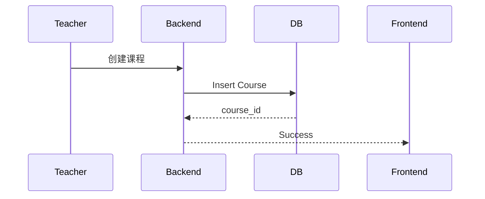

# ProgramMind V2.0 数据库设计说明书（DDS）

# Part 03 —— 课程中心数据库设计（Courses / Chapters / Course Resources）

> 面向开发成员：Backend（数据库负责人）、Frontend（课程模块负责人）、AI/RAG 成员
> 
> 技术栈：MySQL 8.0 + SQLAlchemy 2.x

---

# 第二十二章 课程中心总体设计

## 22.1 模块定位

课程中心是 ProgramMind 的核心业务模块。

所有教学、学习、RAG 都依赖课程。

负责：

- 教师创建课程
- 学生选课
- 课程章节管理
- 教材资源管理
- AI 知识库入口
- 学情统计入口

---

## 22.2 模块关系图

```text
Teacher
   │
   ▼
Courses
   │
   ├───────────────┐
   ▼               ▼
Chapters      CourseResources
   │               │
   ▼               ▼
KnowledgeDocuments（RAG）
```

课程是一切业务主实体。

---

## 22.3 数据表清单

| 表名               | 描述              |
| ---------------- | --------------- |
| courses          | 课程主表            |
| chapters         | 课程章节树           |
| course_resources | 教材 / PPT / 实验资源 |

三张表。

---

# 第二十三章 courses（课程主表）

## 23.1 表定位

课程主数据。

每门课程一条记录。

Demo 中课程 JSON 全部迁移到这里。

---

## 23.2 字段设计

| 字段               | 类型           | 描述                                 |
| ---------------- | ------------ | ---------------------------------- |
| id               | CHAR(36)     | UUID 主键                            |
| course_code      | VARCHAR(30)  | 课程编号                               |
| course_name      | VARCHAR(100) | 课程名称                               |
| teacher_id       | CHAR(36)     | FK users                           |
| major_id         | CHAR(36)     | FK majors                          |
| semester         | VARCHAR(30)  | 学期                                 |
| cover_url        | VARCHAR(255) | 封面图                                |
| description      | TEXT         | 课程简介                               |
| difficulty       | ENUM         | beginner / intermediate / advanced |
| credit           | DECIMAL(3,1) | 学分                                 |
| status           | ENUM         | draft / published / archived       |
| chapter_count    | INT          | 章节数量                               |
| student_count    | INT          | 学生数量                               |
| homework_count   | INT          | 作业数量                               |
| experiment_count | INT          | 实验数量                               |
| quiz_count       | INT          | 测验数量                               |
| created_at       | DATETIME     | 创建时间                               |
| updated_at       | DATETIME     | 更新时间                               |

---

## 23.3 字段说明

### course_code

统一规范。

例如：

| 编号    | 课程         |
| ----- | ---------- |
| PY101 | Python程序设计 |
| DS201 | 数据结构       |
| CN301 | 计算机网络      |

唯一索引。

---

### difficulty

课程难度。

| 值            | 描述  |
| ------------ | --- |
| beginner     | 入门  |
| intermediate | 中级  |
| advanced     | 高级  |

AI 推荐课程依据之一。

---

### semester

示例：

```
2026-2027-1
2026秋季
```

统一字符串。

---

### status

课程生命周期。

| 状态        | 描述  |
| --------- | --- |
| draft     | 草稿  |
| published | 已发布 |
| archived  | 已归档 |

只有 published 可选课。

---

## 23.4 SQLAlchemy Model

目录：

```
models/course.py
```

一个 Model。

关联：

Teacher。

Major。

Chapters。

Resources。

Enrollments。

---

## 23.5 索引设计

| 索引                  | 字段                 |
| ------------------- | ------------------ |
| idx_course_code     | course_code UNIQUE |
| idx_course_teacher  | teacher_id         |
| idx_course_major    | major_id           |
| idx_course_status   | status             |
| idx_course_semester | semester           |

---

## 23.6 API 映射

| API                        | 功能   |
| -------------------------- | ---- |
| GET /courses               | 课程广场 |
| GET /courses/{id}          | 课程详情 |
| POST /teach/courses        | 创建课程 |
| PATCH /teach/courses/{id}  | 编辑课程 |
| DELETE /teach/courses/{id} | 删除课程 |

---

## 23.7 创建课程流程



课程创建成功后自动创建空章节树。

---

## 23.8 Demo 升级点

Demo：

按钮未调用接口。

V2：

真实创建课程。

课程进入课程广场。

学生可选课。

---

# 第二十四章 chapters（课程章节树）

## 24.1 表定位

课程章节目录。

支持无限扩展。

支持知识点关联。

---

## 24.2 ER 图

```text
Course

1

N Chapters

1

N Knowledge Documents
```

---

## 24.3 字段设计

| 字段              | 类型           | 描述             |
| --------------- | ------------ | -------------- |
| id              | CHAR(36)     | UUID           |
| course_id       | CHAR(36)     | FK courses     |
| parent_id       | CHAR(36)     | FK chapters，可空 |
| chapter_number  | VARCHAR(20)  | 章节编号           |
| title           | VARCHAR(150) | 标题             |
| description     | TEXT         | 描述             |
| level           | INT          | 层级             |
| sort_order      | INT          | 排序             |
| knowledge_count | INT          | 知识点数量          |
| created_at      | DATETIME     | 创建时间           |
| updated_at      | DATETIME     | 更新时间           |

---

## 24.4 支持章节树

示例：

```text
第一章 Python基础

1.1 Python简介

1.2 环境安装

第二章 数据类型

2.1 数字

2.2 字符串

2.3 List
```

parent_id 支持树结构。

---

## 24.5 level 定义

| level | 描述      |
| ----- | ------- |
| 1     | 一级章节    |
| 2     | 二级章节    |
| 3     | 知识点（预留） |

---

## 24.6 sort_order

控制课程目录顺序。

前端不排序字符串。

数据库直接排序。

---

## 24.7 API

| API                         | 功能   |
| --------------------------- | ---- |
| GET /courses/{id}/chapters  | 获取章节 |
| POST /teach/chapters        | 创建章节 |
| PATCH /teach/chapters/{id}  | 编辑章节 |
| DELETE /teach/chapters/{id} | 删除章节 |

---

## 24.8 AI 使用章节

Tutor Agent。

Lesson Agent。

Quiz Agent。

Retriever 默认限制章节范围。

---

## 24.9 索引设计

| 索引                 | 字段         |
| ------------------ | ---------- |
| idx_chapter_course | course_id  |
| idx_chapter_parent | parent_id  |
| idx_chapter_sort   | sort_order |
| idx_chapter_level  | level      |

---

# 第二十五章 course_resources（课程资源）

## 25.1 表定位

课程所有教学资源。

包括：

教材。

PPT。

实验指导。

习题。

参考资料。

---

## 25.2 ER 图

```text
Course

1

N Resources
```

---

## 25.3 字段设计

| 字段            | 类型           | 描述                                          |
| ------------- | ------------ | ------------------------------------------- |
| id            | CHAR(36)     | UUID                                        |
| course_id     | CHAR(36)     | FK courses                                  |
| chapter_id    | CHAR(36)     | FK chapters，可空                              |
| title         | VARCHAR(150) | 文件名称                                        |
| resource_type | ENUM         | textbook / ppt / lab / homework / reference |
| file_url      | VARCHAR(255) | OSS 路径                                      |
| cover_url     | VARCHAR(255) | 封面图                                         |
| page_count    | INT          | 页数                                          |
| file_size     | BIGINT       | 字节大小                                        |
| mime_type     | VARCHAR(50)  | MIME                                        |
| uploader_id   | CHAR(36)     | FK users                                    |
| created_at    | DATETIME     | 创建时间                                        |

---

## 25.4 resource_type

| 类型        | 描述   |
| --------- | ---- |
| textbook  | 教材   |
| ppt       | PPT  |
| lab       | 实验指导 |
| homework  | 作业模板 |
| reference | 参考资料 |

AI Knowledge Engine 会自动识别。

---

## 25.5 文件生命周期

```mermaid
flowchart TD

Teacher Upload

↓

OSS Upload

↓

Save Resource

↓

Parser

↓

Knowledge Document
```

上传资源自动进入知识库解析。

---

## 25.6 API

| API                         | 功能   |
| --------------------------- | ---- |
| GET /courses/{id}/resources | 资源列表 |
| POST /resources/upload      | 上传资源 |
| DELETE /resources/{id}      | 删除资源 |
| GET /resources/{id}         | 下载资源 |

---

## 25.7 上传规范

允许：

| 类型       |
| -------- |
| PDF      |
| PPTX     |
| DOCX     |
| Markdown |
| TXT      |

图片后续 OCR。

最大：

100MB。

---

## 25.8 文件存储方案

数据库只保存：

URL。

OSS Key。

Metadata。

禁止 BLOB。

---

## 25.9 索引设计

| 索引                    | 字段            |
| --------------------- | ------------- |
| idx_resource_course   | course_id     |
| idx_resource_type     | resource_type |
| idx_resource_chapter  | chapter_id    |
| idx_resource_uploader | uploader_id   |

---

# 第二十六章 教师课程管理业务设计

## 26.1 创建课程

流程：

填写信息。

↓

保存数据库。

↓

创建默认章节。

↓

进入课程主页。

---

## 26.2 编辑课程

支持修改：

课程名。

封面。

简介。

学期。

学分。

状态。

---

## 26.3 删除课程

软删除。

状态 archived。

保留历史数据。

---

## 26.4 课程统计自动更新

自动统计：

学生人数。

章节数量。

资源数量。

作业数量。

实验数量。

测验数量。

Service 自动维护。

---

# 第二十七章 学生课程业务设计

## 27.1 我的课程

来源：

enrollments JOIN courses。

返回：

课程。

教师。

进度。

最新通知。

---

## 27.2 课程广场

条件：

status = published。

支持：

搜索。

专业过滤。

难度过滤。

教师过滤。

---

## 27.3 课程详情

展示：

课程简介。

教师。

章节目录。

教材资源。

学习统计。

---

## 27.4 推荐课程

Recommendation Agent 调用：

major。

interests。

mastery。

返回推荐课程。

---

# 第二十八章 Repository 设计（课程中心）

## 28.1 CourseRepository

方法：

create_course()

update_course()

delete_course()

get_course()

get_course_list()

---

## 28.2 ChapterRepository

方法：

create_chapter()

move_chapter()

update_chapter()

delete_chapter()

tree()

---

## 28.3 ResourceRepository

方法：

upload()

list()

delete()

search()

---

# 第二十九章 Service 设计（课程中心）

## 29.1 CourseService

负责：

课程 CRUD。

课程统计。

课程发布。

课程归档。

---

## 29.2 ChapterService

负责：

章节树。

章节排序。

章节统计。

---

## 29.3 ResourceService

负责：

文件上传。

元数据。

调用 Knowledge Parser。

删除资源同步删除知识库。

---

# 第三十章 Pydantic Schema

## 30.1 CourseCreateRequest

字段：

course_name。

course_code。

major_id。

semester。

description。

credit。

difficulty。

---

## 30.2 ChapterCreateRequest

字段：

course_id。

parent_id。

title。

description。

sort_order。

---

## 30.3 ResourceUploadResponse

返回：

resource_id。

url。

size。

page_count。

resource_type。

---

# 第三十一章 Demo 数据迁移

## 31.1 Demo Courses

迁移：

Python程序设计。

数据结构。

计算机网络。

生成 UUID。

保留章节。

---

## 31.2 Demo Courseware

COURSEWARE。

↓

course_resources。

所有 PPT。

教材。

实验指导。

统一资源表。

---

## 31.3 Demo Chapters

COURSES[].chapters

↓

chapters 表。

保持章节编号。

保持顺序。

---

# 第三十二章 Checklist（课程中心）

## 数据表

- [ ] courses
- [ ] chapters
- [ ] course_resources

## Repository

- [ ] CourseRepository
- [ ] ChapterRepository
- [ ] ResourceRepository

## Service

- [ ] CourseService
- [ ] ChapterService
- [ ] ResourceService

## API

- [ ] 创建课程
- [ ] 编辑课程
- [ ] 删除课程
- [ ] 上传资源
- [ ] 获取章节树
- [ ] 获取课程详情

## 与 AI Engine 集成

- [ ] 上传教材自动解析
- [ ] Resource → KnowledgeDocument
- [ ] Chapter → Retriever Filter

---

# 本章输出成果

课程中心数据库设计完成。

Backend 成员完成本章节后，可以实现：

- 教师真实创建课程
- 学生课程广场
- 课程章节树
- 教材/PPT资源管理
- AI 知识库入口

下一章节进入 Homework / Experiment / Quiz 六张核心业务表设计。

---

**DOC03 Part03 完成。**
