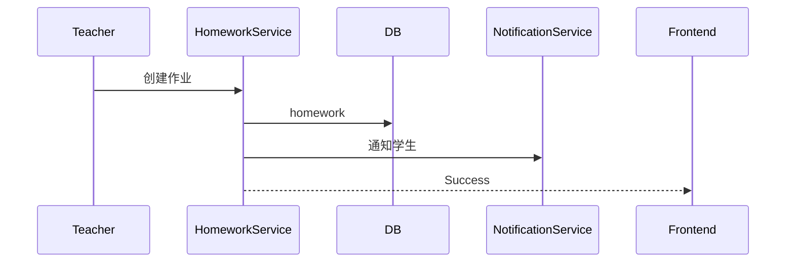

# ProgramMind V2.0 数据库设计说明书（DDS）

# Part 04 —— 教学中心数据库设计（Homework / Experiment / Quiz）

> 面向开发成员：Backend（数据库负责人）、Frontend（教学模块负责人）、AI/RAG 成员
> 
> 技术栈：MySQL 8.0 + SQLAlchemy 2.x

---

# 第三十三章 教学中心总体设计

## 33.1 模块定位

教学中心负责教师教学业务。

覆盖 ProgramMind Demo 中全部教学闭环：

- AI 发布作业
- AI 发布实验
- AI 发布测验
- 学生提交
- 教师批改
- AI 学情分析
- 掌握度更新

所有数据必须持久化。

---

## 33.2 模块关系图

```text
Teacher
   │
   ▼
Courses
   │
   ├───────────────┬───────────────┐
   ▼               ▼               ▼
Homework       Experiment        Quiz
   │               │               │
   ▼               ▼               ▼
HomeworkSubmission ExperimentSubmission QuizRecord
   │               │               │
   └───────────────┴───────────────┘
                   │
                   ▼
            LearningRecords
                   │
                   ▼
            MasteryRecords
```

教学业务全部围绕课程展开。

---

## 33.3 数据表清单

| 表名                     | 描述      |
| ---------------------- | ------- |
| homework               | 作业主表    |
| homework_submissions   | 作业提交表   |
| experiments            | 实验主表    |
| experiment_submissions | 实验提交表   |
| quizzes                | 测验主表    |
| quiz_questions         | 测验题目表   |
| quiz_records           | 学生作答记录表 |

共 **7 张业务表**。

---

# 第三十四章 homework（作业主表）

## 34.1 表定位

教师发布的每份作业。

一个课程可有多个作业。

---

## 34.2 字段设计

| 字段               | 类型           | 描述                         |
| ---------------- | ------------ | -------------------------- |
| id               | CHAR(36)     | UUID 主键                    |
| course_id        | CHAR(36)     | FK courses                 |
| chapter_id       | CHAR(36)     | FK chapters                |
| teacher_id       | CHAR(36)     | FK users                   |
| title            | VARCHAR(200) | 作业标题                       |
| description      | TEXT         | 作业说明（Markdown）             |
| attachment_id    | CHAR(36)     | FK course_resources，可空     |
| difficulty       | ENUM         | easy / medium / hard       |
| total_score      | INT          | 满分                         |
| due_time         | DATETIME     | 截止时间                       |
| status           | ENUM         | draft / published / closed |
| submission_count | INT          | 已提交人数                      |
| created_at       | DATETIME     | 创建时间                       |
| updated_at       | DATETIME     | 更新时间                       |

---

## 34.3 状态设计

| 状态        | 描述  |
| --------- | --- |
| draft     | 草稿  |
| published | 已发布 |
| closed    | 截止  |

教师只能发布 published。

---

## 34.4 Markdown 支持

description 保存 Markdown。

前端统一 Markdown Renderer。

禁止 HTML。

---

## 34.5 API 映射

| API                         | 功能   |
| --------------------------- | ---- |
| GET /teach/homework         | 作业列表 |
| POST /teach/homework        | 创建作业 |
| PATCH /teach/homework/{id}  | 编辑作业 |
| DELETE /teach/homework/{id} | 删除作业 |

---

## 34.6 索引设计

| 索引                   | 字段         |
| -------------------- | ---------- |
| idx_homework_course  | course_id  |
| idx_homework_teacher | teacher_id |
| idx_homework_status  | status     |
| idx_homework_due     | due_time   |

---

# 第三十五章 homework_submissions（作业提交）

## 35.1 表定位

学生每次提交作业。

支持重复提交（保留历史）。

---

## 35.2 字段设计

| 字段              | 类型           | 描述                              |
| --------------- | ------------ | ------------------------------- |
| id              | CHAR(36)     | UUID                            |
| homework_id     | CHAR(36)     | FK homework                     |
| student_id      | CHAR(36)     | FK users                        |
| content         | LONGTEXT     | Markdown 作答                     |
| attachment_id   | CHAR(36)     | FK resources，可空                 |
| score           | DECIMAL(5,2) | 得分                              |
| teacher_comment | LONGTEXT     | 教师评语                            |
| ai_comment      | LONGTEXT     | AI 建议                           |
| reviewed_by     | CHAR(36)     | 教师ID                            |
| review_time     | DATETIME     | 批改时间                            |
| status          | ENUM         | submitted / reviewed / returned |
| submitted_at    | DATETIME     | 提交时间                            |
| created_at      | DATETIME     | 创建时间                            |

---

## 35.3 状态流转

```text
submitted
     │
Teacher Review
     ▼
reviewed
     │
Return
     ▼
returned
```

---

## 35.4 AI 批改支持

AI 批改结果保存：

- ai_comment
- score（AI 初评）
- teacher_comment（人工修改）

支持 Human-in-the-loop。

---

## 35.5 API

| API                         | 功能     |
| --------------------------- | ------ |
| POST /learn/homework/submit | 学生提交   |
| GET /teach/submissions      | 教师查看提交 |
| POST /teach/homework/review | 教师批改   |
| GET /learn/homework/history | 我的提交   |

---

## 35.6 索引设计

| 索引                      | 字段          |
| ----------------------- | ----------- |
| idx_submission_homework | homework_id |
| idx_submission_student  | student_id  |
| idx_submission_status   | status      |
| idx_submission_review   | review_time |

---

# 第三十六章 experiments（实验主表）

## 36.1 表定位

教师发布课程实验。

支持代码实验。

支持实验指导。

---

## 36.2 字段设计

| 字段            | 类型           | 描述                         |
| ------------- | ------------ | -------------------------- |
| id            | CHAR(36)     | UUID                       |
| course_id     | CHAR(36)     | FK courses                 |
| chapter_id    | CHAR(36)     | FK chapters                |
| teacher_id    | CHAR(36)     | FK users                   |
| title         | VARCHAR(200) | 实验标题                       |
| objective     | TEXT         | 实验目标                       |
| description   | LONGTEXT     | 实验说明                       |
| attachment_id | CHAR(36)     | 实验指导 PDF                   |
| total_score   | INT          | 满分                         |
| difficulty    | ENUM         | easy / medium / hard       |
| due_time      | DATETIME     | 截止时间                       |
| status        | ENUM         | draft / published / closed |
| created_at    | DATETIME     | 创建时间                       |
| updated_at    | DATETIME     | 更新时间                       |

---

## 36.3 API

| API                            | 功能   |
| ------------------------------ | ---- |
| GET /teach/experiments         | 实验列表 |
| POST /teach/experiments        | 发布实验 |
| PATCH /teach/experiments/{id}  | 编辑实验 |
| DELETE /teach/experiments/{id} | 删除实验 |

---

# 第三十七章 experiment_submissions（实验提交）

## 37.1 表定位

学生实验提交。

支持多个附件。

支持代码文本。

---

## 37.2 字段设计

| 字段              | 类型           | 描述                   |
| --------------- | ------------ | -------------------- |
| id              | CHAR(36)     | UUID                 |
| experiment_id   | CHAR(36)     | FK experiments       |
| student_id      | CHAR(36)     | FK users             |
| report_markdown | LONGTEXT     | 实验报告                 |
| code_text       | LONGTEXT     | Python/C++代码         |
| attachment_ids  | JSON         | 上传附件                 |
| score           | DECIMAL(5,2) | 分数                   |
| ai_comment      | LONGTEXT     | AI 实验评价              |
| teacher_comment | LONGTEXT     | 教师评价                 |
| status          | ENUM         | submitted / reviewed |
| submitted_at    | DATETIME     | 提交时间                 |
| review_time     | DATETIME     | 批改时间                 |
| created_at      | DATETIME     | 创建时间                 |

---

## 37.3 attachment_ids 示例

```json
[
  "resource-id-1",
  "resource-id-2"
]
```

图片。

PDF。

ZIP。

统一资源管理。

---

## 37.4 AI 实验评价

AI 输出：

实验规范。

代码质量。

结果分析。

实验建议。

教师可以覆盖。

---

# 第三十八章 quizzes（测验主表）

## 38.1 表定位

教师发布测验。

支持 AI 命题。

支持题库。

---

## 38.2 字段设计

| 字段             | 类型           | 描述                         |
| -------------- | ------------ | -------------------------- |
| id             | CHAR(36)     | UUID                       |
| course_id      | CHAR(36)     | FK courses                 |
| chapter_id     | CHAR(36)     | FK chapters                |
| teacher_id     | CHAR(36)     | FK users                   |
| title          | VARCHAR(200) | 测验标题                       |
| description    | TEXT         | 测验说明                       |
| total_score    | INT          | 满分                         |
| duration       | INT          | 分钟                         |
| difficulty     | ENUM         | easy / medium / hard       |
| question_count | INT          | 题目数量                       |
| status         | ENUM         | draft / published / closed |
| start_time     | DATETIME     | 开始时间                       |
| end_time       | DATETIME     | 截止时间                       |
| created_at     | DATETIME     | 创建时间                       |
| updated_at     | DATETIME     | 更新时间                       |

---

## 38.3 测验状态

支持定时开放。

支持关闭。

---

## 38.4 API

| API                        | 功能   |
| -------------------------- | ---- |
| GET /teach/quizzes         | 测验列表 |
| POST /teach/quizzes        | 创建测验 |
| PATCH /teach/quizzes/{id}  | 编辑测验 |
| DELETE /teach/quizzes/{id} | 删除测验 |

---

# 第三十九章 quiz_questions（测验题目）

## 39.1 表定位

一题一条记录。

支持多题型。

---

## 39.2 字段设计

| 字段              | 类型           | 描述                                                |
| --------------- | ------------ | ------------------------------------------------- |
| id              | CHAR(36)     | UUID                                              |
| quiz_id         | CHAR(36)     | FK quizzes                                        |
| question_type   | ENUM         | single / multiple / judge / coding / short_answer |
| knowledge_point | VARCHAR(100) | 知识点                                               |
| difficulty      | ENUM         | easy / medium / hard                              |
| title           | LONGTEXT     | 题目                                                |
| options         | JSON         | 选项                                                |
| answer          | LONGTEXT     | 标准答案                                              |
| analysis        | LONGTEXT     | 解析                                                |
| score           | INT          | 分值                                                |
| sort_order      | INT          | 排序                                                |
| created_at      | DATETIME     | 创建时间                                              |

---

## 39.3 options 示例

```json
[
  {"label":"A","content":"递归"},
  {"label":"B","content":"循环"},
  {"label":"C","content":"列表"},
  {"label":"D","content":"字典"}
]
```

---

## 39.4 支持题型

| 类型           | 描述  |
| ------------ | --- |
| single       | 单选  |
| multiple     | 多选  |
| judge        | 判断  |
| coding       | 编程题 |
| short_answer | 简答题 |

ProgramMind AI 命题全部输出此格式。

---

# 第四十章 quiz_records（学生测验记录）

## 40.1 表定位

学生一次考试一条记录。

保存完整答案。

---

## 40.2 字段设计

| 字段           | 类型           | 描述                  |
| ------------ | ------------ | ------------------- |
| id           | CHAR(36)     | UUID                |
| quiz_id      | CHAR(36)     | FK quizzes          |
| student_id   | CHAR(36)     | FK users            |
| answers      | JSON         | 学生答案                |
| score        | DECIMAL(5,2) | 得分                  |
| accuracy     | DECIMAL(5,2) | 正确率                 |
| duration     | INT          | 作答秒数                |
| ai_analysis  | LONGTEXT     | AI 错题分析             |
| status       | ENUM         | finished / reviewed |
| submitted_at | DATETIME     | 提交时间                |
| created_at   | DATETIME     | 创建时间                |

---

## 40.3 answers 示例

```json
{
  "question_id":"uuid",
  "answer":"A"
}
```

编程题保存代码。

简答保存文本。

---

## 40.4 AI 错题分析

自动生成：

错误知识点。

推荐教材章节。

推荐 Quiz。

推荐实验。

---

# 第四十一章 Repository 设计（教学中心）

## HomeworkRepository

方法：

- create_homework()
- update_homework()
- list_homework()
- close_homework()

---

## HomeworkSubmissionRepository

方法：

- submit_homework()
- review_homework()
- list_submission()
- student_history()

---

## ExperimentRepository

方法：

- publish_experiment()
- list_experiment()
- delete_experiment()

---

## QuizRepository

方法：

- create_quiz()
- save_questions()
- get_quiz()
- publish_quiz()

---

# 第四十二章 Service 设计（教学中心）

## HomeworkService

负责：

发布。

截止。

统计人数。

通知学生。

更新课程统计。

---

## ReviewService

负责：

教师评分。

AI 批改。

更新 Mastery。

记录 LearningRecord。

---

## QuizService

负责：

生成测验。

自动判分。

AI 分析。

更新掌握度。

---

## ExperimentService

负责：

实验提交。

实验评分。

实验统计。

AI 建议。

---

# 第四十三章 AI 与教学中心集成

## 43.1 AI 命题

Quiz Agent 输出：

questions JSON。

直接写 quiz_questions。

---

## 43.2 AI 教案

Lesson Agent 创建 Homework。

自动生成草稿。

教师确认发布。

---

## 43.3 AI 批改

Debug Agent。

Summary Agent。

Analytics Agent。

统一写 ai_comment。

---

## 43.4 掌握度更新

来源：

Homework。

Quiz。

Experiment。

LearningRecord。

统一进入 Mastery Engine。

---

# 第四十四章 教学中心数据流

## 教师发布作业



---

## 学生提交作业

```mermaid
sequenceDiagram

Student->>HomeworkSubmission

HomeworkSubmission->>DB

DB->>LearningRecord

LearningRecord->>MasteryEngine
```

---

## 教师批改作业

```mermaid
sequenceDiagram

Teacher->>ReviewService

ReviewService->>DB

ReviewService->>MasteryEngine

MasteryEngine->>GrowthProfile
```

---

## 学生测验

```mermaid
flowchart TD

Start Quiz

↓

Answer Question

↓

Submit Quiz

↓

Auto Score

↓

AI Analysis

↓

Update Mastery
```

---

# 第四十五章 Demo 数据迁移方案

## Homework JSON

Demo：

HOMEWORK[]。

↓

homework。

↓

homework_submissions。

---

## Experiment JSON

EXPERIMENTS[]。

↓

experiments。

↓

experiment_submissions。

---

## Quiz JSON

QUIZZES[]。

↓

quizzes。

↓

quiz_questions。

↓

quiz_records。

---

## Mastery 更新逻辑保持

Demo：

0.7 + 0.3 平滑。

V2 保留。

迁移进入 MasteryService。

---

# 第四十六章 Checklist（教学中心）

## 数据表

- [ ] homework
- [ ] homework_submissions
- [ ] experiments
- [ ] experiment_submissions
- [ ] quizzes
- [ ] quiz_questions
- [ ] quiz_records

## Repository

- [ ] HomeworkRepository
- [ ] ExperimentRepository
- [ ] QuizRepository

## Service

- [ ] HomeworkService
- [ ] ReviewService
- [ ] ExperimentService
- [ ] QuizService

## AI 集成

- [ ] AI Quiz Agent
- [ ] AI Review
- [ ] Mastery Update

## API

- [ ] 创建作业
- [ ] 提交作业
- [ ] 批改作业
- [ ] 发布实验
- [ ] 提交实验
- [ ] 发布测验
- [ ] 提交测验

---

# 本章输出成果

教学中心数据库设计完成。

Backend 成员完成本章节后，可以实现 Demo 中全部教学业务的真实数据库版本，并打通 AI 批改、掌握度更新、学情统计。

下一章节进入 Knowledge Base / RAG 数据库设计。

---

**DOC03 Part04 完成。**
