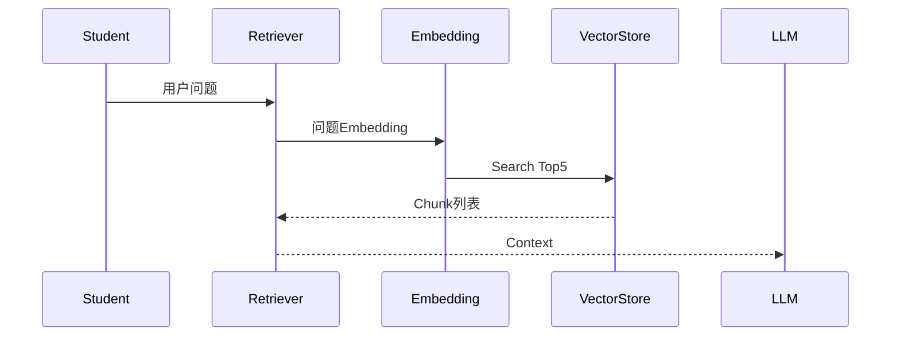

# ProgramMind V2.0 数据库设计说明书（DDS）

# Part 05 —— Knowledge Base（RAG知识库数据库设计）

> 面向开发成员：AI/RAG负责人、Backend负责人
> 
> 技术栈：MySQL 8.0 + SQLAlchemy 2.x + bge-m3 + FAISS（开发版）/ Milvus（比赛版）

---

# 第四十七章 Knowledge Base 总体设计

## 47.1 模块定位

Knowledge Base（知识库）是 ProgramMind V2.0 AI Engine 的基础设施。

ProgramMind 所有 AI Agent 都不能直接回答，而必须：

> **Retriever → Citation → LLM**

因此数据库必须支持：

- 教材上传
- PPT上传
- PDF上传
- Markdown上传
- TXT上传
- 文档切分
- Chunk管理
- Embedding索引
- Citation引用来源

---

## 47.2 模块关系图

```text
Teacher Upload Resource
        │
        ▼
course_resources
        │
        ▼
knowledge_documents
        │
        ▼
knowledge_chunks
        │
        ▼
knowledge_embeddings
        │
        ▼
Retriever
        │
        ▼
LLM + Citation
```

---

## 47.3 数据表清单

| 表名                   | 描述       |
| -------------------- | -------- |
| knowledge_documents  | 文档主表     |
| knowledge_chunks     | Chunk切分表 |
| knowledge_embeddings | 向量索引映射表  |
| knowledge_citations  | 引用来源记录表  |

共 **4 张核心表**。

---

# 第四十八章 knowledge_documents（知识文档）

## 48.1 表定位

一份教材、一份PDF、一份PPT，对应一条 Document。

所有知识来源统一管理。

---

## 48.2 字段设计

| 字段            | 类型           | 描述                                     |
| ------------- | ------------ | -------------------------------------- |
| id            | CHAR(36)     | UUID                                   |
| course_id     | CHAR(36)     | FK courses                             |
| resource_id   | CHAR(36)     | FK course_resources                    |
| title         | VARCHAR(200) | 文档标题                                   |
| document_type | ENUM         | textbook / ppt / pdf / markdown / txt  |
| language      | VARCHAR(20)  | zh / en                                |
| page_count    | INT          | 页数                                     |
| token_count   | INT          | Token数量                                |
| parser_status | ENUM         | pending / parsing / completed / failed |
| summary       | TEXT         | 文档摘要                                   |
| created_by    | CHAR(36)     | 上传教师                                   |
| created_at    | DATETIME     | 上传时间                                   |
| updated_at    | DATETIME     | 更新时间                                   |

---

## 48.3 parser_status 生命周期

| 状态        | 描述         |
| --------- | ---------- |
| pending   | 等待解析       |
| parsing   | Parser处理中  |
| completed | 已完成Chunk生成 |
| failed    | 解析失败       |

Parser Service 自动维护。

---

## 48.4 支持文档类型

| 类型       | Parser       |
| -------- | ------------ |
| PDF      | PyMuPDF      |
| PPTX     | python-pptx  |
| DOCX     | python-docx  |
| Markdown | markdown-it  |
| TXT      | UTF-8 Parser |

ProgramMind 第一版支持 PDF、PPT、Markdown。

---

## 48.5 SQLAlchemy Model

```
models/knowledge_document.py
```

Relationship：

Course

Resource

Chunks

Citation

---

## 48.6 API

| API                              | 功能   |
| -------------------------------- | ---- |
| POST /knowledge/upload           | 上传文档 |
| GET /knowledge/documents         | 文档列表 |
| DELETE /knowledge/documents/{id} | 删除文档 |
| GET /knowledge/documents/{id}    | 文档详情 |

---

# 第四十九章 knowledge_chunks（Chunk切分）

## 49.1 表定位

一份Document拆分成多个Chunk。

Retriever 检索最小单位。

---

## 49.2 Chunk设计原则

ProgramMind统一：

| 参数               | 数值         |
| ---------------- | ---------- |
| Chunk Size       | 500 Tokens |
| Chunk Overlap    | 100 Tokens |
| Max Chunk Length | 700 Tokens |
| Min Chunk Length | 200 Tokens |

统一全项目。

---

## 49.3 字段设计

| 字段            | 类型           | 描述                     |
| ------------- | ------------ | ---------------------- |
| id            | CHAR(36)     | UUID                   |
| document_id   | CHAR(36)     | FK knowledge_documents |
| course_id     | CHAR(36)     | FK courses             |
| chapter_id    | CHAR(36)     | FK chapters            |
| chunk_index   | INT          | 第几个Chunk               |
| page_number   | INT          | 来源页码                   |
| section_title | VARCHAR(200) | 所属章节                   |
| content       | LONGTEXT     | Chunk文本                |
| token_count   | INT          | Token数量                |
| created_at    | DATETIME     | 创建时间                   |

---

## 49.4 Chunk示例

```text
Document：Python程序设计教材

Chunk 001

第一章 Python基础

Python是一门解释型语言...

Token：486

Page：12
```

每个 Chunk 保存来源位置。

---

## 49.5 Citation依赖字段

Retriever 返回：

- page_number
- section_title
- document_id

LLM 输出引用来源。

---

## 49.6 API

| API                        | 功能      |
| -------------------------- | ------- |
| GET /knowledge/chunks      | Chunk列表 |
| GET /knowledge/chunks/{id} | Chunk详情 |

仅管理员调用。

---

## 49.7 索引设计

| 索引                 | 字段          |
| ------------------ | ----------- |
| idx_chunk_document | document_id |
| idx_chunk_course   | course_id   |
| idx_chunk_chapter  | chapter_id  |
| idx_chunk_page     | page_number |

---

# 第五十章 knowledge_embeddings（向量索引）

## 50.1 表定位

数据库记录 Chunk 与 VectorStore 的映射关系。

真正向量存 FAISS / Milvus。

数据库不保存768维向量。

---

## 50.2 字段设计

| 字段              | 类型           | 描述                  |
| --------------- | ------------ | ------------------- |
| id              | CHAR(36)     | UUID                |
| chunk_id        | CHAR(36)     | FK knowledge_chunks |
| vector_store    | ENUM         | faiss / milvus      |
| vector_id       | VARCHAR(128) | 向量库ID               |
| embedding_model | VARCHAR(100) | bge-m3              |
| dimension       | INT          | 1024                |
| version         | VARCHAR(30)  | embedding版本         |
| created_at      | DATETIME     | 创建时间                |

---

## 50.3 为什么不保存Embedding

原因：

- MySQL效率低。
- 向量检索交给 FAISS。
- Milvus/Qdrant 更专业。

数据库只保存 mapping。

---

## 50.4 Embedding Model规范

第一版统一：

| 参数        | 值           |
| --------- | ----------- |
| Model     | BAAI/bge-m3 |
| Dimension | 1024        |
| Normalize | True        |

所有课程统一模型。

---

## 50.5 API

| API                          | 功能          |
| ---------------------------- | ----------- |
| POST /knowledge/embed        | 建立Embedding |
| POST /knowledge/rebuild      | 重建向量        |
| GET /knowledge/vector-status | 查看状态        |

后台调用。

---

# 第五十一章 knowledge_citations（引用来源）

## 51.1 表定位

记录 AI 回答引用了哪些 Chunk。

支持追溯。

---

## 51.2 字段设计

| 字段              | 类型           | 描述                     |
| --------------- | ------------ | ---------------------- |
| id              | CHAR(36)     | UUID                   |
| conversation_id | CHAR(36)     | FK ai_conversations    |
| chunk_id        | CHAR(36)     | FK knowledge_chunks    |
| document_id     | CHAR(36)     | FK knowledge_documents |
| score           | DECIMAL(5,4) | Retriever相似度           |
| citation_text   | TEXT         | 引用摘要                   |
| created_at      | DATETIME     | 创建时间                   |

---

## 51.3 Citation生成流程

```text
Retriever

↓

Top5 Chunk

↓

LLM

↓

Citation保存
```

Conversation 保存多个 Citation。

---

## 51.4 Citation前端展示

ProgramMind统一格式：

```text
📚 来源

Python程序设计（教材）

第3章 第25页

相似度：0.91
```

点击跳转教材。

---

## 51.5 API

| API                                 | 功能        |
| ----------------------------------- | --------- |
| GET /ai/citations/{conversation_id} | 查看引用      |
| GET /knowledge/chunk/{id}           | 查看Chunk原文 |

---

# 第五十二章 文档解析流程设计

## 52.1 Parser Pipeline

```mermaid
flowchart TD

Upload

↓

Save Resource

↓

Document Parser

↓

Extract Text

↓

Split Chunk

↓

Embedding

↓

Save Mapping

↓

Completed
```

---

## 52.2 ParserService职责

负责：

读取PDF。

OCR（后续）。

去除页眉页脚。

保留章节标题。

切Chunk。

写数据库。

调用Embedding。

---

## 52.3 Parser目录

```
backend/app/rag/parser/

pdf_parser.py

ppt_parser.py

markdown_parser.py

splitter.py
```

模块独立。

---

## 52.4 文档摘要生成

Parser完成后：

Summary Agent 自动生成：

- 文档摘要
- 核心知识点
- 标签

保存 knowledge_documents.summary。

---

# 第五十三章 Retriever设计

## 53.1 检索流程



---

## 53.2 检索过滤

支持过滤：

课程。

章节。

文档类型。

教师上传。

TopK。

默认：

Top5。

---

## 53.3 Similarity Score

保存：

0~1。

前端展示：

百分比。

---

## 53.4 Citation生成

LLM Prompt：

包含：

Chunk。

Section。

Page。

Document。

返回 JSON Citation。

---

# 第五十四章 Repository设计（Knowledge Base）

## KnowledgeRepository

方法：

upload_document()

delete_document()

list_documents()

---

## ChunkRepository

方法：

save_chunk()

list_chunk()

search_chunk()

---

## EmbeddingRepository

方法：

save_embedding()

delete_embedding()

rebuild_embedding()

---

## CitationRepository

方法：

save_citation()

conversation_citation()

---

# 第五十五章 Service设计（Knowledge Base）

## KnowledgeService

负责：

上传。

删除。

文档状态。

Parser任务。

---

## ParserService

负责：

文本提取。

Chunk。

Metadata。

Summary。

---

## EmbeddingService

负责：

调用 bge-m3。

生成Embedding。

同步VectorStore。

---

## RetrieverService

负责：

Embedding Query。

Vector Search。

Metadata Filter。

Citation。

---

# 第五十六章 SQLAlchemy Relationship

```text
Course

1:N Documents

Document

1:N Chunks

Chunk

1:1 Embedding

Conversation

1:N Citation
```

形成完整关系。

---

# 第五十七章 Demo升级映射

## Demo COURSEWARE

迁移：

course_resources。

knowledge_documents。

knowledge_chunks。

---

## Demo Knowledge Graph

静态JSON。

↓

Parser自动生成章节。

↓

Knowledge Graph Service。

---

## Demo Source Tag

静态字符串。

↓

knowledge_citations。

真实可点击。

---

# 第五十八章 Checklist（Knowledge Base）

## 数据表

- [ ] knowledge_documents
- [ ] knowledge_chunks
- [ ] knowledge_embeddings
- [ ] knowledge_citations

## Repository

- [ ] KnowledgeRepository
- [ ] ChunkRepository
- [ ] EmbeddingRepository
- [ ] CitationRepository

## Service

- [ ] ParserService
- [ ] EmbeddingService
- [ ] RetrieverService
- [ ] KnowledgeService

## API

- [ ] 上传文档
- [ ] 删除文档
- [ ] Chunk查询
- [ ] Citation查询
- [ ] 重建Embedding

## AI集成

- [ ] Parser自动切Chunk
- [ ] bge-m3向量生成
- [ ] TopK Retriever
- [ ] Citation展示

---

# 本章输出成果

Knowledge Base 数据库设计完成。

Backend + AI 成员完成本章节后，可以实现：

- 教师上传教材/PDF/PPT。
- 自动解析文档。
- 自动Chunk切分。
- 自动Embedding。
- Retriever语义检索。
- AI回答引用教材页码，实现真正RAG。

下一章节进入 AI Conversation / Agent Workflow / Memory 数据库设计。

---

**DOC03 Part05 完成。**
